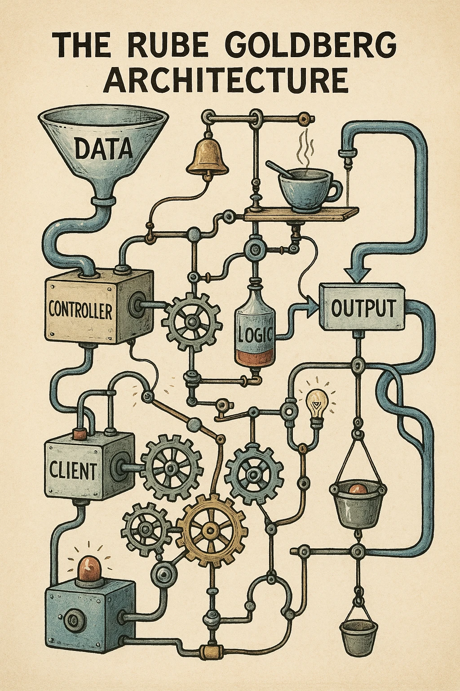

Принцип единственной ответственности — одна из тех идей, которые звучат настолько разумно, что могут проскользнуть мимо вашей критики.

Делай одно дело. Делай его хорошо. Держи модули сфокусированными. Дай коду одну причину для изменений. Хороший совет.

А потом кто-то превращает этот совет в измерительную ленту и начинает заявлять, что любая функция длиннее пяти строк — это запах кода.

Проблема не в SRP. Проблема в том, что «маленький» воспринимается как замена «связному».

В этот момент вы встречаете Одноцелевых Людей: разработчиков, которые не совсем ошибаются насчет модульности, но путают полезные границы с максимальной фрагментацией.

<figure class="inset-right">
  <figcaption>Насилие в программной архитектуре</figcaption>

</figure>

## I. Полезная идея, лежащая в основе

> Добавление одного флажка в форму должно в идеале затрагивать только один файл. А не 8 файлов в 5 директориях... Я смотрю на тебя, React/Redux.

Когда SRP применяется с рассудительностью, это помогает. Кодовые единицы, сфокусированные на одной концептуальной задаче, легче понять. Тесты могут нацеливаться на поведение на разумной границе. Четкие модули упрощают изменение одной части системы без втягивания остального приложения в комнату.

Даже классические примеры Unix более прагматичны, чем предполагает лозунг. `ls` перечисляет файлы, да, но он также координирует вызовы вроде `opendir`, `readdir`, `closedir` и `stat`. Полезная единица — не самая маленькая возможная операция. Полезная единица — это наименьшая связная вещь, решающая задачу.

Исходная философия Unix заключалась в *композиции* и *простоте*, **а не в сведении всего** к одной функции или файлу.

Это различие важно. «Одна ответственность» не то же самое, что «одна строка поведения».

## II. Переизбыток абстракций: когда простота превращается в хаос

> Наш архитектор настаивает, что каждая функция длиннее 5 строк — это «запах кода». Теперь наша кодовая база пахнет слегка бездумным отчаянием.

Режим отказа легко заметить после того, как он уже испортил вашу неделю.

В кодовой базе больше файлов, но меньше формы. У каждого хелпера есть свой хелпер. Каждая концепция разбита по папкам, названным в честь технических ролей, а не смысла продукта. Добавление флажка требует касания компонента, хука, селектора, экшена, редьюсера, константы, тестового фикстура и бочкового экспорта, который существует в основном для того, чтобы пути импорта не выглядели виноватыми.

<figure class="inset-left">
  <figcaption>Нет выхода из этого бесконечного рабочего паттерна</figcaption>

</figure>

Что купила вся эта чистота?

-   **Осколки файловой системы:** Исходные директории разрастаются в кошмарные ландшафты бесчисленных крошечных файлов, часто содержащих одну, трагически одинокую функцию. Навигация превращается в упражнение по спелеологии.
-   **Клубки зависимостей:** Сеть импортов и экспортов настолько плотная, что отслеживание выполнения требует большой белой доски и большего терпения, чем заслуживает фича. Файлы, импортированные ровно один раз, сидят там, притворяясь переиспользуемыми.
-   **Коварство тестирования:** Тесты становятся хрупкими, гиперспецифичными стражами, охраняющими мельчайшие детали реализации. Измените сигнатуру функции? Наблюдайте, как десятки тестов рушатся, как древняя керамика. Набор тестов превращается из страховочной сетки в минное поле.
-   **Скорость исчезает:** Простые изменения метастазируют в саги по модификации множества файлов. Онбординг новых разработчиков включает недели передачи им карт и компасов, просто чтобы найти, где *на самом деле живет* компонент `UserProfile` на этой неделе. Прогресс замедляется до геологического ползания под sheer весом этой «организации».

Я смотрел в бездну кодовых баз, где прямолинейная фича на 100 строк была рассечена на 15+ файлов, каждый из которых был «чистым» маленьким ангелом, содержащим, может быть, одну или две функции. Когнитивный радиус взрыва от попытки удержать этот бардак в голове полностью нивелировал любой теоретический выигрыш от разделения. Это не было проще; это было просто разбросано.

## III. Цена совершенства: влияние на разработчиков

> Мы тратим больше времени на дебаты о структуре файлов и соглашениях об именовании, чем на собственно выпуск фич. Это Agile?

<figure class="inset-left">
  <figcaption>Настолько грязно, что граничит с искусством</figcaption>

</figure>

Эта патологическая фрагментация — не просто эстетическая проблема. Она меняет то, как разработчики тратят свое внимание:

**Снижение продуктивности:** Забудьте о техническом долге; это организационный долг, накопленный через обсессивно-компульсивное вложение директорий. Каждое незначительное изменение превращается в археологические раскопки сквозь слои абстракций. Время исчезает в черной дыре `cd ..` и `grep`.

**Налог на тестирование:** Вместо того чтобы обеспечивать уверенность, набор тестов становится источником трения. Часы тают, исправляя тесты, сломанные тривиальными рефакторингами, тесты, которые были слишком тесно связаны с микроскопическими деталями, которые они должны были проверять.

**Когнитивная нагрузка:** Существует жесткий предел того, сколько разрозненных кусков информации может удерживать человеческий мозг. Принуждение разработчиков собирать поток программы из дюжины разбросанных файлов активно мешает пониманию и усложняет уверенные изменения.

## IV. Принятие прагматизма: практическая альтернатива

> Я предложил поместить две связанные функции в один файл. Команда отреагировала так, будто я предложил удалить стейджинг.
> — Читатель, выздоравливающий от пуризма

Выход не в отказе от SRP. Ответ — применять его на правильном уровне смысла.

Вот как это выглядит на практике:

-   **Фокус на связности, а не на атомах:** Группируйте вещи, которые *изменяются вместе* и *принадлежат вместе* концептуально. Модуль может обрабатывать несколько связанных аспектов аутентификации пользователя. Это нормально. Это, вероятно, *лучше*, чем шесть отдельных файлов, каждый из которых держит одну функцию, связанную с состоянием входа.
-   **Держите родственное рядом:** Не разделяйте связанный код, если нет кричаще очевидной, осязаемой выгоды — вроде реальной переиспользуемости *на практике*, а не в каком-то гипотетическом будущем, которое никогда не наступает. Близость важна для понимания.
-   **Пусть реальность управляет:** Организуйте на основе реальных фич и рабочих процессов вашего приложения, а не какой-то абстрактной идеи функциональной чистоты³. Упрощает ли эта структура понимание и модификацию `Feature X` для кого-то или усложняет?
-   **Помните о мясном оборудовании:** Помните о бедном разработчике. Какая организация минимизирует умственную жонглировку, необходимую для работы с кодом? Оптимизируйте под человеческое понимание.
-   **Тестируйте то, что важно:** Пишите тесты, которые проверяют поведение на разумной границе, а не тесты, которые интимно припаяны к внутренней проводке каждой крошечной функции. Стремитесь к уверенности, а не просто к театру процента покрытия.

Цель не в теоретическом совершенстве, достойном кандидатской диссертации; а в создании кода, который ваши коллеги (и будущий вы) могут навигировать, понимать и модифицировать, не желая поджечь здание.

Иногда это означает, что файл имеет длину 200 строк вместо 50. Иногда функция обрабатывает получение данных *и* их небольшую трансформацию. Иногда класс имеет две ответственности, которые настолько тесно связаны, что должны жить вместе. Если это упрощает работу с системой в целом, это, вероятно, правильное решение.

Оставайтесь бескомпромиссно сфокусированными на практических вопросах:
- Может ли новичок разобраться?
- Можем ли мы изменить `X`, не сломав несвязанный `Y`?
- Говорит ли этот тест на самом деле, работает ли фича?
- Мы выпускаем ценность или просто переставляем папки?

## V. Заключение: Создание связного и поддерживаемого кода

Принцип единственной ответственности — полезный инструмент. Это не мандат на измельчение вашей кодовой базы в атомарную пыль. Как и любой инструмент, его ценность зависит от суждения человека, использующего его.

Поэтому, когда вы встречаете Одноцелевых Людей, готовых начать войну с любой функцией, осмелившейся превысить три строки, сделайте вдох. Вспомните флажок в 12 файлах.

Наша задача не в создании теоретически безупречных снежиночных функций. Наша задача — создавать программное обеспечение, которое работает, решает проблемы и не наказывает следующего человека, который должен его коснуться.

Оставайтесь прагматичными. Фокусируйтесь на результатах. Не позволяйте погоне за идеальной чистотой стать врагом поддерживаемого кода. Ваше здравомыслие и скорость вашей команды зависят от этого.

¹ Ирония в том, что достижение *настоящей* единственной цели на самых низких уровнях требует огромной сложности, скрытой прямо под поверхностью.

² Мы говорим здесь о концептуальной чистоте: идее, что функция должна делать логически только «одно дело». Не путайте это с концепцией «чистой функции» в функциональном программировании без побочных эффектов, что является другой, хотя иногда и связанной, идеей.
