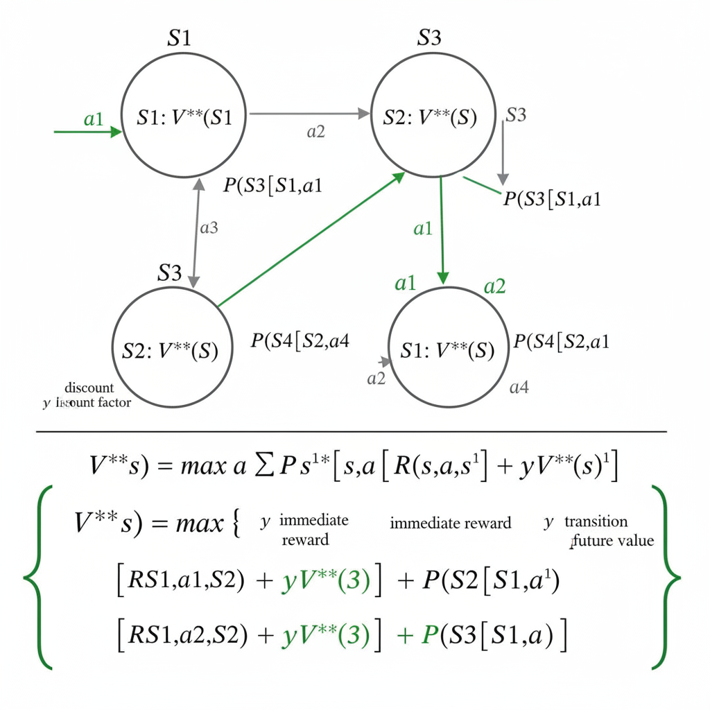

import Challenge from '../../../components/QuizUI/Challenge';
import QuizUI from '../../../components/QuizUI/QuizUI';

<section class="inset">
  Are you agentic or just reactive on Mondays? 🤖
</section>

Welcome to the intersection of intelligent agents and mathematical rigor! This comprehensive quiz explores both the cutting-edge world of agentic AI systems and the deep mathematical foundations that enable autonomous intelligent behavior.

From Markov Decision Processes to multi-agent coordination, from information theory to game-theoretic equilibria—**prove your agent architecture skillz!** 🚀

### 15 Questions... Begin!

<QuizUI>

<Challenge
  client:load
  group="Agent Fundamentals"
  title="AI Agent Definition"
  index={0}
  options={[
    {text: 'Performance measure, Environment, Actuators, Sensors', isAnswer: true },
    {text: 'Neural Networks, Backpropagation, Loss Function'},
    {text: 'Input, Processing, Output, Feedback'},
    {text: 'Data, Model, Training, Inference'},
    {text: 'Sensors, Actuators, Memory, Learning'},
    {text: 'Planning, Execution, Monitoring, Adaptation'},
    {text: 'Perception, Action, Environment, Goals'},
  ]}
>

  <slot name="question">
  

    What are the four essential components that define an AI agent according to Russell & Norvig's framework?
  

  </slot>

  <slot name='hints'>
    Think about the PEAS framework - what does an agent need to function autonomously?
  </slot>

  <slot name='explanation'>
  

    An AI agent is defined by its ability to perceive its environment through sensors, take actions through actuators, operate within an environment, and pursue goals through rational behavior. This PEAS framework (Performance measure, Environment, Actuators, Sensors) is fundamental to agent design.

    **Why other options miss the mark:**
    - Neural networks and backprop are implementation details, not definitional components
    - Input/Processing/Output is too generic for autonomous agents
    - Data/Model/Training/Inference describes ML systems, not agent architecture
    - While sensors/actuators are part of it, this doesn't capture the environmental interaction and goal-driven nature
  

  </slot>

</Challenge>

<Challenge
  client:load
  group="Mathematical Foundations"
  title="Bellman Optimality Equation"
  index={1}
  options={[
    {text: 'V*(s) = max_a Σ P(s\'|s,a)[R(s,a,s\') + γV*(s\')]', isAnswer: true },
    {text: 'V*(s) = Σ P(s\')V*(s\') + R(s)'},
    {text: 'V*(s) = R(s) + γ max_a Q(s,a)'},
    {text: 'V*(s) = E[R_t + γR_{t+1} + γ²R_{t+2} + ...]'},
    {text: 'V*(s) = max_a Σ P(s\'|s,a)R(s,a,s\') + γV(s\')'},
    {text: 'V*(s) = argmax_a Q*(s,a)'},
  ]}
>

  <slot name="question">
  

    Which equation correctly represents the Bellman optimality equation for the value function V*(s) in a Markov Decision Process?
  

  </slot>

  <slot name='hints'>
    The optimal value equals the maximum expected return over all actions. Don't forget the discount factor and the optimal future values.
  </slot>

  <slot name='explanation'>
  

    The Bellman optimality equation states that the optimal value of a state equals the maximum over all actions of the expected immediate reward plus the discounted optimal value of the successor state: V*(s) = max_a Σ P(s'|s,a)[R(s,a,s') + γV*(s')]. This recursive relationship is fundamental to dynamic programming and reinforcement learning.

    
    *Visual breakdown: States connected by action transitions with probabilities and rewards. The optimal value V*(s) is computed by choosing the action that maximizes expected future return.*

    **Recursive insight:** The beauty of the Bellman equation is that it turns an infinite-horizon optimization problem into a recursive one-step lookahead. Each state's optimal value depends on the optimal values of its successor states, creating a system of equations that can be solved iteratively.

    **Why other forms are wrong:**
    - Option 2 lacks the max over actions and has incorrect structure
    - Option 3 mixes value and Q-function notation incorrectly
    - Option 4 is the definition of value function, not the optimality equation
    - Option 5 missing the max inside the expectation (V vs V*)
    - Option 6 confuses value function with policy extraction
  

  </slot>

</Challenge>

<Challenge
  client:load
  group="Agent Architectures"
  title="ReAct Paradigm"
  index={2}
  options={[
    {text: 'Reasoning and Acting in language models', isAnswer: true},
    {text: 'Reactive Agent Control Theory'},
    {text: 'Reinforcement and Adversarial Training'},
    {text: 'Real-time Action Computation'},
    {text: 'Recursive Agent Communication Transactions'},
    {text: 'Relational Agent Context Threading'},
  ]}
>

  <slot name="question">
  

    What does "ReAct" stand for in the context of modern agentic AI systems?
  

  </slot>

  <slot name='hints'>
    Think about how modern LLM-based agents combine internal thought processes with external actions.
  </slot>

  <slot name='explanation'>
  

    ReAct (Reasoning and Acting) is a paradigm where language models interleave reasoning traces with action execution. This allows agents to dynamically reason about and interact with external environments, tools, and APIs while maintaining interpretable thought processes. It's fundamental to many modern AI agent implementations.

    **Key insight:** Instead of just generating final answers, ReAct agents show their "thinking" step-by-step, then take actions based on that reasoning, creating a more transparent and controllable agent architecture.
  

  </slot>

</Challenge>

<Challenge
  client:load
  group="Mathematical Foundations"
  title="Information Theory"
  index={3}
  options={[
    {text: 'H(X) = -Σ p(x) log p(x)', isAnswer: true },
    {text: 'H(X) = Σ p(x)² log p(x)'},
    {text: 'H(X) = log(|X|) - Σ p(x)'},
    {text: 'H(X) = E[p(x)] / Var[p(x)]'},
    {text: 'H(X) = -Σ p(x) log₂(1-p(x))'},
    {text: 'H(X) = max_x p(x) × log |X|'},
  ]}
>

  <slot name="question">
  

    What is the correct formula for Shannon entropy H(X) of a discrete random variable X?
  

  </slot>

  <slot name='hints'>
    Entropy measures uncertainty. Higher probability events contribute less to uncertainty.
  </slot>

  <slot name='explanation'>
  

    Shannon entropy H(X) = -Σ p(x) log p(x) measures the expected amount of information contained in a random variable. It's maximized when all outcomes are equally likely and minimized when the distribution is deterministic. This concept is crucial for understanding information-theoretic approaches to agent learning and decision-making.

    **Intuition:** Entropy quantifies surprise. Rare events are more surprising (contribute more to entropy) than common events. The negative sign ensures entropy is non-negative.

    **Applications in AI agents:**
    - Measuring uncertainty in belief states
    - Information gain in active learning
    - Exploration strategies in RL
  

  </slot>

</Challenge>

<Challenge
  client:load
  group="Multi-Agent Systems"
  title="Nash Equilibrium"
  index={4}
  options={[
    {text: 'No player can unilaterally improve their payoff', isAnswer: true },
    {text: 'All players achieve their maximum possible individual payoffs'},
    {text: 'The strategy profile maximizes total welfare across all players'},
    {text: 'Players cooperatively negotiate to reach optimal outcomes'},
    {text: 'All players use identical strategies in the equilibrium'},
    {text: 'The equilibrium always leads to Pareto efficient outcomes'},
  ]}
>

  <slot name="question">
  

    Which statement **BEST** defines a Nash equilibrium in a multi-agent system?
  

  </slot>

  <slot name='hints'>
    Think about individual rationality versus collective optimality. What happens if one player changes strategy?
  </slot>

  <slot name='explanation'>
  

    A Nash equilibrium is a strategy profile where each player's strategy is a best response to the other players' strategies. No player can unilaterally deviate and improve their payoff. This concept is fundamental to understanding strategic interactions in multi-agent systems and mechanism design.

    **Why other definitions are incorrect:**
    - Players don't necessarily achieve maximum individual payoffs—they achieve the best they can *given others' strategies*
    - Nash equilibria don't maximize total welfare (that would be social optimum)
    - No cooperation or negotiation is required—it's about individual best responses
    - Players can have different strategies in equilibrium
    - Nash equilibria can be Pareto inefficient (like in Prisoner's Dilemma)

    **Classic example:** In Prisoner's Dilemma, both defecting is Nash equilibrium but not Pareto optimal.
  

  </slot>

</Challenge>

<Challenge
  client:load
  group="Decision Theory"
  title="POMDP Belief State"
  index={5}
  options={[
    {text: 'A probability distribution over possible world states', isAnswer: true },
    {text: 'The agent\'s confidence in its current action selection'},
    {text: 'A vector of observable features from the environment'},
    {text: 'The expected reward for following the optimal policy'},
    {text: 'A summary of the agent\'s past action history'},
    {text: 'The likelihood of achieving the agent\'s goals'},
  ]}
>

  <slot name="question">
  

    In a Partially Observable Markov Decision Process (POMDP), what is a belief state?
  

  </slot>

  <slot name='hints'>
    Since the agent can't fully observe the state, what does it maintain instead to capture its uncertainty?
  </slot>

  <slot name='explanation'>
  

    A belief state in a POMDP is a probability distribution b(s) over all possible world states s, representing the agent's uncertainty about the true state given its observation history. The belief state is updated using Bayes' theorem as new observations arrive: b'(s') ∝ Σ_s P(o|s',a)P(s'|s,a)b(s).

    **Why this matters:** Since the agent can't directly observe the true state, it must maintain beliefs about where it might be. The belief state becomes the "sufficient statistic" for optimal decision-making under partial observability.

    **Update process:**
    1. **Predict:** Use action and transition model to predict next belief
    2. **Update:** Use observation and sensor model to refine belief
    3. **Normalize:** Ensure probabilities sum to 1
  

  </slot>

</Challenge>

<Challenge
  client:load
  group="Optimization Theory"
  title="Gradient Descent Convergence"
  index={6}
  options={[
    {text: 'Convex function with Lipschitz continuous gradients', isAnswer: true},
    {text: 'Non-convex function with bounded second derivatives'},
    {text: 'Strictly concave function with continuous first derivatives'},
    {text: 'Differentiable function with finite domain'},
    {text: 'Smooth function with positive definite Hessian everywhere'},
    {text: 'Monotonic function with bounded gradients'},
  ]}
>

  <slot name="question">
  

    Under what mathematical conditions does gradient descent with fixed step size **guarantee** convergence to the global minimum?
  

  </slot>

  <slot name='hints'>
    Think about what function properties ensure there's only one minimum and that gradient steps make steady progress.
  </slot>

  <slot name='explanation'>
  

    Gradient descent with fixed step size converges to the global minimum when the objective function is convex and has Lipschitz continuous gradients (||∇f(x) - ∇f(y)|| ≤ L||x - y|| for some constant L). The step size must satisfy α < 2/L for convergence. This is crucial for understanding optimization in agent learning algorithms.

    **Why other conditions don't guarantee global convergence:**
    - Non-convex functions can have local minima that trap gradient descent
    - Concave functions have maxima, not minima
    - Differentiability alone doesn't prevent local minima
    - Positive definite Hessian (strong convexity) gives faster convergence but isn't necessary
    - Monotonic functions don't ensure convexity

    **Key insight:** Convexity ensures every local minimum is global, and Lipschitz gradients ensure gradient steps are well-behaved.
  

  </slot>

</Challenge>

<Challenge
  client:load
  group="Agent Planning"
  title="A* Algorithm Properties"
  index={7}
  options={[
    {text: 'Admissible heuristic (never overestimates)', isAnswer: true },
    {text: 'Consistent heuristic (satisfies triangle inequality)', isAnswer: true },
    {text: 'Strictly positive heuristic values for all non-goal nodes'},
    {text: 'Heuristic that depends on current search tree structure'},
    {text: 'Perfect heuristic that gives exact remaining cost'},
    {text: 'Greedy heuristic that always chooses steepest descent'},
  ]}
>

  <slot name="question">
  

    Select **ALL** heuristic properties that guarantee A* search finds an optimal path in agent planning.
  

  </slot>

  <slot name='hints'>
    There are two key properties. Think about what ensures optimality versus what improves efficiency.
  </slot>

  <slot name='explanation'>
  

    A* finds optimal solutions when the heuristic h(n) is **admissible** (never overestimates true cost: h(n) ≤ h*(n)) OR **consistent** (satisfies triangle inequality: h(n) ≤ c(n,n') + h(n')). Consistency implies admissibility, so either property suffices, but having both is common in practice.

    **Why other properties don't guarantee optimality:**
    - Strictly positive values aren't required (h can be 0)
    - Tree-dependent heuristics violate consistency principles  
    - Perfect heuristics would make A* optimal but are usually impossible to compute
    - Greedy selection ignores the full path cost structure

    **Key insight:** Admissibility ensures A* never prunes optimal paths, while consistency ensures monotonic f-values and eliminates re-opening of nodes.

    **Practical note:** Many real heuristics (like Manhattan distance) are both admissible and consistent.
  

  </slot>

</Challenge>

<Challenge
  client:load
  group="Mathematical Foundations"
  title="KL Divergence"
  index={8}
  options={[
    {text: 'D_KL(P||Q) = Σ P(x) log(P(x)/Q(x))', isAnswer: true },
    {text: 'D_KL(P||Q) = Σ |P(x) - Q(x)|'},
    {text: 'D_KL(P||Q) = ||P - Q||²'},
    {text: 'D_KL(P||Q) = H(P,Q) - H(P)'},
    {text: 'D_KL(P||Q) = Σ Q(x) log(P(x)/Q(x))'},
    {text: 'D_KL(P||Q) = max_x |P(x) - Q(x)|'},
  ]}
>

  <slot name="question">
  

    What is the correct formula for Kullback-Leibler (KL) divergence between distributions P and Q?
  

  </slot>

  <slot name='hints'>
    KL divergence measures how much one distribution differs from another. The direction matters—it's not symmetric.
  </slot>

  <slot name='explanation'>
  

    KL divergence D_KL(P||Q) = Σ P(x) log(P(x)/Q(x)) measures how much one probability distribution differs from another. It's non-negative, non-symmetric, and equals zero only when P = Q. KL divergence is fundamental in variational inference, policy gradient methods, and measuring distributional changes in agent learning.

    **Key properties:**
    - **Non-negative:** D_KL(P||Q) ≥ 0 always
    - **Non-symmetric:** D_KL(P||Q) ≠ D_KL(Q||P) generally
    - **Zero iff identical:** D_KL(P||Q) = 0 ⟺ P = Q

    **Why other formulas are wrong:**
    - L1 distance (|P-Q|) is symmetric and doesn't have information-theoretic meaning
    - L2 distance (||P-Q||²) similarly lacks the probabilistic interpretation
    - Cross-entropy minus entropy is correct but less direct than the log ratio
    - Switching P and Q changes the meaning entirely
    - Max difference doesn't capture distributional divergence properly
  

  </slot>

</Challenge>

<Challenge
  client:load
  group="Advanced Agentic Systems"
  title="Multi-Agent Reinforcement Learning"
  index={9}
  options={[
    {text: 'Non-stationarity due to learning agents changing their policies', isAnswer: true },
    {text: 'Increased computational complexity of neural network training'},
    {text: 'Limited observation space in partially observable environments'},
    {text: 'Difficulty in defining appropriate reward functions'},
    {text: 'Communication bandwidth limitations between agents'},
    {text: 'Synchronization problems in distributed training'},
  ]}
>

  <slot name="question">
  

    What is the **primary** challenge that distinguishes multi-agent reinforcement learning from single-agent RL?
  

  </slot>

  <slot name='hints'>
    Think about what makes the environment "moving" from each agent's perspective as other agents learn.
  </slot>

  <slot name='explanation'>
  

    The main challenge in MARL is non-stationarity: as each agent learns and changes its policy, the environment appears non-stationary to other agents. This violates the stationarity assumption of single-agent RL and requires techniques like centralized training with decentralized execution, or opponent modeling to achieve stable learning.

    **Why this is uniquely challenging:**
    - Single-agent RL assumes a stationary environment
    - In MARL, other agents' learning makes the environment non-stationary from any individual agent's perspective
    - This can cause oscillating or divergent learning dynamics

    **Common solutions:**
    - **Centralized training, decentralized execution (CTDE)**
    - **Independent learning with experience replay**
    - **Opponent modeling and prediction**
    - **Multi-agent policy gradient methods**

    **Why other options are secondary:**
    - Computational complexity exists in single-agent RL too
    - Partial observability can occur in single-agent settings
    - Reward design is challenging but not uniquely multi-agent
    - Communication and sync are implementation issues, not fundamental learning challenges
  

  </slot>

</Challenge>

<Challenge
  client:load
  group="Agent Communication"
  title="FIPA Agent Communication"
  index={10}
  options={[
    {text: 'Foundation for Intelligent Physical Agents', isAnswer: true},
    {text: 'Formal Interface Protocol Architecture'},
    {text: 'Federated Information Processing Association'},
    {text: 'Framework for Interoperable Planning Algorithms'},
    {text: 'Functional Integration Platform for Agents'},
    {text: 'Fast Inter-Process Agent communication'},
  ]}
>

  <slot name="question">
  

    What does FIPA stand for in the context of multi-agent systems and agent communication protocols?
  

  </slot>

  <slot name='hints'>
  </slot>

  <slot name='explanation'>
  

    FIPA (Foundation for Intelligent Physical Agents) is an IEEE standards organization that develops specifications for agent-based systems. FIPA-ACL (Agent Communication Language) defines message formats, ontologies, and interaction protocols that enable heterogeneous agents to communicate and coordinate effectively in multi-agent systems.

    **Key FIPA contributions:**
    - **Agent Communication Language (ACL):** Standardized message format
    - **Interaction protocols:** Common patterns for agent conversations
    - **Ontology specifications:** Shared vocabularies for agents
    - **Agent management:** Standards for agent lifecycle and discovery

    This standardization enables interoperability between agents built by different teams or organizations.
  

  </slot>

</Challenge>

<Challenge
  client:load
  group="Mathematical Foundations"
  title="Eigenvalue Applications"
  index={11}
  options={[
    {text: 'PageRank algorithm and Markov chain stationary distributions', isAnswer: true },
    {text: 'Gradient computation in backpropagation algorithms'},
    {text: 'Loss function optimization in neural network training'},
    {text: 'Feature selection in supervised learning tasks'},
    {text: 'Activation function design in deep networks'},
    {text: 'Batch normalization in convolutional layers'},
  ]}
>

  <slot name="question">
  

    Which AI/ML applications **MOST directly** leverage eigenvalues and eigenvectors in their mathematical formulation?
  

  </slot>

  <slot name='hints'>
    Think about algorithms that find dominant directions or stationary points in matrix operations.
  </slot>

  <slot name='explanation'>
  

    Eigenvalues and eigenvectors are fundamental to PageRank (dominant eigenvector of the transition matrix), Principal Component Analysis (eigenvectors of covariance matrix), and finding stationary distributions of Markov chains (eigenvector with eigenvalue 1). They're also used in spectral clustering and graph-based algorithms in multi-agent coordination.

    **Key applications:**
    - **PageRank:** Web page importance via dominant eigenvector
    - **PCA:** Dimensionality reduction using eigenvectors of covariance
    - **Markov chains:** Stationary distribution as eigenvector with λ=1
    - **Spectral clustering:** Graph partitioning via eigenvectors of Laplacian
    - **Policy evaluation:** Solving Bellman equations via matrix methods

    **Why other options don't directly use eigenvalues:**
    - Backpropagation uses chain rule, not eigendecomposition
    - Loss optimization typically uses gradient-based methods
    - Feature selection uses correlation/mutual information
    - Activation functions are element-wise operations
    - Batch norm uses statistics, not spectral properties
  

  </slot>

</Challenge>

<Challenge
  client:load
  group="Agent Environments"
  title="Environment Classifications"
  index={12}
  options={[
    {text: 'Deterministic, fully observable, static, discrete'},
    {text: 'Stochastic, partially observable, dynamic, continuous', isAnswer: true },
    {text: 'Episodic, single-agent, known, accessible'},
    {text: 'Sequential, competitive, unknown, inaccessible'},
  ]}
>

  <slot name="question">
  

    Which environment characteristics make agent decision-making **MOST challenging**?
  

  </slot>

  <slot name='hints'>
    Think about what adds uncertainty, limits information, requires adaptation, and complicates representation.
  </slot>

  <slot name='explanation'>
  

    Stochastic, partially observable, dynamic, and continuous environments pose the greatest challenges for agents. Stochasticity requires probabilistic reasoning, partial observability demands belief state maintenance, dynamic environments need continuous adaptation, and continuous spaces require function approximation rather than tabular methods.

    **Why each property adds difficulty:**
    - **Stochastic:** Outcomes are uncertain, requiring probabilistic planning
    - **Partially observable:** Must maintain belief states and handle uncertainty
    - **Dynamic:** Environment changes require continuous adaptation and learning
    - **Continuous:** Cannot enumerate states/actions, need function approximation

    **Real-world example:** Autonomous driving operates in stochastic (unpredictable traffic), partially observable (limited sensors), dynamic (changing conditions), continuous (infinite possible positions/velocities) environments.

    **Contrast with easier environments:**
    - Deterministic, fully observable, static, discrete environments (like chess) are much more tractable
  

  </slot>

</Challenge>

<Challenge
  client:load
  group="Real-World Applications"
  title="Monte Carlo Tree Search"
  index={13}
  options={[
    {text: 'Selection, Expansion, Simulation, Backpropagation', isAnswer: true },
    {text: 'Initialize, Evaluate, Mutate, Select'},
    {text: 'Explore, Exploit, Update, Converge'},
    {text: 'Sample, Estimate, Optimize, Validate'},
    {text: 'Plan, Act, Observe, Learn'},
    {text: 'Generate, Test, Refine, Execute'},
  ]}
>

  <slot name="question">
  

    What are the four main phases of Monte Carlo Tree Search (MCTS) used in game-playing agents like AlphaGo?
  

  </slot>

  <slot name='hints'>
    Think about how MCTS builds a search tree iteratively, balancing exploration with exploitation.
  </slot>

  <slot name='explanation'>
  

    MCTS consists of: 1) **Selection** - traverse tree using UCB1 formula, 2) **Expansion** - add new node to tree, 3) **Simulation** - random playout to terminal state, 4) **Backpropagation** - update node values back to root. The UCB1 formula balances exploration/exploitation: UCB1 = w_i/n_i + c√(ln(N)/n_i).

    **Detailed process:**
    - **Selection:** Start at root, use UCB1 to pick child nodes until reaching a leaf
    - **Expansion:** Add one or more child nodes to the selected leaf
    - **Simulation:** Play out the game randomly (or with lightweight heuristics) from new node
    - **Backpropagation:** Update win counts and visit counts back up to root

    **Key insight:** MCTS doesn't need domain knowledge or evaluation functions—it learns purely from simulation outcomes, making it broadly applicable beyond games.
  

  </slot>

</Challenge>

<Challenge
  client:load
  group="Advanced Mathematical Concepts"
  title="Variational Inference"
  index={14}
  options={[
    {text: 'Minimize KL(q(z)||p(z|x)) by maximizing ELBO', isAnswer: true },
    {text: 'Maximize likelihood using EM algorithm iterations'},
    {text: 'Sample from posterior using MCMC chains'},
    {text: 'Optimize hyperparameters using grid search'},
    {text: 'Approximate integrals using importance sampling'},
    {text: 'Estimate gradients using finite differences'},
  ]}
>

  <slot name="question">
  

    What is the core mathematical principle behind variational inference used in modern probabilistic agent models?
  

  </slot>

  <slot name='hints'>
    Think about how to approximate intractable posteriors using optimization rather than sampling.
  </slot>

  <slot name='explanation'>
  

    Variational inference approximates intractable posterior distributions p(z|x) with tractable variational distributions q(z). It minimizes KL(q(z)||p(z|x)) equivalently by maximizing the Evidence Lower BOund (ELBO): L = E_q[log p(x,z) - log q(z)]. This is fundamental to variational autoencoders and Bayesian neural networks in agent architectures.

    **The ELBO connection:**
    - log p(x) = ELBO + KL(q(z)||p(z|x))
    - Since KL ≥ 0, ELBO ≤ log p(x)
    - Maximizing ELBO minimizes the KL divergence to true posterior

    **Why this matters for agents:**
    - Enables tractable Bayesian reasoning under uncertainty
    - Allows learning of generative models for planning
    - Provides principled way to handle model uncertainty
    - Scales better than MCMC for high-dimensional problems

    **Applications:** VAEs, Bayesian neural networks, belief state approximation in POMDPs
  

  </slot>

</Challenge>

</QuizUI>