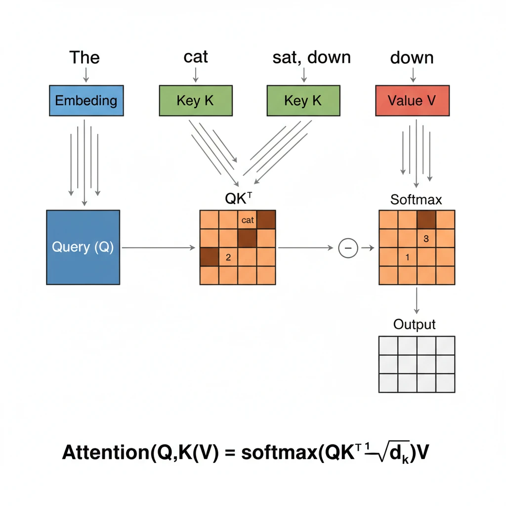

import Challenge from '../../../components/QuizUI/Challenge';
import QuizUI from '../../../components/QuizUI/QuizUI';

<section class="inset">
  Are you transformer-ready or still stuck in the RNN era? 🤖
</section>

This comprehensive quiz dives deep into Large Language Models and Transformer architecture. From attention mechanisms to training processes, from scaling laws to real-world gotchas—we'll separate the prompt engineers from the architecture wizards.

**Prove your modern AI skillz!** 🚀

### 15 Questions... Begin!

<QuizUI>

<Challenge
  client:load
  group="Warmup"
  title="LLM Definition"
  index={0}
  options={[
    {text: 'Neural networks trained on vast amounts of text data', isAnswer: true },
    {text: 'Rule-based systems for natural language processing'},
    {text: 'Statistical models that only work with structured data'},
    {text: 'Traditional machine learning algorithms with large parameter counts'},
    {text: 'Expert systems with linguistic knowledge bases'},
    {text: 'Symbolic AI systems using first-order logic'},
  ]}
>

  <slot name="question">
  

    Which statement **MOST accurately** describes a Large Language Model (LLM)?
  

  </slot>

  <slot name='hints'>
    Think about what fundamentally distinguishes modern LLMs from earlier NLP approaches.
  </slot>

  <slot name='explanation'>
  

    Large Language Models are neural networks, specifically transformer-based architectures, trained on massive datasets of text to learn patterns in language. They can generate, understand, and manipulate text through learned representations rather than explicit rules.

    **Why other options are wrong:**
    - Rule-based systems require hand-crafted linguistic rules, unlike LLMs that learn patterns from data
    - LLMs work with unstructured text data, not just structured data
    - Traditional ML algorithms typically can't handle the complexity and scale of language understanding that LLMs achieve
    - Expert systems rely on explicitly programmed knowledge, while LLMs learn implicitly from training data
    - Symbolic AI uses logical representations, while LLMs use distributed neural representations
  

  </slot>

</Challenge>

<Challenge
  client:load
  group="Warmup"
  title="Transformer Innovation"
  index={1}
  options={[
    {text: 'Recurrent Neural Networks (RNNs)'},
    {text: 'Convolutional Neural Networks (CNNs)'},
    {text: 'Self-attention mechanisms', isAnswer: true},
    {text: 'Long Short-Term Memory (LSTM) units'},
    {text: 'Gated Recurrent Units (GRUs)'},
    {text: 'Residual connections and skip layers'},
  ]}
>

  <slot name="question">
  

    What key innovation introduced in "Attention Is All You Need" made Transformers so effective?
  

  </slot>

  <slot name='hints'>
    The paper's title gives away the core insight about what component became central.
  </slot>

  <slot name='explanation'>
  

    The Transformer architecture's breakthrough was the self-attention mechanism, which allows models to directly attend to all positions in a sequence simultaneously, eliminating the need for recurrent connections and enabling much better parallelization during training.

    **Why other architectures fell short:**
    - RNNs and LSTMs process sequences sequentially, creating bottlenecks and gradient flow issues
    - CNNs have limited receptive fields and struggle with long-range dependencies
    - GRUs still suffer from sequential processing limitations
    - While residual connections help with training depth, they weren't the core innovation that enabled the Transformer's success
  

  </slot>

</Challenge>

<Challenge
  client:load
  group="Architecture Fundamentals"
  title="Attention Mechanism"
  index={2}
  options={[
    {text: 'Query, Key, Value', isAnswer: true},
    {text: 'Input, Hidden, Output'},
    {text: 'Encoder, Decoder, Attention'},
    {text: 'Forward, Backward, Update'},
    {text: 'Embedding, Position, Context'},
    {text: 'Source, Target, Alignment'},
  ]}
>

  <slot name="question">
  

    In the self-attention mechanism, what are the three main matrices computed from the input embeddings?
  

  </slot>

  <slot name='hints'>
    Think about the database analogy: you have something you're looking for, something to match against, and something to retrieve.
  </slot>

  <slot name='explanation'>
  

    Self-attention computes three matrices: Query (Q), Key (K), and Value (V). The attention weights are calculated as softmax(QK^T/√d_k), which are then used to weight the Value matrix. This allows the model to determine which parts of the input to focus on.

    
    *Visual breakdown: Input tokens flow through linear transformations to create Q, K, V matrices. The attention weights (shown as heatmap) determine how much each token should focus on every other token.*

    **Database analogy:** Query is "what you're looking for," Key is "what to match against," and Value is "what to retrieve" when there's a match.

    **Key insight:** Unlike RNNs that process sequentially, self-attention allows every token to directly interact with every other token in parallel, enabling much more efficient training and better capture of long-range dependencies.
  

  </slot>

</Challenge>

<Challenge
  client:load
  group="Architecture Fundamentals"
  title="Multi-Head Attention"
  index={3}
  options={[
    {text: 'To process multiple languages simultaneously'},
    {text: 'To capture different types of relationships and representations', isAnswer: true},
    {text: 'To increase the model size exponentially'},
    {text: 'To reduce computational complexity through parallelization'},
    {text: 'To enable bidirectional attention in decoder layers'},
    {text: 'To implement ensemble learning within a single model'},
  ]}
>

  <slot name="question">
  

    Why do Transformers use multi-head attention instead of single-head attention?
  

  </slot>

  <slot name='hints'>
    Consider what happens when you have multiple "perspectives" on the same data.
  </slot>

  <slot name='explanation'>
  

    Multi-head attention allows the model to attend to information from different representation subspaces at different positions. Each head can learn to focus on different types of relationships (syntactic, semantic, positional, etc.), providing richer representations than a single attention head could capture.

    **Why other explanations miss the mark:**
    - It's not about multiple languages—each head processes the same input language
    - It doesn't reduce computational complexity—it actually increases it
    - Decoder attention masking is separate from the multi-head mechanism
    - While it provides some ensemble-like benefits, that's not the primary purpose
  

  </slot>

</Challenge>

<Challenge
  client:load
  group="Architecture Fundamentals"
  title="Positional Encoding"
  index={4}
  options={[
    {text: 'Transformers process sequences sequentially like RNNs'},
    {text: 'Position information is automatically learned during training without explicit encoding'},
    {text: 'Transformers have no inherent notion of sequence order', isAnswer: true},
    {text: 'Word embeddings contain sufficient positional information'},
    {text: 'Attention weights naturally encode position through their computation'},
    {text: 'Layer normalization provides implicit positional awareness'},
    {text: 'Residual connections preserve sequential order information'},
  ]}
>

  <slot name="question">
  

    Which statement **BEST** explains why Transformers require positional encodings?
  

  </slot>

  <slot name='hints'>
    Think about what makes RNNs naturally position-aware versus how self-attention operates.
  </slot>

  <slot name='explanation'>
  

    Unlike RNNs that process sequences step-by-step, Transformers process all positions in parallel through self-attention. This means they have no inherent understanding of sequence order, so positional encodings (using sine/cosine functions or learned embeddings) must be added to give the model information about token positions.

    **Why other explanations fall short:**
    - Transformers explicitly don't process sequentially—that's their key advantage for parallelization
    - Position information requires explicit encoding; it doesn't emerge automatically from standard training
    - Word embeddings are position-agnostic by design
    - Attention weights reflect content relationships, not inherent positional structure
    - Layer norm and residual connections help with gradient flow but don't provide positional information
  

  </slot>

</Challenge>

<Challenge
  client:load
  group="Model Training"
  title="Pre-training Objective"
  index={5}
  options={[
    {text: 'Next token prediction (causal language modeling)', isAnswer: true},
    {text: 'Masked language modeling only'},
    {text: 'Bidirectional context prediction'},
    {text: 'Sequence-to-sequence translation'},
    {text: 'Contrastive learning between text pairs'},
    {text: 'Multi-task learning across NLP benchmarks'},
  ]}
>

  <slot name="question">
  

    What is the primary training objective for decoder-only models like GPT during pre-training?
  

  </slot>

  <slot name='hints'>
    Consider what "decoder-only" means for the attention pattern and prediction task.
  </slot>

  <slot name='explanation'>
  

    GPT-style models are trained with causal language modeling, where the model learns to predict the next token in a sequence given all previous tokens. This self-supervised approach allows models to learn rich language representations from large amounts of unlabeled text data.

    **Key distinction:** While BERT uses masked language modeling (bidirectional), GPT uses causal/autoregressive prediction (unidirectional), which makes it naturally suited for text generation tasks.
  

  </slot>

</Challenge>

<Challenge
  client:load
  group="Model Training"
  title="Fine-tuning vs Pre-training"
  index={6}
  options={[
    {text: 'Fine-tuning adapts a pre-trained model to specific tasks with smaller datasets', isAnswer: true},
    {text: 'Fine-tuning is the initial training phase on large datasets'},
    {text: 'Fine-tuning and pre-training use identical learning rates and objectives'},
    {text: 'Fine-tuning requires more computational resources than pre-training'},
    {text: 'Fine-tuning replaces the pre-training weights entirely'},
    {text: 'Fine-tuning only updates the final classification layer'},
  ]}
>

  <slot name="question">
  

    Which statement **MOST accurately** describes the relationship between pre-training and fine-tuning?
  

  </slot>

  <slot name='hints'>
  </slot>

  <slot name='explanation'>
  

    Pre-training involves training a model on massive amounts of general text data to learn language representations. Fine-tuning then adapts this pre-trained model to specific tasks or domains using smaller, task-specific datasets. This transfer learning approach is more efficient than training from scratch for each task.

    **Why other options are incorrect:**
    - Fine-tuning comes after pre-training, not before
    - Fine-tuning typically uses different (often lower) learning rates and task-specific objectives
    - Pre-training requires vastly more compute due to dataset size and training time
    - Fine-tuning updates most/all parameters, not just the final layer
    - Fine-tuning builds on pre-training weights rather than replacing them
  

  </slot>

</Challenge>

<Challenge
  client:load
  group="Advanced Concepts"
  title="RLHF Process"
  index={7}
  options={[
    {text: 'Reinforcement Learning with Human Feedback trains models to align with human preferences', isAnswer: true},
    {text: 'RLHF is a tokenization technique for handling rare words'},
    {text: 'RLHF is a method for reducing model size through pruning'},
    {text: 'RLHF stands for Recurrent Language Hidden Features'},
    {text: 'RLHF is a distributed training optimization for large clusters'},
    {text: 'RLHF is a regularization technique to prevent overfitting'},
  ]}
>

  <slot name="question">
  

    What is RLHF and why is it critical in modern LLM development?
  

  </slot>

  <slot name='hints'>
    Think about the alignment problem and how human preferences get incorporated into model training.
  </slot>

  <slot name='explanation'>
  

    Reinforcement Learning with Human Feedback (RLHF) is a training technique where human evaluators rank model outputs, and this feedback is used to train a reward model. The LLM is then fine-tuned using reinforcement learning to maximize this reward, helping align the model's behavior with human preferences and values.

    **The three-stage process:** 1) Supervised fine-tuning on high-quality demonstrations, 2) Training a reward model on human preference data, 3) RL optimization using PPO or similar algorithms to maximize the learned reward.

    This addresses the critical alignment problem where models trained purely on next-token prediction may learn to be helpful but not necessarily honest or harmless.
  

  </slot>

</Challenge>

<Challenge
  client:load
  group="Advanced Concepts"
  title="Scaling Laws"
  index={8}
  options={[
    {text: 'Performance improvements plateau after 1 billion parameters'},
    {text: 'Model performance scales predictably with compute, data, and parameters', isAnswer: true},
    {text: 'Larger models always perform worse due to overfitting'},
    {text: 'Scaling laws only apply to computer vision models'},
    {text: 'Performance scales linearly with model size in all domains'},
    {text: 'Scaling laws break down completely beyond 10B parameters'},
  ]}
>

  <slot name="question">
  

    What do scaling laws in LLMs tell us about the relationship between model size and performance?
  

  </slot>

  <slot name='hints'>
    Consider the Chinchilla paper and what it revealed about optimal compute allocation.
  </slot>

  <slot name='explanation'>
  

    Scaling laws, as described by researchers like Kaplan et al. and Hoffmann et al. (Chinchilla), show that LLM performance scales predictably with three factors: compute budget, dataset size, and model parameters. These follow power-law relationships, suggesting that larger models trained on more data with more compute will generally perform better, though with diminishing returns.

    **Key insight:** The Chinchilla paper showed that many large models were undertrained—optimal performance requires balancing model size with training data, not just scaling parameters.

    **Why other options miss the mark:**
    - There's no clear plateau at 1B parameters; improvements continue at much larger scales
    - Overfitting isn't the primary concern with proper regularization and enough data
    - Scaling laws apply broadly across domains, not just vision
    - The relationship is power-law (sublinear), not linear
    - Recent models like GPT-4 and PaLM show scaling laws continuing beyond 10B
  

  </slot>

</Challenge>

<Challenge
  client:load
  group="Advanced Concepts"
  title="Tokenization Methods"
  index={9}
  options={[
    {text: 'Word-level tokenization'},
    {text: 'Character-level tokenization'},
    {text: 'Byte Pair Encoding (BPE)', isAnswer: true},
    {text: 'Sentence-level tokenization'},
    {text: 'Phoneme-based tokenization'},
    {text: 'Morphological tokenization'},
  ]}
>

  <slot name="question">
  

    Which tokenization method is **MOST commonly** used in modern LLMs like GPT and BERT?
  

  </slot>

  <slot name='hints'>
    Think about the balance between vocabulary size, semantic meaning, and handling unknown words.
  </slot>

  <slot name='explanation'>
  

    Byte Pair Encoding (BPE) and its variants (like SentencePiece) are the most common tokenization methods in modern LLMs. BPE starts with characters and iteratively merges the most frequent pairs, creating subword units that balance vocabulary size with meaningful semantic units, handling out-of-vocabulary words better than word-level tokenization.

    **Advantages of BPE:**
    - Handles rare/unknown words by breaking them into known subwords
    - Keeps vocabulary size manageable (typically 30K-50K tokens)
    - Preserves semantic relationships better than pure character-level
    - Language-agnostic and doesn't require linguistic knowledge

    **Why other methods are less common:**
    - Word-level creates huge vocabularies and can't handle unknown words
    - Character-level requires much longer sequences and loses semantic chunking
    - Sentence-level is too coarse for most language modeling tasks
    - Phoneme and morphological approaches require language-specific knowledge
  

  </slot>

</Challenge>

<Challenge
  client:load
  group="Real-World Applications"
  title="Model Architectures"
  index={10}
  options={[
    {text: 'BERT uses decoder-only architecture with causal masking'},
    {text: 'GPT uses encoder-only architecture with bidirectional attention'},
    {text: 'T5 uses encoder-decoder architecture', isAnswer: true},
    {text: 'All transformer models use identical architectural patterns'},
    {text: 'PaLM uses encoder-decoder with cross-attention'},
    {text: 'BERT and GPT both use full encoder-decoder architectures'},
  ]}
>

  <slot name="question">
  

    Which statement about transformer model architectures is **MOST accurate**?
  

  </slot>

  <slot name='hints'>
    Think about what "encoder-only," "decoder-only," and "encoder-decoder" mean for attention patterns.
  </slot>

  <slot name='explanation'>
  

    Different transformer models use different architectural patterns: BERT uses encoder-only (bidirectional attention), GPT uses decoder-only (causal/autoregressive), and T5 uses encoder-decoder architecture. Each design choice makes them suitable for different tasks—BERT for understanding, GPT for generation, and T5 for sequence-to-sequence tasks.

    **Architecture breakdown:**
    - **BERT (encoder-only):** Bidirectional attention, good for classification/understanding tasks
    - **GPT (decoder-only):** Causal attention, optimized for text generation
    - **T5 (encoder-decoder):** Encoder has bidirectional attention, decoder has causal attention, good for translation/summarization
    - **PaLM:** Actually decoder-only like GPT, not encoder-decoder

    **Why other statements are wrong:**
    - BERT uses encoder-only with bidirectional attention, not decoder-only with causal masking
    - GPT uses decoder-only with causal attention, not encoder-only with bidirectional
    - Each architecture is optimized for different use cases—they're not identical
  

  </slot>

</Challenge>

<Challenge
  client:load
  group="Real-World Applications"
  title="Prompt Engineering"
  index={11}
  options={[
    {text: 'The way you structure input to get desired outputs from LLMs', isAnswer: true},
    {text: 'The process of training new language models from scratch'},
    {text: 'A technique for reducing model size through quantization'},
    {text: 'A method for tokenizing input text efficiently'},
    {text: 'The architecture design phase for transformer models'},
    {text: 'A distributed training strategy for large models'},
  ]}
>

  <slot name="question">
  

    What is prompt engineering in the context of LLMs?
  

  </slot>

  <slot name='hints'>
    Think about what you do before hitting "send" to an LLM to get better results.
  </slot>

  <slot name='explanation'>
  

    Prompt engineering is the practice of carefully crafting input prompts to elicit desired behaviors from pre-trained language models. This includes techniques like few-shot prompting, chain-of-thought reasoning, and instruction following to maximize model performance without additional training.

    **Key techniques include:**
    - **Few-shot prompting:** Providing examples in the prompt
    - **Chain-of-thought:** Encouraging step-by-step reasoning
    - **Role prompting:** Having the model adopt a specific persona
    - **Template design:** Structuring inputs for consistency

    **Why it matters:** Since most users interact with LLMs through prompts rather than fine-tuning, prompt engineering has become a critical skill for getting reliable, high-quality outputs from these models.
  

  </slot>

</Challenge>

<Challenge
  client:load
  group="Evaluation & Benchmarks"
  title="Model Evaluation"
  index={12}
  options={[
    {text: 'BLEU score (bilingual evaluation understudy)'},
    {text: 'Perplexity', isAnswer: true},
    {text: 'F1 score'},
    {text: 'Accuracy'},
    {text: 'ROUGE score (recall-oriented understudy)'},
    {text: 'METEOR (metric for evaluation of translation)'},
  ]}
>

  <slot name="question">
  

    Which metric is **MOST commonly** used to evaluate language model quality during pre-training?
  

  </slot>

  <slot name='hints'>
    Think about what metric directly relates to the language modeling objective itself.
  </slot>

  <slot name='explanation'>
  

    Perplexity is the standard metric for evaluating language models during training, measuring how well a model predicts a sample of text. Lower perplexity indicates better performance. It's calculated as 2^(cross-entropy loss), representing the average number of choices the model is uncertain about when predicting the next token.

    **Intuition:** Perplexity can be thought of as the "effective vocabulary size" the model is choosing from at each step. A perplexity of 10 means the model is, on average, as confused as if it had to choose uniformly from 10 options.

    **Why other metrics are less suitable for pre-training:**
    - BLEU, ROUGE, METEOR are for specific tasks like translation/summarization
    - F1 and accuracy are for classification tasks
    - Perplexity directly measures the core language modeling objective
  

  </slot>

</Challenge>

<Challenge
  client:load
  group="Limitations & Challenges"
  title="Hallucination Problem"
  index={13}
  options={[
    {text: 'When models generate plausible but factually incorrect information', isAnswer: true},
    {text: 'When models fail to generate any output whatsoever'},
    {text: 'When models only repeat training data verbatim'},
    {text: 'When models generate outputs in the wrong language'},
    {text: 'When models produce garbled or nonsensical text'},
    {text: 'When models refuse to answer any questions'},
  ]}
>

  <slot name="question">
  

    What does "hallucination" mean in the context of LLM outputs?
  

  </slot>

  <slot name='hints'>
    The term suggests something that seems real but isn't actually there.
  </slot>

  <slot name='explanation'>
  

    Hallucination refers to when LLMs generate content that appears plausible and well-structured but is factually incorrect or not grounded in their training data. This is a significant challenge because the outputs can be convincing while being wrong, making it difficult for users to identify inaccurate information.

    **Why this happens:**
    - LLMs are trained to predict plausible next tokens, not to be factually accurate
    - They can confabulate details that "sound right" based on patterns in training data
    - They lack real-time access to factual databases or the ability to verify claims

    **Mitigation strategies:**
    - Retrieval-augmented generation (RAG)
    - Fact-checking and citation systems
    - Confidence calibration and uncertainty quantification
    - Human feedback and verification loops
  

  </slot>

</Challenge>

<Challenge
  client:load
  group="Recent Developments"
  title="Emergent Abilities"
  index={14}
  options={[
    {text: 'Capabilities that appear suddenly at certain model scales without being explicitly trained', isAnswer: true},
    {text: 'Features that only work with specific programming languages'},
    {text: 'Abilities that require additional fine-tuning to unlock'},
    {text: 'Functions that emerge only during inference time optimization'},
    {text: 'Skills that develop through self-play and reinforcement learning'},
    {text: 'Capabilities that transfer from one domain to completely unrelated domains'},
  ]}
>

  <slot name="question">
  

    What are "emergent abilities" in large language models?
  

  </slot>

  <slot name='hints'>
    Think about phase transitions—sudden changes that happen when you cross a threshold.
  </slot>

  <slot name='explanation'>
  

    Emergent abilities are capabilities that appear in large language models at certain scales that are not present in smaller models and were not explicitly trained for. Examples include few-shot learning, chain-of-thought reasoning, and complex problem-solving. These abilities seem to emerge when models reach sufficient size and training, suggesting phase transitions in model capabilities.

    **Notable examples:**
    - **Few-shot learning:** Learning from just a few examples in the prompt
    - **Chain-of-thought reasoning:** Breaking down complex problems step-by-step
    - **Code generation:** Writing functional programs from natural language descriptions
    - **Mathematical reasoning:** Solving multi-step word problems

    **The mystery:** We don't fully understand why these abilities emerge at specific scales or how to predict what new capabilities might appear with even larger models. This makes scaling both exciting and somewhat unpredictable.
  

  </slot>

</Challenge>

</QuizUI>