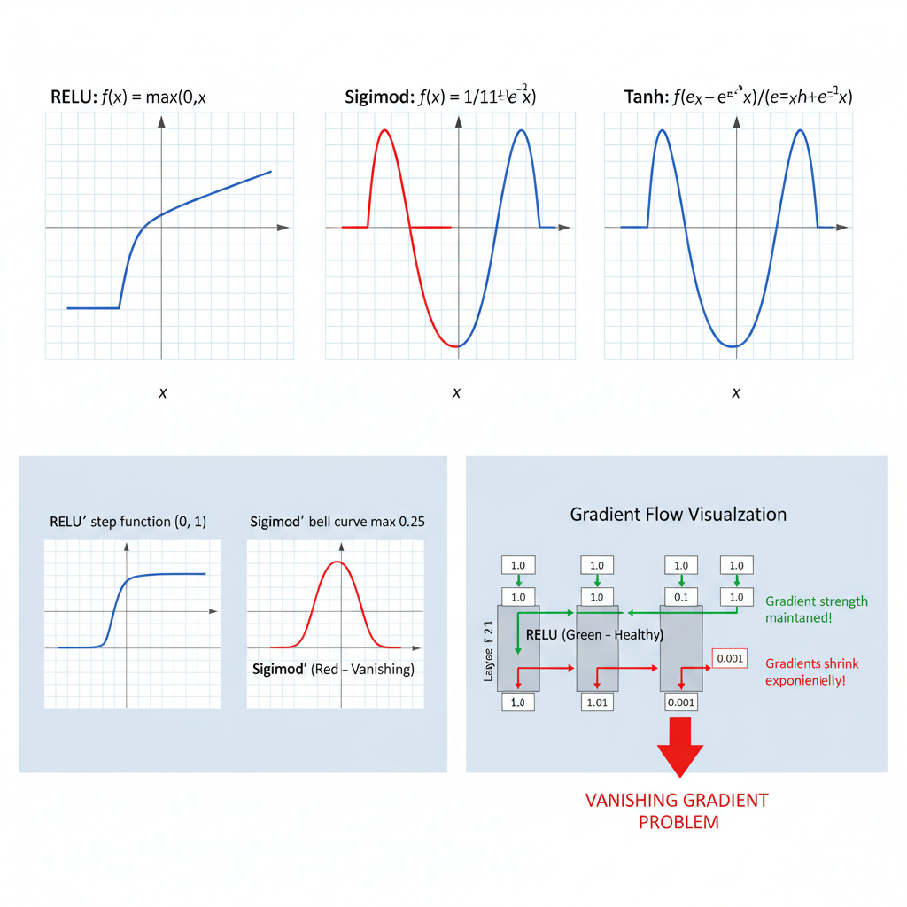

import Challenge from '../../../components/QuizUI/Challenge';
import QuizUI from '../../../components/QuizUI/QuizUI';

<section class="inset">
  Time to separate the ReLU rookies from the activation aficionados! 🔥
</section>

Activation functions are the heart of neural networks, determining how information flows and transforms through layers. ReLU revolutionized deep learning by solving critical problems that plagued earlier activation functions—but do you really understand why?

From the basic mathematical definition to cutting-edge alternatives like Swish and GELU, **prove your deep learning foundation is solid!** 🚀

### 14 Questions on Neural Networks and ReLU Functions... Begin!

<QuizUI>

<Challenge
  client:load
  index={0}
  group="Activation Fundamentals"
  title="ReLU Mathematical Definition"
  options={[
    {text: 'ReLU(x) = max(0, x)', isAnswer: true },
    {text: 'ReLU(x) = min(0, x)'},
    {text: 'ReLU(x) = x/(1 + e^(-x))'},
    {text: 'ReLU(x) = (e^x - e^(-x))/(e^x + e^(-x))'},
    {text: 'ReLU(x) = x if x > 0, -x if x < 0'},
    {text: 'ReLU(x) = |x|'},
  ]}
>
  <slot name="question">
  

    What is the **correct** mathematical definition of the ReLU (Rectified Linear Unit) activation function?
  

  </slot>

  <slot name='hints'>
    "Rectified" means corrected or set right. Think about what happens to negative values.
  </slot>

  <slot name='explanation'>
  

    ReLU(x) = max(0, x) is the standard definition. It outputs the input directly if positive, otherwise zero. This simple piecewise linear function is computationally efficient and helps mitigate the vanishing gradient problem in deep networks.

    **Why other options are wrong:**
    - min(0, x) would give negative values for negative inputs and zero for positive inputs—opposite behavior
    - x/(1 + e^(-x)) is the sigmoid function, not ReLU
    - (e^x - e^(-x))/(e^x + e^(-x)) is the tanh function
    - x if x > 0, -x if x < 0 is the absolute value function
    - |x| would preserve magnitude but lose sign information that ReLU specifically zeros out
  

  </slot>
</Challenge>

<Challenge
  client:load
  index={1}
  group="Activation Fundamentals"
  title="ReLU Derivative"
  options={[
    {text: '1 if x > 0, 0 if x < 0, undefined at x = 0', isAnswer: true },
    {text: 'Always 1 regardless of input value'},
    {text: 'x if x > 0, 0 otherwise'},
    {text: 'e^x / (1 + e^x)^2'},
    {text: '1 if x ≥ 0, 0 if x < 0'},
    {text: '0 if x > 0, 1 if x < 0'},
  ]}
>
  <slot name="question">
  

    What is the derivative of ReLU(x) = max(0, x)?
  

  </slot>

  <slot name='hints'>
    The derivative tells you the slope. What's the slope of y = x when x > 0? What about when x < 0?
  </slot>

  <slot name='explanation'>
  

    The derivative of ReLU is 1 for x > 0, 0 for x < 0, and technically undefined at x = 0 (though often treated as 0 or 1 in practice). This derivative enables efficient backpropagation since it's either 0 or 1, avoiding the exponential computations needed for sigmoid/tanh derivatives.

    **Why other options are incorrect:**
    - "Always 1" ignores the zero region where slope is actually 0
    - "x if x > 0" would be the derivative of x²/2, not ReLU
    - "e^x / (1 + e^x)²" is the derivative of sigmoid
    - "1 if x ≥ 0" incorrectly includes x = 0 where derivative is undefined
    - "0 if x > 0, 1 if x < 0" has the regions exactly backwards

    **Practical note:** The undefined derivative at x = 0 rarely matters since exact zero inputs are uncommon with floating-point arithmetic.
  

  </slot>
</Challenge>

<Challenge
  client:load
  index={2}
  group="Activation Fundamentals"
  title="Vanishing Gradient Problem"
  options={[
    {text: 'ReLU maintains constant gradients for positive inputs', isAnswer: true },
    {text: 'ReLU amplifies gradients exponentially for large inputs'},
    {text: 'ReLU has no effect on gradient flow compared to sigmoid'},
    {text: 'ReLU causes gradients to explode in deep networks'},
    {text: 'ReLU eliminates gradients entirely for all negative inputs'},
    {text: 'ReLU provides adaptive gradients based on input magnitude'},
  ]}
>
  <slot name="question">
  

    How does ReLU help mitigate the vanishing gradient problem compared to sigmoid activation?
  

  </slot>

  <slot name='hints'>
    Compare what happens to gradients in the "active" region of ReLU versus the saturation regions of sigmoid.
  </slot>

  <slot name='explanation'>
  

    ReLU has a constant gradient of 1 for positive inputs, unlike sigmoid whose gradient approaches 0 at the extremes. This prevents gradients from vanishing as they propagate backward through deep networks, enabling training of much deeper architectures.

    
    *Visual comparison: ReLU maintains unit gradients (green) while sigmoid gradients diminish exponentially through layers (red). This multiplicative effect makes early layers impossible to train with sigmoid in deep networks.*

    **The vanishing gradient problem:** In deep networks with sigmoid activations, gradients get multiplied by many small values (σ'(x) ≤ 0.25), causing them to approach zero in early layers. With a 10-layer network, gradients can shrink by (0.25)^10 ≈ 0.000001!

    **Historical impact:** This problem limited neural networks to ~2-3 layers before ReLU. The "deep learning revolution" was largely enabled by ReLU allowing networks with 10s or 100s of layers.

    **Why other explanations are wrong:**
    - ReLU doesn't amplify gradients—it preserves them (gradient = 1, not > 1)
    - ReLU significantly improves gradient flow compared to sigmoid
    - Gradient explosion is a separate problem, not caused by ReLU
    - While ReLU zeros gradients for negative inputs, this is the "dead neuron" problem, not vanishing gradients
    - ReLU gradients are fixed (0 or 1), not adaptive to input magnitude
  

  </slot>
</Challenge>

<Challenge
  client:load
  index={3}
  group="ReLU Deep Dive"
  title="Dead Neuron Problem"
  options={[
    {text: 'Lower learning rate and check weight initialization'},
    {text: 'Switch to Leaky ReLU with α = 0.01', isAnswer: true},
    {text: 'Add more layers to increase network capacity'},
    {text: 'Increase batch size to stabilize training'},
    {text: 'Apply stronger L2 regularization'},
    {text: 'Use gradient clipping to prevent large updates'},
  ]}
>
  <slot name="question">
  

    Your network has 60% dead neurons (always output 0) after switching to higher learning rates. What's the **MOST direct** fix?
  

  </slot>

  <slot name='hints'>
    Dead neurons occur when ReLU inputs are consistently negative. What activation variant addresses this specific issue?
  </slot>

  <slot name='explanation'>
  

    Dead neurons occur when a ReLU unit consistently receives negative inputs, causing it to output zero. Since the gradient is also zero for negative inputs, these neurons stop learning entirely. Leaky ReLU with α = 0.01 provides a small but non-zero gradient (0.01) for negative inputs, allowing "dead" neurons to potentially recover.

    **Why other solutions are less direct:**
    - Lower learning rate might help but doesn't address the fundamental issue
    - Better initialization prevents the problem but doesn't fix existing dead neurons
    - More layers won't revive dead neurons in existing layers
    - Batch size affects training dynamics but not the dead neuron mechanism
    - L2 regularization might worsen the problem by pushing weights toward zero
    - Gradient clipping addresses exploding gradients, not dead neurons

    **Alternative solutions:** ELU, Swish, or proper He initialization can also help, but Leaky ReLU is the most direct architectural fix for this specific problem.
  

  </slot>
</Challenge>

<Challenge
  client:load
  index={4}
  group="ReLU Deep Dive"
  title="Leaky ReLU Definition"
  options={[
    {text: 'LeakyReLU(x) = max(αx, x) where α is a small positive constant (e.g., 0.01)', isAnswer: true },
    {text: 'LeakyReLU(x) = max(0, x) + α for small positive α'},
    {text: 'LeakyReLU(x) = x * α if x < 0, x otherwise'},
    {text: 'LeakyReLU(x) = sigmoid(x) + αx'},
    {text: 'LeakyReLU(x) = ReLU(x) + α * ReLU(-x)'},
    {text: 'LeakyReLU(x) = x + α * max(0, -x)'},
  ]}
>
  <slot name="question">
  

    What is the **MOST accurate** mathematical definition of Leaky ReLU?
  

  </slot>

  <slot name='hints'>
    Think about what "leaky" means—some signal gets through even in the negative region.
  </slot>

  <slot name='explanation'>
  

    Leaky ReLU is defined as max(αx, x) where α is typically 0.01. For negative inputs, it outputs αx instead of 0, providing a small but non-zero gradient that allows "dead" neurons to potentially recover during training.

    **Equivalent formulations:**
    - LeakyReLU(x) = x if x > 0, αx if x ≤ 0  
    - LeakyReLU(x) = max(αx, x) (most compact)

    **Why other definitions are wrong:**
    - max(0, x) + α adds a constant shift, not a leaky negative region
    - "x * α if x < 0, x otherwise" is correct behavior but less elegant notation
    - sigmoid(x) + αx combines two different activation paradigms incorrectly
    - ReLU(x) + α * ReLU(-x) is mathematically equivalent but unnecessarily complex
    - x + α * max(0, -x) is also equivalent but the max(αx, x) form is standard

    **Key insight:** The "leak" allows a small gradient (α) to flow through for negative inputs, preventing complete neuron death.
  

  </slot>
</Challenge>

<Challenge
  client:load
  index={5}
  group="ReLU Deep Dive"
  title="ReLU Computational Efficiency"
  options={[
    {text: 'O(1) - constant time comparison and assignment', isAnswer: true },
    {text: 'O(log n) - logarithmic in the input dimensionality'},
    {text: 'O(n) - linear in the size of input tensor'},
    {text: 'O(e^n) - exponential due to gradient computation'},
    {text: 'O(n²) - quadratic due to matrix operations'},
    {text: 'O(√n) - square root scaling for numerical stability'},
  ]}
>
  <slot name="question">
  

    What is the computational complexity of evaluating ReLU(x) = max(0, x) for a **single input**?
  

  </slot>

  <slot name='hints'>
    Consider the basic operations: one comparison and one conditional assignment. How does this scale with any parameters?
  </slot>

  <slot name='explanation'>
  

    ReLU has O(1) complexity—it requires only a simple comparison (x > 0) and conditional assignment. This is much more efficient than sigmoid or tanh which require expensive exponential computations, making ReLU ideal for large-scale neural networks.

    **Detailed comparison:**
    - **ReLU:** Single comparison + conditional assignment
    - **Sigmoid:** Exponential computation + division  
    - **Tanh:** Two exponentials + arithmetic operations
    - **Swish:** Exponential + division + multiplication

    **Why other complexities don't apply:**
    - O(log n) or O(n) would suggest the operation scales with input size, but ReLU processes each element independently
    - O(e^n) vastly overestimates—even sigmoid is just O(1) per element
    - O(n²) would imply pairwise operations between inputs
    - O(√n) has no basis in the simple max operation

    **Practical impact:** This efficiency allows ReLU networks to train and infer much faster than networks using transcendental activation functions.
  

  </slot>
</Challenge>

<Challenge
  client:load
  index={6}
  group="Mathematical Foundations"
  title="He Initialization with ReLU"
  options={[
    {text: 'Weights ~ N(0, 2/n_in) where n_in is the number of input units', isAnswer: true },
    {text: 'Weights ~ N(0, 1/n_in) - standard Xavier initialization'},
    {text: 'Weights ~ N(0, 1/(n_in + n_out)) - symmetric Xavier'},
    {text: 'Weights ~ U[-1/√n_in, 1/√n_in] - uniform distribution'},
    {text: 'Weights ~ N(0, 1/√n_in) - normalized Gaussian'},
    {text: 'Weights ~ N(0, 6/(n_in + n_out)) - Xavier for ReLU'},
  ]}
>
  <slot name="question">
  

    What is the **recommended** weight initialization scheme for layers using ReLU activation (He initialization)?
  

  </slot>

  <slot name='hints'>
    ReLU zeros out negative values. How does this affect the variance of activations compared to symmetric functions like tanh?
  </slot>

  <slot name='explanation'>
  

    He initialization uses weights drawn from N(0, 2/n_in), where n_in is the number of input connections. The factor of 2 accounts for ReLU's property of zeroing out negative inputs, maintaining proper variance propagation through the network and preventing activation collapse.

    **The math behind it:**
    - ReLU zeros ~half the inputs, effectively halving the variance
    - To maintain unit variance through layers, we need to compensate with 2x larger initialization
    - For symmetric activations like tanh, Xavier uses variance 1/n_in
    - For ReLU, He uses variance 2/n_in to account for the lost negative half

    **Why other initializations fall short:**
    - Standard Xavier (1/n_in) doesn't account for ReLU's asymmetry
    - Symmetric Xavier (1/(n_in + n_out)) is designed for symmetric activations
    - Uniform distributions can work but Gaussian is more principled
    - 1/√n_in gives wrong scaling (standard deviation vs variance)
    - 6/(n_in + n_out) is Xavier for symmetric functions, wrong for ReLU
  

  </slot>
</Challenge>

<Challenge
  client:load
  index={7}
  group="Mathematical Foundations"
  title="ReLU Output Distribution"
  options={[
    {text: 'Half-normal distribution (truncated normal at zero)', isAnswer: true },
    {text: 'Uniform distribution over [0, ∞)'},
    {text: 'Exponential distribution with rate parameter λ'},
    {text: 'Standard normal distribution N(0,1)'},
    {text: 'Chi-squared distribution with 1 degree of freedom'},
    {text: 'Rayleigh distribution for non-negative values'},
  ]}
>
  <slot name="question">
  

    If the input to a ReLU layer follows a zero-mean normal distribution, what distribution do the outputs follow?
  

  </slot>

  <slot name='hints'>
    ReLU keeps positive values unchanged and zeros out negative values. What does this do to a symmetric distribution?
  </slot>

  <slot name='explanation'>
  

    When ReLU is applied to normally distributed inputs with zero mean, the output follows a half-normal distribution—essentially a normal distribution truncated at zero. This asymmetric distribution affects the statistics of subsequent layers and influences batch normalization behavior.

    **Mathematical details:**
    - Input: X ~ N(0, σ²)  
    - Output: Y = max(0, X)
    - Y follows half-normal distribution with same σ
    - Mean of Y = σ√(2/π) ≈ 0.8σ (no longer zero!)
    - Variance of Y = σ²(1 - 2/π) ≈ 0.36σ²

    **Why other distributions are incorrect:**
    - Uniform distribution would require uniform inputs, not normal
    - Exponential distribution has a specific shape that doesn't match truncated normal
    - Standard normal is symmetric, but ReLU creates asymmetry
    - Chi-squared has quadratic relationship to normal, not linear truncation
    - Rayleigh distribution relates to 2D vector magnitudes, not 1D truncation

    **Practical impact:** This distribution shift can affect convergence and suggests why batch normalization is often placed after ReLU.
  

  </slot>
</Challenge>

<Challenge
  client:load
  index={8}
  group="Mathematical Foundations"
  title="Gradient Flow Mathematics"
  options={[
    {text: '∂L/∂x = ∂L/∂y if x > 0, 0 if x ≤ 0', isAnswer: true },
    {text: '∂L/∂x = ∂L/∂y for all x (gradient passes through unchanged)'},
    {text: '∂L/∂x = x * ∂L/∂y (input-weighted gradient)'},
    {text: '∂L/∂x = sigmoid(∂L/∂y) (sigmoid-gated gradient)'},
    {text: '∂L/∂x = max(0, ∂L/∂y) (ReLU applied to gradient)'},
    {text: '∂L/∂x = |∂L/∂y| (absolute value of upstream gradient)'},
  ]}
>
  <slot name="question">
  

    In backpropagation through a ReLU layer, how is the gradient ∂L/∂x computed from the upstream gradient ∂L/∂y?
  

  </slot>

  <slot name='hints'>
    Chain rule says: local gradient × upstream gradient. What's the local gradient of ReLU?
  </slot>

  <slot name='explanation'>
  

    The gradient through ReLU is ∂L/∂x = ∂L/∂y if x > 0, and 0 if x ≤ 0. This implements the chain rule where the local gradient of ReLU (1 or 0) is multiplied by the upstream gradient, creating a "gate" that either passes or blocks gradient flow.

    **Chain rule breakdown:**
    - ∂L/∂x = (∂L/∂y) × (∂y/∂x)
    - ∂y/∂x = 1 if x > 0, 0 if x ≤ 0 (ReLU derivative)
    - Therefore: ∂L/∂x = ∂L/∂y × 1 = ∂L/∂y when x > 0
    - And: ∂L/∂x = ∂L/∂y × 0 = 0 when x ≤ 0

    **Why other formulations are wrong:**
    - Gradient doesn't pass through unchanged—it gets blocked for negative inputs
    - Input-weighting (x * ∂L/∂y) would be wrong dimensionally and mathematically
    - Sigmoid gating would introduce nonlinearity that doesn't exist in ReLU backprop
    - Applying ReLU to gradients isn't how backprop works
    - Taking absolute value ignores the sign information in gradients

    **Key insight:** ReLU acts as a gradient gate—either fully open (gradient = 1) or fully closed (gradient = 0).
  

  </slot>
</Challenge>

<Challenge
  client:load
  index={9}
  group="Advanced Networks"
  title="ReLU in Convolutional Networks"
  options={[
    {text: 'Applied element-wise to each feature map independently', isAnswer: true },
    {text: 'Applied across channels at each spatial location'},
    {text: 'Applied only to the final fully connected layer'},
    {text: 'Applied as a global pooling operation across spatial dimensions'},
    {text: 'Applied to the concatenated feature maps before spatial pooling'},
    {text: 'Applied channel-wise with learned per-channel thresholds'},
  ]}
>
  <slot name="question">
  

    How is ReLU **typically** applied in convolutional neural network feature maps?
  

  </slot>

  <slot name='hints'>
    Think about preserving spatial structure while adding non-linearity. Does ReLU need to "know" about neighboring pixels?
  </slot>

  <slot name='explanation'>
  

    In CNNs, ReLU is applied element-wise to each activation in each feature map independently. This preserves spatial structure while introducing non-linearity, allowing the network to learn complex spatial patterns and hierarchical features.

    **Standard CNN operation order:**
    1. Convolution → produces feature maps
    2. ReLU → applied element-wise to each pixel in each channel  
    3. (Optional) Pooling → spatial downsampling

    **Why other approaches don't make sense:**
    - Cross-channel application would lose spatial locality that convolutions are designed to capture
    - Applying only to FC layers wastes the benefits of non-linearity in feature extraction
    - Global pooling is a reduction operation, not an activation function
    - Concatenating before pooling would mix different feature channels inappropriately  
    - Per-channel thresholds aren't standard ReLU and would add learnable parameters unnecessarily

    **Key insight:** Element-wise application maintains the spatial dimensions while adding crucial non-linearity after each convolutional layer.
  

  </slot>
</Challenge>

<Challenge
  client:load
  index={10}
  group="Advanced Networks"
  title="Swish Activation Function"
  options={[
    {text: 'Swish(x) = x × sigmoid(x) = x / (1 + e^(-x))', isAnswer: true },
    {text: 'Swish(x) = max(0, x) × sigmoid(x)'},
    {text: 'Swish(x) = x × tanh(x)'},
    {text: 'Swish(x) = x × (1 + e^(-x))'},
    {text: 'Swish(x) = sigmoid(x) × ReLU(x)'},
    {text: 'Swish(x) = x × softmax(x)'},
  ]}
>
  <slot name="question">
  

    What is the mathematical definition of the Swish activation function, which often outperforms ReLU in deeper networks?
  

  </slot>

  <slot name='hints'>
    Swish combines the input with a smooth gating function. Think about what function smoothly transitions from 0 to 1.
  </slot>

  <slot name='explanation'>
  

    Swish(x) = x × sigmoid(x) = x / (1 + e^(-x)). Unlike ReLU, Swish is smooth and differentiable everywhere, with a small negative region that can help with gradient flow. It often achieves better performance than ReLU in very deep networks, particularly in vision tasks.

    **Key properties of Swish:**
    - **Smooth:** No sharp corner at x = 0 like ReLU
    - **Self-gated:** Uses the input to gate itself via sigmoid
    - **Bounded below:** Approaches -0.28x for large negative x
    - **Unbounded above:** Linear growth for large positive x
    - **Non-monotonic:** Slightly decreases for small negative x before increasing

    **Why other definitions are wrong:**
    - max(0, x) × sigmoid(x) would zero out negative values, losing Swish's key property
    - x × tanh(x) is a different function (though also sometimes used)
    - x × (1 + e^(-x)) grows exponentially for negative x
    - sigmoid(x) × ReLU(x) zeros negative values like ReLU
    - softmax requires a vector input, not scalar

    **Performance insight:** Swish's smooth negative region helps gradient flow while maintaining ReLU-like behavior for positive values.
  

  </slot>
</Challenge>

<Challenge
  client:load
  index={11}
  group="Advanced Networks"
  title="GELU Activation Function"
  options={[
    {text: 'GELU(x) = x × Φ(x) where Φ is the standard normal CDF', isAnswer: true },
    {text: 'GELU(x) = max(0, x) × Φ(x)'},
    {text: 'GELU(x) = x × exp(-x²/2)'},
    {text: 'GELU(x) = x × erf(x/√2)'},
    {text: 'GELU(x) = x × (1 + tanh(√(2/π) × x))'},
    {text: 'GELU(x) = x × sigmoid(1.702 × x)'},
  ]}
>
  <slot name="question">
  

    What is the **exact** definition of GELU (Gaussian Error Linear Unit), commonly used in transformer architectures?
  

  </slot>

  <slot name='hints'>
    GELU has a probabilistic interpretation related to dropping inputs based on their values. What function represents "probability that a standard normal variable is less than x"?
  </slot>

  <slot name='explanation'>
  

    GELU(x) = x × Φ(x) where Φ is the standard normal cumulative distribution function. It can be approximated as GELU(x) ≈ 0.5x(1 + tanh(√(2/π)(x + 0.044715x³))). GELU provides a probabilistic interpretation: it's the expected output when input is randomly set to zero with probability 1-Φ(x).

    **Probabilistic intuition:**
    - Φ(x) = probability that standard normal random variable ≤ x
    - GELU(x) = x × P(N(0,1) ≤ x)
    - Larger x values are more likely to "survive" the stochastic zeroing

    **Why other formulations are close but not exact:**
    - max(0, x) × Φ(x) loses the smooth negative region
    - x × exp(-x²/2) is the Gaussian PDF times x, not CDF
    - x × erf(x/√2) is related but erf ≠ Φ (different normalization)
    - The tanh approximation in option 5 is actually a common GELU approximation!
    - The sigmoid approximation is another fast approximation but not exact

    **Transformer connection:** GELU is preferred in transformers because it provides smoother gradients than ReLU while maintaining computational tractability.
  

  </slot>
</Challenge>

<Challenge
  client:load
  index={12}
  group="Practical Applications"
  title="ReLU in Batch Normalization"
  options={[
    {text: 'Conv → Batch Normalization → ReLU', isAnswer: true },
    {text: 'Conv → ReLU → Batch Normalization'},
    {text: 'Batch Normalization → Conv → ReLU'},
    {text: 'ReLU → Conv → Batch Normalization'},
    {text: 'Conv → ReLU → Batch Normalization → ReLU'},
    {text: 'Batch normalization replaces the need for ReLU entirely'},
  ]}
>
  <slot name="question">
  

    What is the **standard** ordering of batch normalization and ReLU activation in modern neural network architectures?
  

  </slot>

  <slot name='hints'>
    Think about what batch normalization does to the distribution of pre-activations, and when you want to apply the non-linearity.
  </slot>

  <slot name='explanation'>
  

    The standard order is: Convolution/Linear → Batch Normalization → ReLU. This allows batch normalization to normalize the pre-activation distribution before applying the non-linearity, leading to more stable training and better gradient flow.

    **Why this order works best:**
    - **BN first:** Normalizes the pre-activations to have good statistical properties
    - **ReLU second:** Applied to the normalized values, maintaining the normalization benefits
    - **Stable gradients:** BN reduces internal covariate shift before the non-linearity

    **Why other orders are suboptimal:**
    - ReLU before BN: BN operates on already non-linear, asymmetric distributions
    - BN before Conv: Normalizes inputs before transformation, less effective
    - Multiple ReLUs: Redundant and can hurt gradient flow
    - BN replacing ReLU: BN is normalization, not non-linearity—both are needed

    **Historical note:** Early ResNet used BN → ReLU → Conv, but the modern standard is Conv → BN → ReLU for better performance.
  

  </slot>

</Challenge>

<Challenge
  client:load
  index={13}
  group="Practical Applications"
  title="ReLU Performance Analysis"
  options={[
    {text: 'Approximately 50% of neurons are active (sparse activation)', isAnswer: true },
    {text: 'All neurons are always active for any given input'},
    {text: 'Less than 10% of neurons are typically active'},
    {text: 'More than 90% of neurons are typically active'},
    {text: 'Activation sparsity varies dramatically with input magnitude'},
    {text: 'Activation patterns are completely random and unpredictable'},
  ]}
>
  <slot name="question">
  

    In a well-trained deep network using ReLU activations, what percentage of neurons are **typically** active for a given input?
  

  </slot>

  <slot name='hints'>
    Think about the statistical properties of ReLU with properly initialized networks. What fraction of a zero-mean distribution is positive?
  </slot>

  <slot name='explanation'>
  

    ReLU networks typically exhibit approximately 50% sparsity—about half the neurons output zero for any given input. This sparse activation pattern reduces computational requirements during inference and provides a form of implicit regularization, contributing to ReLU's effectiveness in deep learning.

    **Why ~50% sparsity:**
    - With proper initialization and training, pre-activations tend to be roughly zero-centered
    - ReLU zeros out negative values, which is ~50% of a symmetric distribution
    - This creates natural feature selection—only relevant neurons activate

    **Benefits of sparsity:**
    - **Computational efficiency:** Zero outputs mean less computation in subsequent layers
    - **Implicit regularization:** Forces the network to use fewer neurons per input
    - **Feature selectivity:** Each neuron specializes for specific input patterns
    - **Biological plausibility:** Real neurons also exhibit sparse firing patterns

    **Why other percentages are less typical:**
    - 100% active would suggest no selectivity (poor ReLU behavior)
    - Less than 10% would indicate severe dead neuron problems
    - More than 90% would suggest the network isn't learning discriminative features
    - While sparsity can vary with input, ~50% is the healthy baseline
  

  </slot>

</Challenge>

</QuizUI>