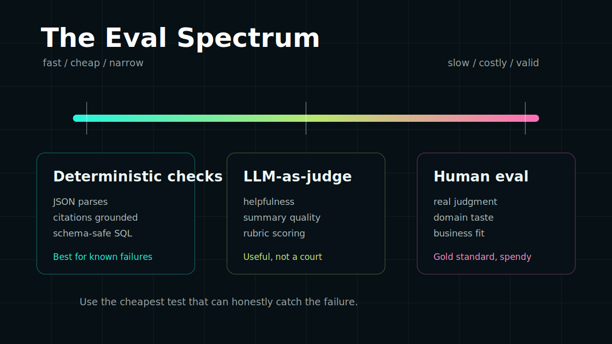
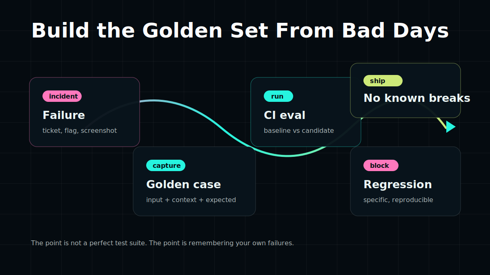

Chaque nouveau modèle arrive vêtu d'un smoking de benchmarks.

MMLU : 92,4 %. HumanEval : 87,2 %. LLeMU : 88,7 %. MATH : 73,6 %. AGI : 127 % !

Pourtant, pour 99 % des entreprises qui construisent des processus et des produits avec l'IA, **rien de tout cela n'a d'importance.**

Ce qui compte ? Comment VOS charges de travail se débrouillent ? En progrès ou en régression ? La seule façon sensée de le savoir est d'écrire des evals (des tests pour les LLM) qui reflètent les tâches, les données et les modes de défaillance spécifiques de votre système.

<blockquote class="breakout">
  <p>Les benchmarks ne mentent pas. Ils répondent à la question de quelqu'un d'autre.</p>
</blockquote>

---

## Ce que coûte vraiment l'« évaluation au feeling »

L'approche standard : déployer un changement de modèle, surveiller les canaux de plaintes, revenir en arrière si la salle s'agite.

Cela rate presque tout ce qui compte :

**Vous ne captez que les bruyants.** Les utilisateurs qui reçoivent une réponse fausse mais convaincante et ne s'en rendent pas compte ? Silence. Ceux qui obtiennent une réponse dégradée et abandonnent la fonctionnalité ? Silence. Les tickets support et les taux d'erreur ne capturent qu'une fraction de la régression qualité.

**Vous ne pouvez pas distinguer les régressions des améliorations.** Si le nouveau modèle est meilleur sur la tâche A et pire sur la tâche B, les plaintes concernant B ressemblent exactement au feedback générique « l'IA s'est dégradée ». Vous ne savez pas quoi corriger.

**Vous utilisez vos utilisateurs comme infrastructure de test.** Ils n'ont pas signé pour ça.

---

## Le spectre des evals (et là où la plupart des équipes se trompent)

Les approches d'évaluation s'inscrivent dans un spectre allant du « rapide mais fragile » à « coûteux mais valide ».

<figure class="breakout">



<figcaption>Utilisez la méthode d'évaluation la moins chère capable de détecter honnêtement la défaillance.</figcaption>
</figure>

**LLM-as-judge** est la coqueluche du moment : demander à un modèle puissant de noter les sorties d'un autre modèle. Rapide, scalable, bon marché. Le problème : cela intègre les biais du modèle évaluateur, peut être manipulé et crée une dépendance circulaire. Si vous utilisez GPT-5 pour noter les sorties de GPT-5, vous mesurez quelque chose comme « dans quelle mesure GPT-5 est d'accord avec GPT-5 ». Ce n'est pas rien, mais ce n'est pas ce que vous croyez.

**L'évaluation humaine** est le standard d'or que tout le monde essaie de sauter. Faire évaluer les sorties par des humains est coûteux, lent, incohérent entre évaluateurs et pénible à planifier. Mais c'est la seule chose qui valide si votre système est utile à des humains réels.

**Les vérifications automatisées spécifiques à une tâche** sont là où la plupart des équipes devraient passer plus de temps. Elles ne sont pas glamour, mais elles sont rapides, déterministes et liées à ce qui compte dans votre système.

---

## Ce qui fonctionne vraiment

### 1. Définir la défaillance avant de déployer

Avant de changer un modèle ou un prompt, écrivez à quoi ressemble un mauvais résultat. Concrètement.

Pas « la sortie doit être exacte ». Ce n'est pas un test. Plutôt :

- Le JSON structuré doit s'analyser sans erreur
- Toutes les citations dans la réponse doivent apparaître mot pour mot dans le contexte récupéré
- Les réponses ne doivent pas mentionner de noms de produits concurrents
- Les requêtes SQL doivent être syntaxiquement valides et ne référencer que des tables existantes dans le schéma
- La classification de sentiment ne doit pas basculer de positif à négatif plus de 3 % du temps sur le jeu de test existant

Vous pouvez vérifier cela programmatiquement. Aucun modèle juge nécessaire.

**Harness d'evals : vérifications déterministes**

```typescript
type EvalResult = { passed: boolean; reason?: string };

const evals: Record<string, (output: string, context: EvalContext) => EvalResult> = {
  // Le JSON doit s'analyser
  validJson: (output) => {
    try {
      JSON.parse(output);
      return { passed: true };
    } catch (e) {
      return { passed: false, reason: `JSON invalide : ${e.message}` };
    }
  },

  // Pas de citations hallucinées — chaque affirmation doit apparaître dans le contexte
  groundedCitations: (output, { retrievedChunks }) => {
    const claims = extractCitations(output);
    const ungrounded = claims.filter(
      (claim) => !retrievedChunks.some((chunk) => chunk.includes(claim))
    );
    return ungrounded.length === 0
      ? { passed: true }
      : { passed: false, reason: `Affirmations non fondées : ${ungrounded.join(', ')}` };
  },

  // Vérification de longueur de réponse — détecter les troncatures ou les générations incontrôlées
  reasonableLength: (output) => {
    const words = output.split(/\s+/).length;
    return words >= 10 && words <= 2000
      ? { passed: true }
      : { passed: false, reason: `Nombre de mots ${words} hors limites` };
  },
};
```

### 2. Constituer un jeu d'or à partir de vos pires journées

Vos meilleures données d'évaluation sont les contenus embarrassants : les sorties qui ont poussé quelqu'un à ouvrir un ticket, à faire une capture d'écran d'une hallucination, ou à cesser tranquillement d'utiliser la fonctionnalité.

Chaque fois qu'un utilisateur signale une mauvaise sortie, signale une hallucination ou que vous remarquez une défaillance manuellement, ajoutez-la à votre jeu d'or : l'entrée, le contexte et le comportement attendu. Gardez 50 à 100 cas et exécutez-les à chaque changement de modèle.

Cela semble manuel au début. Après six mois, vous avez une suite de tests qu'aucun benchmark public ne peut manipuler, car chaque cas provient de votre propre historique de défaillances.

<figure class="breakout">



<figcaption>Un jeu d'or transforme les contenus embarrassants en suite de régression.</figcaption>
</figure>

**Forme d'un cas d'or**

```typescript
interface GoldenCase {
  id: string;
  input: string;
  context: Record<string, unknown>;
  expectedBehavior: {
    mustContain?: string[];
    mustNotContain?: string[];
    structureCheck?: (output: string) => boolean;
    minSimilarityToReference?: number; // similarité cosinus avec une réponse de référence
  };
  sourceIncident?: string; // lien vers le rapport de bug ou le ticket
}
```

### 3. Tests de régression, pas seulement tests d'acceptation

La plupart des équipes exécutent des evals uniquement lorsqu'elles envisagent un changement de modèle. C'est du test d'acceptation : « cette nouvelle chose est-elle assez bonne ? »

Vous avez aussi besoin de tests de régression : « est-ce que cela a cassé quelque chose qui fonctionnait avant ? »

Exécutez votre jeu d'or à chaque changement de prompt, pas seulement à chaque changement de modèle. Un prompt qui fonctionnait bien peut se dégrader silencieusement quand vous ajoutez un nouvel outil, changez une stratégie de récupération RAG ou mettez à jour votre modèle de contexte. Des outils comme [Langfuse](https://langfuse.com/) attachent des scores d'eval aux traces de production pour que la régression apparaisse dans les tableaux de bord, pas seulement dans les rapports d'incident.

<details>
<summary>Harness d'evals : comparaison baseline vs candidat</summary>

```typescript
async function compareModelVersions(
  goldenCases: GoldenCase[],
  baselinePipeline: Pipeline,
  candidatePipeline: Pipeline
) {
  const results = await Promise.all(
    goldenCases.map(async (tc) => {
      const [baseline, candidate] = await Promise.all([
        baselinePipeline.run(tc.input, tc.context),
        candidatePipeline.run(tc.input, tc.context),
      ]);

      return {
        id: tc.id,
        baselinePassed: runEvals(baseline, tc.expectedBehavior),
        candidatePassed: runEvals(candidate, tc.expectedBehavior),
        regression: /* baseline passé */ && /* candidat échoué */,
        improvement: /* baseline échoué */ && /* candidat passé */,
      };
    })
  );

  const regressions = results.filter((r) => r.regression);
  const improvements = results.filter((r) => r.improvement);

  console.log(`Régressions : ${regressions.length} / ${goldenCases.length}`);
  console.log(`Améliorations : ${improvements.length} / ${goldenCases.length}`);

  if (regressions.length > 0) {
    console.error('Régressions bloquantes trouvées :');
    regressions.forEach((r) => console.error(` - ${r.id}`));
  }

  return { regressions, improvements };
}
```

</details>

Si un candidat régresse sur des défaillances connues, la conversation de mise à niveau devient merveilleusement spécifique : quels cas se sont améliorés, quels cas ont cassé, et si le compromis en vaut la peine.

### 4. Utilisez LLM-as-judge pour exactement une chose

LLM-as-judge est utile pour les sorties ouvertes où il n'y a pas de réponse déterministe juste : « cette réponse est-elle utile ? », « ce résumé préserve-t-il les points clés ? », « cette explication est-elle adaptée à un débutant ? »

Utilisez-le là. Ne l'utilisez pas pour des réponses déterministes. Quand vous l'utilisez, rendez le barème de notation explicite :

**Harness d'evals : juge avec barème**

```typescript
async function judgeHelpfulness(
  userQuery: string,
  modelResponse: string
): Promise<{ score: number; reasoning: string }> {
  const judgePrompt = `
Vous évaluez une réponse de support client.

Question de l'utilisateur : ${userQuery}
Réponse : ${modelResponse}

Notez la réponse sur une échelle de 1 à 5 :
5 = Répond directement à la question avec des informations exactes et exploitables
4 = Répond à la question mais pourrait être plus spécifique ou exploitable
3 = Aborde partiellement la question ; des informations clés manquent
2 = Lié de manière tangentielle mais ne répond pas à la question
1 = Hors sujet, factuellement faux ou nuisible

Répondez avec un JSON : {"score": <nombre>, "reasoning": "<une phrase>"}
`;

  const result = await judgeModel.generate(judgePrompt);
  return JSON.parse(result);
}
```

Un barème explicite réduit la variance de l'évaluateur, vous donne une sortie interprétable et facilite l'audit quand le juge se trompe. Des bibliothèques comme [Autoevals](https://github.com/braintrustdata/autoevals) et [Braintrust](https://www.braintrust.dev/) fournissent des barèmes préconstruits pour des tâches courantes — à voler avant d'écrire les vôtres à partir de zéro.

---

## Outils qui valent le coup

Vous n'avez pas à construire tout cela à partir de zéro. Plusieurs outils ont fait de sérieux progrès sur le problème de l'infrastructure d'evals :

**[Braintrust](https://www.braintrust.dev/)** — Plateforme d'evals complète avec suivi d'expériences, gestion de jeux de données et fonctions de notation. Organise les exécutions d'evals par prompt, modèle et déploiement pour que vous puissiez comparer la qualité dans le temps, pas seulement entre les versions. Fonctionne bien avec leur bibliothèque open-source **[Autoevals](https://github.com/braintrustdata/autoevals)**, qui fournit des fonctions de notation préconstruites évaluées par modèle pour des tâches courantes (exactitude factuelle, utilité, toxicité, similarité sémantique).

**[Langfuse](https://langfuse.com/)** — Observabilité LLM open-source qui se place entre votre application et vos modèles. Trace chaque appel, attache des scores d'evals (humains ou automatisés) à chaque span, et révèle les tendances qualité sur le trafic de production. Bonne option si vous voulez observabilité et evals dans le même outil plutôt qu'un harness d'evals séparé.

**[Evalite](https://www.evalite.dev/)** — Framework d'evals natif TypeScript par Matt Pocock. Peu de cérémonie : définissez une tâche, définissez un scoreur, exécutez-le dans votre configuration de test existante. Cible les équipes qui veulent des evals qui ressemblent à des tests unitaires plutôt qu'à une plateforme d'expériences ML séparée.

**[promptfoo](https://www.promptfoo.dev/)** — Exécuteur d'evals CLI-first axé sur la comparaison de prompts et le red-teaming. Facile à configurer via YAML, s'intègre à la plupart des fournisseurs de modèles et dispose d'un support intégré pour détecter l'injection de prompt et d'autres entrées adverses.

**[deepeval](https://docs.confident-ai.com/)** — Framework d'evals Python avec une grande bibliothèque de métriques intégrées (G-Eval, fidélité RAG, pertinence des réponses, détection d'hallucinations). Utile pour les pipelines RAG où vous voulez une notation spécifique pour la qualité de récupération, pas seulement la qualité de génération.

Le bon outil dépend de votre stack et de votre point de départ. Ce qui compte plus que le choix du framework, c'est la discipline d'exécuter des evals — régulièrement, à chaque changement significatif.

---

## La partie inconfortable

La plupart des équipes sautent cela parce que cela pose une question irritante dès le départ : à quoi ressemblerait un « bon » résultat ici ?

C'est véritablement difficile pour une nouvelle fonctionnalité IA. C'est aussi non négociable si vous vous souciez de la fiabilité. Les équipes qui livrent une IA digne de confiance font la même chose que pour tout chemin de code critique : définir le comportement attendu, le tester et exécuter ces tests en continu.

Les benchmarks ne mentent pas. Ils répondent à la question de quelqu'un d'autre. Cessez de les lire comme des feuilles de route produit et commencez à écrire des tests qui correspondent à votre système.

Vos utilisateurs le remarqueront avant vos tableaux de bord. Construisez d'abord la suite de tests.
