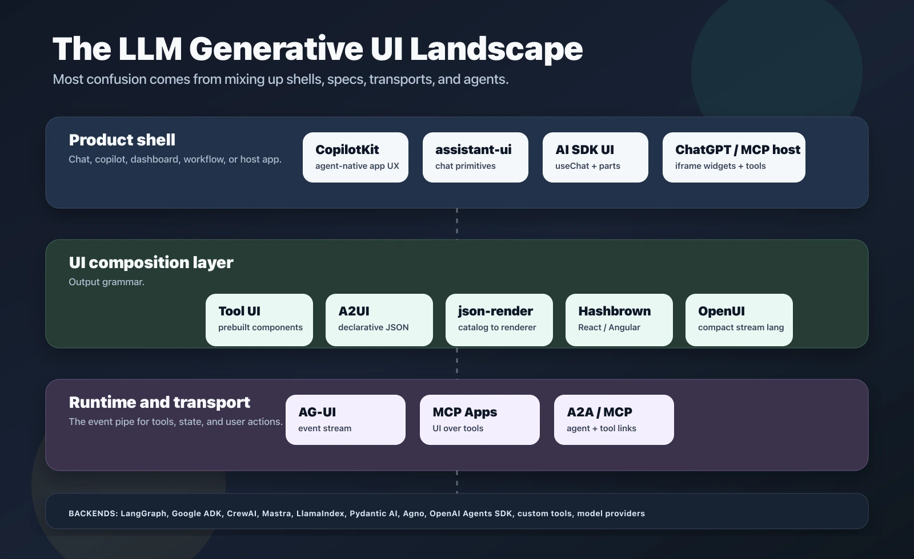
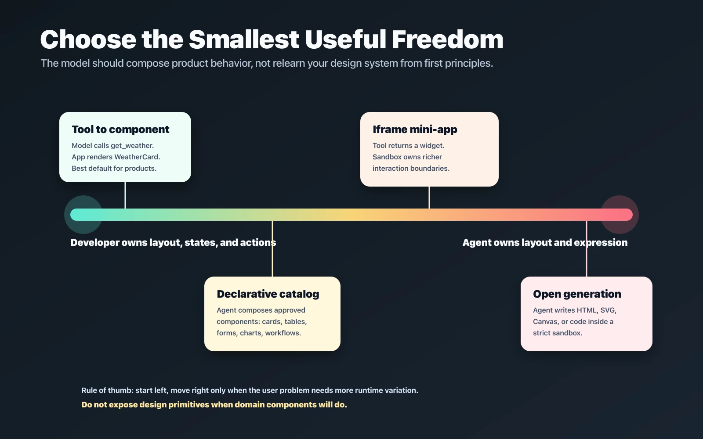

Chat war die Trainingshilfe.

Die erste Generation von LLM-Apps sah mostly wie eine Textbox aus, die an ein Produkt angenagelt war. Das Modell gab Prosa zurück. Das Frontend renderte Markdown. Wenn der Nutzer eine Aktion ausführen musste, beschrieb der Assistent den Button, den der Nutzer irgendwo anders anklicken sollte.

Das war okay für Demos. Es ist nicht, wohin das geht.

Der nächste nützliche Schritt ist **generative UI**: Das Modell antwortet nicht nur mit Text; es hilft dabei zu entscheiden, welche Schnittstelle der Nutzer gerade braucht. Manchmal bedeutet das, ein Tool aufzurufen und eine vorgefertigte Karte zu rendern. Manchmal bedeutet es, einen bekannten Workflow-Komponenten mit frischen Daten zu füllen. Manchmal bedeutet es, ein temporäres Dashboard, Formular, Vergleichstabelle, Diagramm oder interaktives Widget zusammenzustellen.

Leider ist „generative UI" zu einem dieser Ausdrücke geworden, der vor dem Frühstück fünf verschiedene Bedeutungen hat.

Leute benutzen ihn, um Folgendes zu beschreiben:

- ein Modell, das aus vom Entwickler definierten React-Komponenten wählt
- ein JSON-Spez, das das Frontend in native Komponenten rendert
- eine iframe-App, die von einem MCP-Tool zurückgegeben wird
- eine Chat-UI-Bibliothek, die Tool-Calls unterstützt
- ein Agenten-Protokoll, das Zustand zwischen Backend und Frontend streamt
- ein Design-Time-Code-Generator wie v0, Lovable, Bolt oder Cursor
- ein Modell, das bei Laufzeit buchstäblich HTML, SVG, Canvas oder React schreibt

Die sind verwandt, aber sie sind nicht die gleiche Schicht. Wenn man sie vermischt, wird jede Architekturdiskussion zu Suppe.

Das ist die Karte, die ich gewollt hätte, als ich angefangen habe, den aktuellen Stack zu vergleichen.



## Das Kernmissverständnis

Der größte Fehler ist, „generative UI" als eine einzelne Technologieentscheidung zu behandeln.

Es ist besser, das Problem in vier Schichten zu trennen:

1.  **Produktschale**: das Ding, das Nutzer berühren. Das kann ein Chat, Seitenleisten-Copilot, Dashboard, Workflow-Builder, IDE-Panel, ChatGPT-App, Mobile-Screen oder Support-Konsole sein.
2.  **UI-Kompositionsmodell**: die Grammatik, die das Modell sprechen darf. Das können Tool-Calls, JSON, A2UI, json-render, OpenUI Lang, Hashbrown-Komponentenauswahl oder gesandetes HTML sein.
3.  **Laufzeit und Transport**: wie Nachrichten, Tool-Calls, Zustandsdeltas, Nutzeraktionen und UI-Artefakte zwischen Agent und Frontend wandern. AG-UI, MCP Apps, Apps SDK, A2A, SSE, WebSockets und ganz normales HTTP leben hier.
4.  **Agenten- und Tool-Backend**: LangGraph, Google ADK, CrewAI, Mastra, LlamaIndex, Pydantic AI, Agno, OpenAI Agents SDK, benutzerdefinierte Funktionen, Datenbanken, Retrieval und die ganze langweilige Geschäftslogik, die noch korrekt sein muss.

Sobald man die Schichten aufteilt, wird das Ökosystem viel weniger mystisch.

[AG-UI](https://github.com/ag-ui-protocol/ag-ui) ist nicht wirklich ein Konkurrent zu [A2UI](https://github.com/google/A2UI). AG-UI ist ein Ereignisprotokoll für Agent-zu-Anwendung-Interaktion. A2UI ist ein deklaratives UI-Format, das der Agent senden kann. Man kann A2UI über AG-UI legen. Man kann auch benutzerdefinierte tool-gerenderte Komponenten über AG-UI legen.

[json-render](https://github.com/vercel-labs/json-render) ist nicht ein Chat-Produkt. Es ist eine Komponenten-Katalog- und Renderer-Architektur: definiere die Komponenten, die das Modell benutzen darf, lass das Modell einen gültigen JSON-Baum emittieren und rendere diesen Baum sicher.

[CopilotKit](https://github.com/CopilotKit/CopilotKit) ist nicht nur eine Chat-Blase. Es ist ein Frontend-Stack für agent-native Apps: Chat-UI, generative UI, geteilter Zustand, Frontend-Tools und Human-in-the-Loop-Flows.

[OpenAI Apps SDK](https://developers.openai.com/apps-sdk) und [MCP Apps](https://github.com/MCP-UI-Org/mcp-ui) sind keine „mach deine React-App dynamisch"-Tools. Sie sind Host-Integrationsmodelle für das Rendern von Widgets in ChatGPT oder anderen MCP-kompatiblen Hosts.

Die Namen sind verwirrend, weil der Raum jung ist. Die Schichten sind der Teil, der nützlich bleibt.

## Das Kontrollspektrum

Generative UI ist ein Trade-off zwischen **Entwicklerkontrolle** und **Agentenfreiheit**.

Zu viel Kontrolle und der Assistent fühlt sich an wie eine Befehlspalette, die ein Kostüm trägt. Zu viel Freiheit und das Modell fängt an, seltsames Layout zu erfinden, vage Buttons, gebrochene visuelle Hierarchie, unmögliche Zustände und Sicherheitsprobleme mit einem selbstsichenen kleinen Grinsen.

Der Trick ist, die kleinste Menge Freiheit zu wählen, die das Nutzerproblem löst.



Ich denke über das Spektrum so:

**Tool-zu-Komponenten-Rendering** ist die sicherste Standardwahl. Das Modell ruft `get_weather`, `search_products`, `compare_plans` oder `draft_invoice` auf. Die App mappt dieses Tool-Ergebnis auf eine Komponente, die du bereits besitzt: `WeatherCard`, `ProductGrid`, `PlanComparison`, `InvoiceReview`. Das Modell entscheidet *wann* die UI nützlich ist. Entwickler besitzen weiterhin Layout, Styling, Barrierefreiheit, Ladezustände, Empty States und gefährliche Aktionen.

Das ist das Muster, das in [Vercel AI SDKs generative UI Anleitung](https://ai-sdk.dev/docs/ai-sdk-ui/generative-user-interfaces) dokumentiert ist: das Modell ruft ein Tool auf, das Tool gibt Daten zurück, und die UI rendert eine Komponente aus dem Ergebnis. Das ist auch das mentale Modell hinter vielen CopilotKit- und assistant-ui-Implementierungen.

**Deklarative Komponenten-Kataloge** geben dem Modell mehr Raum. Statt eine Komponente zu wählen, komponiert der Baum aus erlaubten Teilen. Ein Katalog kann `Metric`, `Table`, `Chart`, `FilterBar`, `ApprovalPanel` und `Timeline` enthalten. Der Baum kann ein Dashboard oder Workflow-Schritt zusammenstellen, aber er kann keinen beliebigen Code ausführen. Hier sitzen [A2UI](https://github.com/google/A2UI), [json-render](https://github.com/vercel-labs/json-render), [Hashbrown](https://github.com/liveloveapp/hashbrown) und [OpenUI](https://github.com/thesysdev/openui).

**Iframe-Mini-Apps** machen Sinn, wenn die UI reicher sein muss als ein Komponentenbaum, oder wenn ein entfernter Tool-Anbieter die Erfahrung besitzt. MCP Apps und OpenAI Apps SDKs lassen ein Tool strukturierte Daten plus eine Widget-Ressource zurückgeben, die der Host in einem iframe rendert. Das ist mächtig für Karten, Einkaufswagen, Buchungsläufe, Diagramme und externe Produktflächen. Es schafft aber auch eine härtere Grenze zwischen der Host-App und dem Widget.

**Offene Generierung** ist das ferne Ende: der Agent emittiert HTML, SVG, Canvas, WebGL oder andere code-artefakte in ein gesandetes. [OpenGenerativeUI](https://github.com/CopilotKit/OpenGenerativeUI) ist das beste aktuelle Beispiel: der Agent kann algorithmische Visualisierungen, 3D-Szenen, Diagramme und Simulationen in gesandeten iframes generieren. Das ist großartig für einmalige visuelle Erklärungen. Das ist nicht, wo ich für einen Enterprise-Approval-Flow anfangen würde.

Es hilft, die Schlüsselunterscheidung hier zu benennen: **iframe HTML** (das Modell schreibt Code in ein Sandkasten) vs. **JSON-Katalog** (das Modell emittiert ein strukturiertes Spec und dein Renderer mappt es auf vorgebaute Komponenten). Diese klingen verwandt, tragen aber sehr unterschiedliche Risiko- und Komplexitätsprofile. iframe HTML ist maximal ausdrucksstark; die iframe-Grenze macht die Sicherheitsarbeit. JSON-Katalog gibt dem Modell keine ausführbare Freiheit — es kann nur Komponententypen referenzieren, die du im Voraus definiert hast. Die meisten Frameworks in diesem Raum fallen eindeutig in das eine oder andere Lager.

**Jenseits des Sandkastens**: sehr neue Demos deuten darauf hin, dass sich eine vierte Mode bildet — LLMs, die spielartige oder immersive Erfahrungen steuern, indem sie visuellen Output direkter kontrollieren, als es irgendein Komponenten-Katalog erlaubt. Projekte, die von Prompts explorable 3D-Welten generieren, LLM-gelenktes NPC-Verhalten bei Laufzeit und Modell-Inferenz im Browser via WebGPU ([WebLLM](https://mlc.ai/web-llm/)) sind frühe Marker. Es gibt noch keine stabilen Frameworks, um damit Produktionsarbeit zu machen. Ich werde diese Richtung in einem dedizierten Artikel abdecken, sobald sich das ändert.

## Hoch-Level-Komponenten vs. Granulare Komponenten

Das ist die wichtigste Designentscheidung.

Wenn dein Katalog zu granular ist, muss das Modell ein Frontend-Ingenieur werden:

```tsx
Container
Row
Column
Text
Button
Icon
Spacer
Divider
```

Das sieht flexibel aus, aber jetzt muss das Modell Abstände, Hierarchie, Gruppierung, Empty States, Button-Labels, Fehlerbehandlung und responsives Verhalten entscheiden. Du hast auch den Prompt größer gemacht und die Ausgabe leichter zu brechen.

Wenn dein Katalog zu hoch-levelig ist, ist das Modell gefangen:

```tsx
WeatherCard
StockCard
HotelCard
```

Das ist sicher, aber es funktioniert nur für bekannte Szenarien. Das Modell kann keine Vergleichsmatrix machen, fehlende Inputs abfragen oder die Informationsarchitektur ändern, wenn sich die Frage des Nutzers ändert.

Die nützliche Mitte ist **domänen-levelige Komponenten mit eingeschränkten Slots**:

```tsx
SearchResults
ComparisonTable
MetricGroup
EditablePlan
ApprovalRequest
Timeline
DataCollectionForm
CheckoutReview
```

Diese Komponenten kodieren Produktschmack und Geschäftsbeschränkungen. Das Modell darf entscheiden *was angezeigt werden soll*, aber nicht jede CSS-Entscheidung.

Zum Beispiel braucht ein Reiseagent nicht `div`, `span` und `button`. Es braucht:

- `TripSummary`
- `FlightOptionList`
- `HotelComparison`
- `TravelerForm`
- `PolicyNotice`
- `BookingConfirmation`

Ein Finanzagent braucht keinen generischen Charting-Spielplatz. Es braucht:

- `PortfolioSnapshot`
- `TransactionTable`
- `RiskBreakdown`
- `ScenarioComparison`
- `ApprovalGate`

Der Katalog sollte nach deinem Produkt klingen, nicht nach HTML.

## Feature-Tabelle

Diese Tabelle ist absichtlich meinungsstark. Sie behandelt jedes Projekt als Werkzeug in einem Stack, nicht als winner-take-all-Plattform.

| Technologie | Schicht | Beste Passung | UI-Modell | Streaming / Zustand | Hinweise und Beispiele |
| --- | --- | --- | --- | --- | --- |
| [AG-UI](https://github.com/ag-ui-protocol/ag-ui) | Laufzeitprotokoll | Verbindung von Agenten-Backends mit Frontend-Apps | Ereignisse für Nachrichten, Tools, Zustand, Aktivität, Interrupts | Ja; Ereignisstrom plus Zustandssnapshots/-deltas | Benutze es, wenn du ein Standard-Agent-zu-App-Rohr brauchst. Es ergänzt MCP und A2A, statt sie zu ersetzen. |
| [A2UI](https://github.com/google/A2UI) | Deklaratives UI-Protokoll | Plattformübergreifende, agentengenerierte native UI | JSON-Payload, die Komponenten, Datenmodell und Updates beschreibt | Entwickelt für inkrementelle Updates | Starke Wahl für Remote-Agenten und Vertrauensgrenzen. Frühe öffentliche Vorschau, aber konzeptionell sauber. |
| [json-render](https://github.com/vercel-labs/json-render) | Komponenten-Katalog und Renderer | Das Modell erlaubte Komponenten komponieren lassen | JSON-Baum, eingeschränkt durch einen getypten Katalog | Unterstützt progressives Rendern | Gut für React, Vue, Svelte, Solid, React Native, E-Mail, PDF, Remotion, Terminal und mehr. |
| [CopilotKit](https://github.com/CopilotKit/CopilotKit) | Produktschale und Agenten-UI-Framework | In-App-Copilots, geteilter Zustand, Frontend-Tools, HITL | Tool-Rendering, AG-UI, A2UI, MCP Apps-Muster | Ja | Eines der breitesten „agent-native Apps bauen"-Stacks. Siehe [generative-ui Beispiele](https://github.com/CopilotKit/generative-ui). |
| [OpenGenerativeUI](https://github.com/CopilotKit/OpenGenerativeUI) | Offene UI-Generierungs-Showcase | Visuelle Erklärungen, Diagramme, Simulationen, Diagramme | Agent emittiert HTML / SVG / Canvas in gesandeten iframes | Progressive visuelle Rendierung | Benutze es für dynamische Artefakte, wo ein fester Komponenten-Katalog zu limitierend ist. |
| [MCP Apps / mcp-ui](https://github.com/MCP-UI-Org/mcp-ui) | Host/Widget-Standard | Tool-Anbieter, die interaktive UI über MCP zurückgeben | HTML-Ressource, verlinkt aus Tool-Metadaten | Host-Brücke und Widget-Aktionen | Am besten, wenn die UI zu einem Tool-Anbieter gehört oder iframe-Isolation braucht. |
| [OpenAI Apps SDK](https://developers.openai.com/apps-sdk) | ChatGPT-App-Host-Integration | Bau von benutzerdefinierten ChatGPT-App-Widgets | MCP-Server-Tools plus iframe-UI-Komponenten | Tool-Input/Ergebnis, Widget-Zustand, Folge-Nachrichten | Neue ChatGPT-Apps sollten MCP Apps-Felder und die `ui/*`-Brücke bevorzugen, mit `window.openai` als Kompatibilitätsschicht und optionalem Erweiterungssurface. |
| [Vercel AI SDK UI](https://ai-sdk.dev/docs/ai-sdk-ui/generative-user-interfaces) | App-SDK und Chat-Zustand | Benutzerdefinierte App-Chat, Tool-Calls, Streaming-Nachrichtenteile | Tool-Ergebnisse als React-Komponenten rendern | Ja, via `useChat` und UI-Nachrichtenströme | Großartiger Ausgangspunkt, wenn du die App bereits besitzt und lower-level Kontrolle willst. Kombiniere mit [AI Elements](https://elements.ai-sdk.dev/) für UI-Primitiven. |
| [assistant-ui](https://github.com/assistant-ui/assistant-ui) | React-Chat-Primitiven | Produktions-Chat-UX mit benutzerdefiniertem Rendern | Kombinierbare Chat-Primitiven, Tool-Call-Rendering, JSON als Komponenten | Ja | Stark, wenn du polierte Chat-Ergonomien brauchst, aber dein eigenes Backend mitbringen willst. |
| [LangGraph Generative UI](https://docs.langchain.com/langgraph-platform/generative-ui-react) | Agenten-Plattform-Integration | UI-Komponenten neben Graph-Code ko-lozieren | Graph emittiert benannte UI-Nachrichten, die von React-Komponenten gerendert werden | Ja, einschließlich benutzerdefinierter Stream-Ereignisse | Natürliche Passung für LangGraph-Deployments und graph-eigene UI-Komponenten. |
| [Hashbrown](https://github.com/liveloveapp/hashbrown) | Frontend GenUI-Framework | React/Angular-Apps, die Komponenten und Client-seitige Tools expose | LLM wählt und rendert erlaubte App-Komponenten | Unterstützt Streaming-Muster | Gut für die Einbettung von Intelligenz direkt in Produktflächen, nicht nur Chat. |
| [OpenUI](https://github.com/thesysdev/openui) | Kompakte UI-Sprache und Laufzeit | Streamable modellgenerierte UI mit weniger Tokens als JSON | OpenUI Lang plus React-Laufzeit und Komponenten-Bibliotheken | Entwickelt für Token-Streaming | Interessant, wenn JSON-Verschwendung zum Flaschenhals wird. Noch jung, aberWatcher-wert. |
| [Tambo](https://github.com/tambo-ai/tambo) | React-generative UI-SDK | Komponentenauswahl, zustandsbehaftete Komponenten, Client-seitige Tool-Ausführung | AI wählt Komponenten aus und interagiert mit Client-Tools | Zustand-orientiert | Beliebte OSS React-Option für automatische Komponenten-Orchestrierung. |
| [llm-ui](https://llm-ui.com/) | Output-Renderer | Glattere LLM-Textausgabe mit benutzerdefinierten Inline-Komponenten | Parsen von Modell-Ausgabe-Strings in React-Rendering | Glatter Token-Rendering | Nützlich für leichte benutzerdefinierte Komponenten in Textströmen; kein vollständiges Agenten-UI-Protokoll. |
| AI SDK RSC / React Server Components | Älteres Muster / Framework-Feature | Server-gerenderte Komponentenströme in Next.js | Modell/Tool-Fluss gibt server-gerenderte UI zurück | Ja, aber frameworkspezifisch | Entwicklung im Oktober 2024 pausiert ([Discussion #3251](https://github.com/vercel/ai/discussions/3251)); nicht der empfohlene Weg. Zu `useObject` oder json-render migrieren. |

## Was Für Welches Produkt Zu Benutzen

Hier ist die Empfehlungsmatrix, die ich tatsächlich mit einem Team benutzen würde.

**Du fügst einem bestehenden SaaS-App einen Assistenten hinzu.**

Start mit Tool-zu-Komponenten-Rendering. Benutze [Vercel AI SDK UI](https://ai-sdk.dev/docs/ai-sdk-ui/generative-user-interfaces), [assistant-ui](https://github.com/assistant-ui/assistant-ui) oder [CopilotKit](https://github.com/CopilotKit/CopilotKit), je nachdem, wie viel Agenten-Zustand und Frontend-Tool-Integration du brauchst. Halte den Katalog am Anfang winzig. Render Produkt-Komponenten, denen du bereits vertraust.

**Du baust einen ernsthaften In-App-Copilot, der geteilten Zustand braucht.**

Sieh CopilotKit plus AG-UI genau an. Das wichtige Feature ist nicht „Chat". Es ist geteilter Zustand und bidirektionale Interaktion: der Agent kann Input abfragen, UI rendern, Zustand aktualisieren und für Approval pausieren.

**Du hast Remote-Agenten, die UI über eine Grenze senden müssen.**

Benutze A2UI oder ein A2UI-ähnliches deklaratives Protokoll. Der ganze Punkt ist, dass ein Remote-Agent UI als Daten beschreiben kann, während der Host die Kontrolle über natives Rendering, Sicherheit und Stil behält. Wenn du auch live Agent/Anwendung-Interaktion brauchst, laufe es über AG-UI oder was auch immer Transport deine Umgebung standardisiert auf.

**Du baust in ChatGPT oder einem MCP-kompatiblen Host.**

Benutze MCP Apps und den Apps SDK-Weg. OpenAI's aktuelle Docs empfehlen die MCP Apps `ui/*`-Brücke für neue Arbeit, während `window.openai` als Kompatibilitätsschicht und optionales Erweiterungssurface bleibt. Kopiere auch ihre Aufteilung zwischen Daten-Tools und Render-Tools: lass das Modell Daten abrufen und über Daten nachdenken, bevor es sich entscheidet, ein Widget zu rendern.

**Du willst Natural-Language-Dashboards, Berichte oder Formulare in deiner eigenen App.**

Versuche json-render, Hashbrown oder OpenUI. Der Schlüssel ist der Katalog. Wenn du `LineChart`, `DataTable`, `MetricGroup`, `FilterControl` und `InsightCallout` expose, kann das Modell nützliche Reporting-Oberflächen zusammenstellen, ohne an beliebigen Code zu kommen.

**Du willst pädagogische, visuelle oder hoch-besondere Artefakte.**

Benutze einen offenen Sandkasten wie OpenGenerativeUI. Lass das Modell HTML, SVG, Canvas, WebGL oder selbstständiges HTML schreiben, aber behandle die Ausgabe wie unzuverlässigen Nutzerinhalt. Sandkaste sie, size sie, streiche Berechtigungen, und halte sie weg von privilegierten App-Zuständen.

**Du brauchst mostly prettier streaming Markdown mit ein paar Inline-Affordanzen.**

Überbaue nicht. llm-ui oder assistant-ui Tool-Rendering könnte genug sein.

## Die Fehler, Die Ich Vermeiden Würde

**Fehler 1: Das Modell schreiben lassen, bei Laufzeit Produktions-React zu schreiben.**

Es gibt Ausnahmen, aber für Produkt-UI ist das meistens die falsche Standardwahl. Laufzeit-Code-Generierung ist schwer zu sichern, schwer zu testen, schwer zu thematisieren und schwer zugänglich zu halten. Wenn das Modell die Aufgabe erledigen kann, indem es aus vertrauten Komponenten wählt, mach das.

**Fehler 2: Design-Primitiven expose, statt Produkt-Primitiven.**

Wenn du dem Modell `Row`, `Column`, `Text` und `Button` gibst, fragst du es, dein Design-System zu werden. Es wird ein mittelmäßiges werden. Gib ihm höher-levelige Produktnomen.

**Fehler 3: Gültiges JSON bedeutet sichere UI denken.**

Eine Payload kann Schema-Validierung passieren und trotzdem manipulativ oder gefährlich sein. Das Label kann „Rechnung ansehen" sagen, während die Aktion das Konto archiviert. Behandle UI-Spez als Verhalten, nicht als Dekoration. Sie brauchen Policy-Tests, semantische Checks und Human-Confirmation für folgenreiche Aktionen.

**Fehler 4: Geschäftslogik in Render-Tools stecken.**

Render-Tools sollten rendern. Daten-Tools sollten abrufen, berechnen, mutieren und validieren. OpenAI's Apps SDK Docs weisen auf diese Aufteilung aus einem Grund hin: wenn jedes Daten-Tool einen Widget zusammenzieht, verliert das Modell Raum, bevor es präsentiert.

**Fehler 5: Für Neuheit optimieren statt Aufgabenabschluss.**

Der Punkt ist nicht, jede Antwort zu einem Schneeflocken-Interface zu machen. Der Punkt ist, Reibung zu reduzieren. Ein stabiles, langweiliges Approval-Panel, das dem Nutzer vier Minuten spart, ist besser als ein dazzling generiertes Dashboard, das nicht zweimal vertraut werden kann.

## Eine Praktische Architektur

Wenn ich heute ein neues Produkt starten würde, würde ich einen gestuften Ansatz benutzen:

1.  **Ship kontrollierte Tool-UI zuerst.** Mappe bekannte Tools zu bekannten Komponenten. Logge jeden Tool-Call, UI-Render und Nutzeraktion.
2.  **Füge einen Domänen-Katalog hinzu.** Sobald Muster sich wiederholen, expose `ComparisonTable`, `DecisionPanel`, `DataCollectionForm`, `Timeline` und andere produktspezifische Komponenten.
3.  **Füge Transport-Standardisierung erst hinzu, wenn nötig.** Wenn du Frontend und Backend besitzt, kann plain Streaming okay sein. Wenn du mehrere Agenten-Frameworks hast, benutze AG-UI. Wenn Tools Produktgrenzen überschreiten, benutze MCP. Wenn Agenten Organisationsgrenzen überschreiten, watch A2A und A2UI.
4.  **Benutze iframe-Widgets für fremde oder komplexe Oberflächen.** Karten, Warenkörbe, Buchungsläufe und Drittanbieter-Mini-Apps gehören hinter eine Grenze.
5.  **Reserviere offene Generierung für Artefakte.** Diagramme, Simulationen, temporäre Erklärer und visuelle Kritzelpads sind eine großartige Passung. Kern-Workflows sind nicht.

Die Architektur sieht so aus:

```txt
Nutzerabsicht
  -> Agenten-Laufzeit
  -> Tool/Daten-Calls
  -> strukturiertes Ergebnis
  -> UI-Entscheidung
  -> vertraute Komponente, deklaratives Spec oder gesandetes Widget
  -> Nutzeraktion
  -> Zustand/Ereignis-Stream zurück zum Agenten
```

Das ist die echte Schleife. Die Chat-Box ist nur ein mögliches Eingabegerät.

## Evaluation Sollte Die UI Einschließen

LLM-Teams lernen langsam, Prompts und Modell-Ausgaben zu evaluieren. Generative UI fügt eine weitere Oberfläche hinzu: die Schnittstelle selbst kann falsch sein.

Speichere für jedes generierte UI mindestens diese Artefakte:

- Prompt und Tool-Kontext
- Tool-Calls und Tool-Ergebnisse
- generierte UI-Spez oder Komponentenauswahl
- gerenderte Komponente und Props
- Nutzer-sichtbare Labels
- an Buttons/Formulare angehängte Aktionen
- modell-sichtbare Zustands-Updates von der UI
- Nutzeraktionshistorie

Dann schreibe Checks wie:

- jede destruktive Aktion muss eine Bestätigungskomponente haben
- Button-Labels müssen Aktionsssemantik entsprechen
- Render-Spezs dürfen nur erlaubte Komponenten referenzieren
- Nutzer-sichtbare Total müssen Tool-Ergebnis-Total entsprechen
- Formulare dürfen keine Felder außerhalb des Aufgabenbereichs anfordern
- Widgets dürfen keine Secrets erhalten, die nur das Modell brauchte
- versteckte Metadaten dürfen sichtbare Labels nicht widersprechen

Das klingt mühsam. Es ist auch, wo Produktionsvertrauen herkommt.

## Die Links, Mit Denen Ich Starten Würde

Wenn du von Artikel zu Code gehen willst, sind das die besten Ausgangspunkte, die ich gefunden habe:

- [AG-UI Repo](https://github.com/ag-ui-protocol/ag-ui) und [AG-UI Docs](https://docs.ag-ui.com/introduction) für das Laufzeit-Ereignismodell.
- [A2UI Repo](https://github.com/google/A2UI) und [A2UI Spec](https://a2ui.org/specification/v0.9-a2ui/) für deklarative Agent-zu-UI-Payloads.
- [json-render Repo](https://github.com/vercel-labs/json-render) und [json-render Docs](https://json-render.dev/) für kataloggetriebene JSON-UI-Generierung.
- [CopilotKit Repo](https://github.com/CopilotKit/CopilotKit) und [generative-ui Beispiele](https://github.com/CopilotKit/generative-ui) für AG-UI, A2UI, Open-JSON-UI und MCP Apps-Muster.
- [OpenGenerativeUI](https://github.com/CopilotKit/OpenGenerativeUI) für gesandetes HTML/SVG/Canvas-visuelle Artefakte.
- [MCP-UI / MCP Apps SDK](https://github.com/MCP-UI-Org/mcp-ui) für UI-Ressourcen über MCP.
- [OpenAI Apps SDK Docs](https://developers.openai.com/apps-sdk) und [Apps SDK Beispiele](https://github.com/openai/openai-apps-sdk-examples) für ChatGPT-App-Widgets.
- [Vercel AI SDK generative UI Anleitung](https://ai-sdk.dev/docs/ai-sdk-ui/generative-user-interfaces) und [AI Elements](https://elements.ai-sdk.dev/) für app-eigene Chat/Tool-Rendering.
- [assistant-ui](https://github.com/assistant-ui/assistant-ui) für kombinierbare React-Chat-Primitiven.
- [LangGraph generative UI Docs](https://docs.langchain.com/langgraph-platform/generative-ui-react) für graph-emittierte UI-Komponenten.
- [Hashbrown](https://github.com/liveloveapp/hashbrown) für React/Angular-Komponentenauswahl und Client-seitige Tools.
- [OpenUI](https://github.com/thesysdev/openui) für kompakte, streaming-first modellgenerierte UI.
- [Tambo](https://github.com/tambo-ai/tambo) für React-generative UI mit zustandsbehafteten Komponenten.
- [llm-ui](https://llm-ui.com/) für glatte Textströme mit benutzerdefinierten Inline-Komponenten.

## Ein Hinweis auf Projektabstabilität

Jedes große Protokoll in diesem Raum ist pre-1.0. Zuletzt verifiziert am 8. Mai 2026; plane auf Änderung und prüfe die aktuellen Docs, bevor du eine Plattform-Wette machst.

**Vercel AI SDK RSC** — die ursprüngliche „Generative UI"-Kopfnuss — hatte Entwicklung im Oktober 2024 ([Discussion #3251](https://github.com/vercel/ai/discussions/3251)) wegen architektonischer Grenzen pausiert, die keine kurzfristige Lösung hatten. **json-render** (Vercel Labs) entstand als Ersatzrichtung: katalogbasiert, frameworks-agnostisch, keine RSC-Kopplung. Es scheint schnell web-Entwickler-Aufmerksamkeit seit seiner Früh-2026-Veröffentlichung aufgenommen zu haben. Der wahrscheinliche Grund ist DX: json-render funktioniert sofort in einem Standard-React-Projekt; A2UIs Plattform-übergreifender Umfang fügt Setup-Reibung hinzu.

**A2UI** (Google) ist pre-1.0 mit Breaking-Changes zwischen Minor-Versionen und inkonsistenter Roadmap-Kommunikation. Sein Vorteil ist echter Plattform-übergreifender Reichweite (Web, Flutter, SwiftUI), die json-render nicht adressiert. Für reine-Web-Fälle heute scheint json-render bessere Tooling-Abdeckung zu haben; für Plattform-übergreifende oder Remote-Agenten-Szenarien ist A2UIs Design passender. Konvergenz zwischen den beiden Specs ist möglich — Vercel hat mit A2UI-kompatibler Ausgabe von json-render experimentiert.

**AG-UI** (CopilotKit) ist auch pre-1.0. Die häufigste Verwirrung ist der Name: AG-UI ist ein Transportprotokoll, kein UI-Framework. Es definiert *wie* Ereignisse zwischen Agent und Frontend wandern; was du rendert, ist immer noch deine Wahl. Das Konzept ist solide und weit verbreitet. Die Spec ist noch in Entwicklung.

## Meine Meinung

Generative UI wird sorgfältig entworfene Produkt-Interfaces nicht ersetzen. Es wird die faule Annahme ersetzen, dass ein Chat-Transkript das universelle Interface für KI ist.

Die besten Systeme werden das Modell nicht freistyle alles lassen. Sie geben ihm einen kleinen, scharfen Satz produktnativer Baublöcke; eine zuverlässige Laufzeitverbindung; klare Sicherheitsgrenzen; und genug Freiheit, das Interface der Aufgabe anzupassen.

Die Zukunft ist nicht „das Modell schreibt dein Frontend."

Die Zukunft ist näher am: **dein Frontend wird ein Instrument, das der Agent spielen kann, aber du entscheidest immer noch, was das Instrument klingen darf.**
