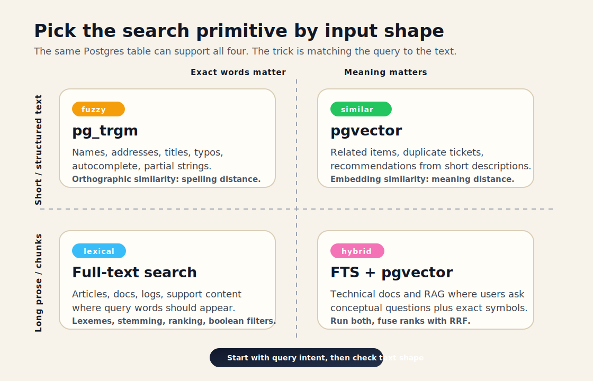
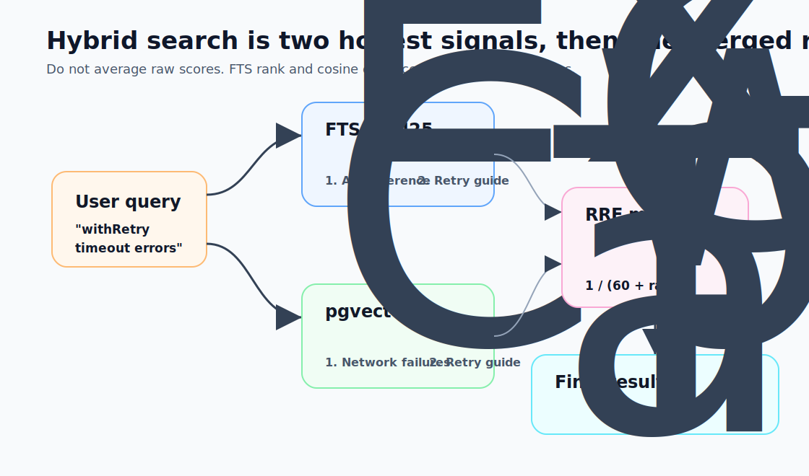
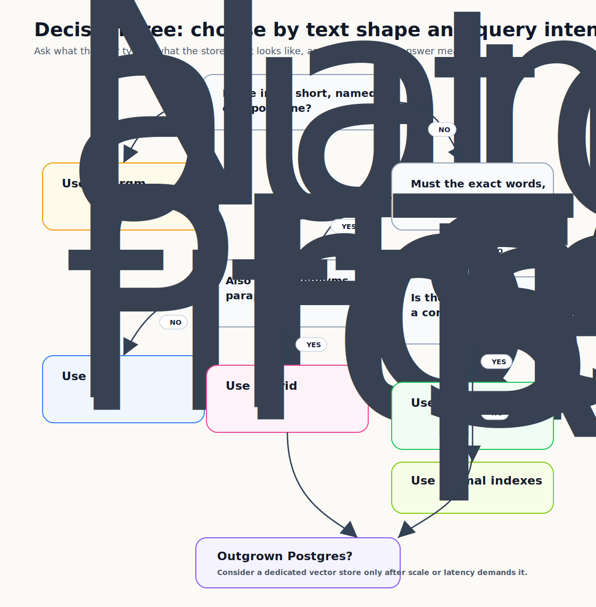

Teams adding AI features often reach for a dedicated vector database first.

Pinecone, Weaviate, Qdrant, Chroma. New service, new dependency, new connection, new subscription, and now two data sources to keep in sync.

Meanwhile, they already have PostgreSQL. PostgreSQL already has `pgvector`. It has also had excellent full-text search built in since 2008.

This is not an argument against dedicated vector stores. At large scale and high query volume, they matter. But for most applications, running two search systems before you've outgrown one is premature complexity. You're solving a future problem while making the current one harder.

So: when do you use FTS, when do you use pgvector, and when do you use both?

---

## What Each One Actually Does

Full-text search (`tsvector` / `GIN` index) is lexical. It tokenizes text into lexemes, stems them, and matches queries against the index. "Running" and "runs" collapse to the same lexeme. So do "dog" and "dogs." The ranking function (`ts_rank`) rewards documents where query terms appear often or prominently.

pgvector is semantic. It stores a dense vector - a list of numbers - representing a chunk's *meaning* as understood by an embedding model. Similarity search finds nearby vectors in that high-dimensional space. "Dog" and "canine" end up near each other. "Running" the sport and "running" a process might not.

The practical difference: FTS finds documents containing these words. Vector search finds documents that mean roughly this thing.



_The first split is not "old search vs. AI search." It's the shape of the text and what kind of answer would be correct._

---

## When Full-Text Search Wins

**You're searching for terms that matter exactly.** Product SKUs, error codes, model numbers, usernames, legal clause references. `SKU-AX-44192` is not semantically similar to anything. It either matches or it doesn't. Vector search may confidently return `SKU-AX-44193`. That's not what you want.

**Your queries are keyword-based.** Users typing into a search box, filtering by tag, searching blog posts by keyword. This is what FTS was built for.

**You need ranked results without GPU or embedding infrastructure.** FTS indexes are fast, deterministic, and require no external API calls. Add a `tsvector` column, build a GIN index, and you're done.

**You're doing boolean filtering alongside search.** `WHERE to_tsvector(body) @@ to_tsquery('postgres') AND category = 'tutorial' AND published_at > NOW() - INTERVAL '6 months'` — this composes naturally with your existing query logic.

```sql
-- Create the index
ALTER TABLE posts ADD COLUMN search_vector tsvector
  GENERATED ALWAYS AS (
    setweight(to_tsvector('english', coalesce(title, '')), 'A') ||
    setweight(to_tsvector('english', coalesce(body, '')), 'B')
  ) STORED;

CREATE INDEX posts_search_idx ON posts USING GIN (search_vector);

-- Query
SELECT title, ts_rank(search_vector, query) AS rank
FROM posts, to_tsquery('english', 'postgres & performance') query
WHERE search_vector @@ query
ORDER BY rank DESC
LIMIT 10;
```

The `GENERATED ALWAYS AS` column keeps the index updated automatically. The `setweight` gives title matches higher rank than body matches. That's the whole setup.

---

## When Trigrams Win (pg_trgm)

There's a third tool that gets left out: `pg_trgm`. It is not full-text search or vector search. It is fuzzy string matching, and it handles a class of queries both FTS and pgvector handle poorly.

**The use case: searching names, addresses, identifiers, and short strings with typos.**

FTS tokenizes text into lexemes and stems them. That works for prose, but it is a bad fit for:
- Person names ("Dan Levy" → stemmed to "dan levi", "leiv", depends on language config)
- Company names, addresses, product titles where exact spelling matters
- Queries with typos — "Micheal Jordan", "Amaon", "javascipt"
- Autocomplete / prefix search
- Partial string matching ("son" matching "Johnson", "Anderson")

pgvector is also a poor choice here. You can embed "Micheal Jordan" and find the nearest vector, but embedding space organizes names by meaning, not spelling. The nearest neighbor might be "basketball legend" or "Michael B. Jordan", not the user record with the typo.

`pg_trgm` breaks strings into overlapping 3-character slices and measures how many trigrams two strings share. "Dan" -> `" da"`, `"dan"`, `"an "`. "Micheal" and "Michael" share most of their trigrams, so similarity is high.

```sql
-- Enable the extension (usually already available)
CREATE EXTENSION IF NOT EXISTS pg_trgm;

-- GIN index on names column — enables fast trigram similarity search
CREATE INDEX users_name_trgm_idx ON users USING GIN (name gin_trgm_ops);

-- Fuzzy name search: finds "Micheal Jordan" when searching "Michael Jordan"
SELECT id, name, similarity(name, $1) AS score
FROM users
WHERE name % $1          -- % operator = similarity threshold (default 0.3)
ORDER BY score DESC
LIMIT 10;

-- Or use ILIKE with trigram index support (fast prefix/contains matching)
SELECT id, name
FROM users
WHERE name ILIKE '%johnson%'   -- GIN index makes this fast
LIMIT 10;
```

The `%` operator uses `pg_trgm.similarity_threshold` (default 0.3, range 0-1). Higher values require closer matches. For name search, 0.3-0.4 is usually right: permissive enough to catch typos, strict enough to avoid noise.

**Trigrams also handle prefix search and autocomplete well:**

```sql
-- Autocomplete: fast prefix matching with index support
SELECT name FROM users
WHERE name ILIKE $1 || '%'
ORDER BY name
LIMIT 10;

-- More control: word_similarity for partial matches within longer strings
-- (useful when searching "Johnson" within "Andrew Johnson III")
SELECT id, name, word_similarity($1, name) AS score
FROM users
WHERE $1 <% name          -- <% operator = word_similarity threshold
ORDER BY score DESC
LIMIT 10;
```

**When to reach for `pg_trgm` over FTS:**

| Scenario | Use |
|---|---|
| Person/company name search with typos | `pg_trgm` |
| Autocomplete / prefix search | `pg_trgm` (or FTS with prefix queries) |
| Searching short strings, codes, identifiers | `pg_trgm` |
| Searching prose articles, documentation | FTS |
| Searching log messages for keywords | FTS |
| Multilingual name search | `pg_trgm` (it's language-agnostic) |

`pg_trgm` also composes with FTS. Use trigrams for a fuzzy pre-filter and rank with `ts_rank`, or combine trigram similarity with a vector score.

---

## When pgvector Wins

**You're building RAG.** RAG depends on semantic retrieval: find document *chunks* whose meaning is closest to the user's question, even when the wording differs. Vector search is purpose-built for this. FTS will miss paraphrases, synonyms, and conceptual matches.

**Users describe what they want, not what to search for.** "Something light for a summer evening" has no obvious wine keywords. "Articles about building confidence as a new manager" requires semantic understanding FTS can't provide.

**You're finding similar items.** Related products, similar support tickets, duplicate bug reports. "Find me issues similar to this one" is a vector operation. You embed the new issue and find its nearest neighbors.

**Multilingual content.** Vector embeddings trained on multilingual data can match across languages. FTS requires language-specific configurations and handles cross-language queries poorly.

```sql
-- Setup
CREATE EXTENSION IF NOT EXISTS vector;

ALTER TABLE documents ADD COLUMN embedding vector(1536);
CREATE INDEX documents_embedding_idx
  ON documents USING ivfflat (embedding vector_cosine_ops)
  WITH (lists = 100);

-- Query: semantic search
SELECT id, title, 1 - (embedding <=> $1::vector) AS similarity
FROM documents
ORDER BY embedding <=> $1::vector
LIMIT 10;
```

Note: `ivfflat` is approximate — it's fast but trades some recall for speed. For smaller datasets (under ~1M rows), `hnsw` is often better:

```sql
CREATE INDEX documents_embedding_idx
  ON documents USING hnsw (embedding vector_cosine_ops);
```

---

## When You Need Both

Here's the scenario that trips people up: a technical documentation search. Users search for "how to configure timeouts" but also for function names like `withRetry()` or error codes like `ECONNRESET`.

Vector search handles conceptual queries. FTS handles exact terms. Neither handles both well alone.

The solution is hybrid search: run both, then fuse the results.

**Reciprocal Rank Fusion (RRF)** is the standard algorithm here. It doesn't require you to normalize scores from two systems; it combines rank positions.

```sql
-- Hybrid search with Reciprocal Rank Fusion
WITH fts_results AS (
  SELECT id, ROW_NUMBER() OVER (ORDER BY ts_rank(search_vector, query) DESC) AS rank
  FROM documents, to_tsquery('english', $1) query
  WHERE search_vector @@ query
  LIMIT 50
),
vector_results AS (
  SELECT id, ROW_NUMBER() OVER (ORDER BY embedding <=> $2::vector) AS rank
  FROM documents
  ORDER BY embedding <=> $2::vector
  LIMIT 50
),
rrf AS (
  SELECT
    COALESCE(f.id, v.id) AS id,
    COALESCE(1.0 / (60 + f.rank), 0) + COALESCE(1.0 / (60 + v.rank), 0) AS rrf_score
  FROM fts_results f
  FULL OUTER JOIN vector_results v ON f.id = v.id
)
SELECT d.id, d.title, rrf.rrf_score
FROM rrf
JOIN documents d ON d.id = rrf.id
ORDER BY rrf_score DESC
LIMIT 10;
```

The `60` in the denominator is the RRF constant — higher values reduce the influence of rank differences, lower values amplify them. The default of 60 works well in most cases.

This runs two searches in one query, fuses the ranks, and pushes results where keyword and semantic signals agree toward the top.



_RRF is valuable because it avoids pretending `ts_rank` and cosine distance are comparable raw scores. It only asks, "how high did this result appear in each list?"_

---

## The Practical Decision Tree

When picking a search strategy, start with the **shape of the input**, then ask **what kind of query the user is making**. "Short string with spelling variation" is different from "long prose where exact terms matter," and both differ from "question over document chunks."



The same tree in words:

- **Names, addresses, titles, autocomplete, or typo-prone short strings** → `pg_trgm`
- **Known words, error codes, SKUs, function names, tags, categories, filters** → FTS
- **Questions, paraphrases, recommendations, related items, multilingual matching, RAG chunks** → pgvector
- **Technical content where users need both exact symbols and conceptual answers** → Hybrid with RRF
- **Primary keys, exact IDs, permission filters, date ranges, sorted lists** → normal SQL indexes
- **Huge vector volume, very high concurrency, or sub-10ms p99 requirements** → evaluate dedicated vector stores

### FTS vs. Semantic: The Short Version

The question "should I use FTS or vector search?" usually resolves to this: **do you know what words will appear in the relevant documents?**

If yes - users search for known terms, categories, function names, product codes - FTS is faster, cheaper, and more predictable. It tells you why a result matched.

If no - users describe a concept, ask a question, or search in a different language - vector search is the right tool. It matches meaning, not words.

The tricky middle is natural language queries over technical content. Someone searching "how do I handle connection drops" might need an article titled "implementing retry logic for network failures" - no overlapping words, high semantic relevance. That's where vector search earns its keep.

The other tricky case is **names and proper nouns**. Neither FTS nor vector search is great at them:
- FTS will miss "Micheal" when searching "Michael" — different tokens
- Vector search will miss the name entirely if it doesn't appear frequently in training data
- `pg_trgm` handles this correctly: orthographic similarity, not semantic or lexical

In practice, most content-heavy search boxes need FTS for speed and keywords, and may need hybrid or `pg_trgm` depending on whether users search for names. A true semantic search feature usually means pgvector. RAG always means pgvector.

---

## If You Do Need a Dedicated Vector Store

Some systems genuinely outgrow pgvector. When that happens, the market is noisy. Here's what matters across the top options.

### The Feature Matrix

A few columns need unpacking before the table makes sense.

**Hybrid search** means BM25 keyword search and vector similarity run in one query, merged via Reciprocal Rank Fusion. "withRetry timeout" can match the function name exactly *and* documents about "retry logic for network failures" semantically. Without hybrid, you pick one search mode or fuse two queries yourself. pgvector's "Manual (RRF via SQL)" is [the approach shown above](#when-you-need-both): it works, but you write it yourself.

**Sparse vectors** go further than BM25. A SPLADE sparse vector has ~30,000 dimensions (one per vocabulary term), ~98% zeros. The non-zero positions tell you which terms matter and how much. A query for "dogs" also weights "canine" and "pet": BM25-level keyword precision plus term expansion inside a vector index. If this column is false, you need an external FTS layer for exact-term queries.

```python
# SPLADE: ~30,000 dims total, ~60 non-zero — only the relevant vocabulary positions fire
def encode_splade(text: str) -> dict:
    tokens = tokenizer(text, return_tensors="pt", truncation=True, max_length=512)
    with torch.no_grad():
        output = model(**tokens)
    vec = torch.log1p(torch.relu(output.logits)).max(dim=1).values.squeeze()
    return {"indices": vec.nonzero().squeeze().tolist(), "values": vec[vec != 0].tolist()}
```

**SQL / SQL-like** is really about filtering. Vector search without filtering isn't production software: you need to scope by tenant, date, permission, or category. Full SQL (pgvector) expresses that beside your existing joins. Purpose-built DBs use JSON filter objects (Qdrant, Pinecone), a query DSL (Elasticsearch, Milvus), or GraphQL (Weaviate). They work; SQL wins as filter logic gets complex.

```sql
-- pgvector: vector similarity is just another expression in WHERE
SELECT id, title, 1 - (embedding <=> $1) AS score
FROM documents
WHERE tenant_id = $2 AND category = ANY($3::text[]) AND created_at > NOW() - INTERVAL '90 days'
ORDER BY embedding <=> $1 LIMIT 10;
```

```python
# Qdrant: equivalent filter as a Python object — functional, more ceremony
results = client.query_points(
    collection_name="documents", query=query_embedding,
    query_filter=models.Filter(must=[
        models.FieldCondition(key="tenant_id", match=models.MatchValue(value=tenant_id)),
        models.FieldCondition(key="category",  match=models.MatchAny(any=categories)),
        models.FieldCondition(key="created_at", range=models.DatetimeRange(gte=cutoff)),
    ]),
    limit=10,
)
```

**Multimodal native** doesn't mean "can store image embeddings"; every database stores float arrays. It means the database ships embedding models for non-text content, so you hand it a raw image URL and it handles vectorization. Most databases here are embedding-agnostic, so you own that pipeline. Marqo and Weaviate (via CLIP/ImageBind modules) close the loop.

```python
# Marqo: POST raw images, query with text — no external embedding step needed
mq.index("products").add_documents(
    [{"id": "shoe-001", "image": "https://cdn.example.com/shoes/001.jpg"}],
    tensor_fields=["image"]
)
results = mq.index("products").search(q="lightweight shoes for summer")
# Returns shoe-001 despite zero keyword overlap — CLIP handles the cross-modal match
```

**Disk-based index** is a cost question. RAM-resident HNSW costs ~6GB of RAM per million vectors at 1536 dims, roughly $800/month for a 64GB AWS node. Disk-native alternatives (Milvus DiskANN, Elasticsearch DiskBBQ, LanceDB's Lance format, Turbopuffer's object storage tier) trade 5-20ms extra latency for cheaper infrastructure. For RAG workloads where users tolerate 200-500ms end-to-end, that's often right. Redis VSS is the hard constraint: RAM-only, no disk path.

**Max dimensions** is a forward-looking concern. `text-embedding-3-large` uses 3072 dims, Jina v3 up to 8192, and research models are pushing past 16K. MongoDB Atlas caps at 2,048, already below some current models. Elasticsearch caps at 4,096. Qdrant, Weaviate, and LanceDB are effectively uncapped. Pick something with headroom; migrating a production vector index because you hit a dimension ceiling is a miserable sprint.

| Database | Deployment | License | Hybrid Search | Sparse Vectors | SQL / SQL-like | Multimodal | Disk Index | Max Dims | Sweet Spot |
|---|---|---|---|---|---|---|---|---|---|
| **pgvector** | Self-host / managed (Supabase, Neon, RDS) | OSS (PostgreSQL) | Manual (RRF via SQL) | ❌ | ✅ Full SQL | ❌ | ✅ HNSW on disk | 16,000 | Already on Postgres; under 10M vectors |
| **Qdrant** | Self-host / Cloud | Apache 2.0 | ✅ Native BM25 | ✅ Best-in-class | ❌ (REST/gRPC) | ❌ | ✅ | 65,535 | Filtered queries at scale; complex metadata |
| **Weaviate** | Self-host / Cloud | BSD 3 | ✅ Native BM25 + RRF | ✅ | ❌ (GraphQL / gRPC) | ✅ via modules | ✅ | 65,535 | GraphQL access patterns; built-in vectorization |
| **Pinecone** | Cloud only | Proprietary | ✅ (added 2024) | ✅ | ❌ | ❌ | ✅ (serverless) | 20,000 | Managed simplicity; no ops team |
| **Milvus / Zilliz** | Self-host / Cloud (Zilliz) | Apache 2.0 | ✅ Native | ✅ | ✅ SQL-like (Milvus Query Language) | ✅ | ✅ DiskANN | 32,768 | Billion-scale; enterprise on-prem |
| **Chroma** | Embedded / self-host | Apache 2.0 | ❌ | ❌ | ❌ | ❌ | ❌ | 65,535 | Local dev and prototyping only |
| **LanceDB** | Embedded / Cloud | Apache 2.0 | ✅ | ❌ | ✅ SQL via DataFusion | ✅ Native | ✅ (Lance format) | Unlimited | Edge / serverless; multimodal lakehouse |
| **Turbopuffer** | Cloud only (serverless) | Proprietary | ✅ BM25 + vector | ❌ | ❌ | ❌ | ✅ (object storage) | 16,000 | Multi-tenant SaaS; millions of namespaces |
| **Elasticsearch** | Self-host / Elastic Cloud | SSPL / AGPLv3 | ✅ RRF + ELSER sparse | ✅ (ELSER) | ✅ Query DSL | ❌ | ✅ DiskBBQ | 4,096 | Already on Elastic stack; hybrid enterprise search |
| **OpenSearch** | Self-host / AWS managed | Apache 2.0 | ✅ RRF + Neural Search | ✅ | ✅ Query DSL | ❌ | ✅ FAISS + HNSW | 16,000 | AWS-native; open-source Elastic alternative |
| **MongoDB Atlas** | Cloud / self-host | SSPL | ✅ Built-in | ❌ | ✅ MQL + aggregation | ❌ | ✅ HNSW | 2,048 | Already on MongoDB; document + vector in one |
| **Redis (VSS)** | Self-host / Redis Cloud | RSALv2 / SSPL | ✅ (RediSearch) | ✅ | ❌ | ❌ | ❌ RAM-only | 32,768 | Ultra-low latency; cache-layer vector search |
| **Marqo** | Cloud / self-host | Apache 2.0 | ✅ | ❌ | ❌ | ✅ Native focus | ✅ | Varies | End-to-end multimodal: image + text + video |

### Reading the Matrix

A few things don't fit cleanly in a table:

**Sparse vectors** are how you get BM25-quality keyword matching inside a vector index, with no separate full-text engine. Qdrant has the most mature implementation. Elasticsearch's ELSER is production-proven at enterprise scale. Weaviate supports them via BM25F. If hybrid search is critical and you can't run two systems, look for sparse vector support.

**Disk-based indexes** matter more than people realize. RAM-resident HNSW indexes are fast but expensive: at 1536 dimensions, float32, expect ~6GB RAM per million vectors. Disk-based alternatives (Milvus DiskANN, Elasticsearch DiskBBQ, Turbopuffer object storage, LanceDB's Lance format) trade query latency for much lower infrastructure cost. For large RAG indexes, that tradeoff is usually worth it.

**Turbopuffer's multi-tenancy** is in a different class. Most databases count namespaces or indexes as a limit. Turbopuffer doesn't. Notion runs 10B+ vectors across millions of namespaces on it. If each user or organization needs isolated vector search, this changes the economics.

**LanceDB embedded mode** is the closest thing to "SQLite for vector search." It runs in-process, requires no server, and works in Lambda, Cloudflare Workers, and edge environments. The Lance columnar format makes embedded operation practical at real scale.

**Chroma stops at dev/test.** At 100M+ vectors it degrades badly, with no disk index, real hybrid search, or production HA story. It is a great prototyping tool. Don't mistake it for a production system.

### The Simplified Decision

If you've genuinely outgrown pgvector - over ~10M vectors, or sub-10ms p99 at high concurrency - choose by constraint:

- **SaaS product with per-tenant isolation** → Turbopuffer
- **Need Rust-level performance + complex metadata filtering** → Qdrant
- **Already on Elastic/ELK stack** → Elasticsearch with DiskBBQ
- **AWS shop that wants open-source** → OpenSearch
- **Billion-scale on-prem / self-hosted** → Milvus
- **Edge / serverless / multimodal** → LanceDB
- **Zero ops, just works, cost is secondary** → Pinecone
- **Multimodal-first (images, video, audio)** → Marqo
- **Already on MongoDB** → Atlas Vector Search
- **Already on Postgres, need more headroom** → Supabase Vector or Neon (both pgvector managed, with better tooling)

---

## One Thing to Not Do

Don't use vector search as fuzzy text search for things that have correct answers.

"Find me the user with email `dan@example.com`" is not a vector search problem. Neither is "Find me the order with ID `ORD-12345`." Embedding `ORD-12345` and doing cosine similarity against your orders table will return *something*, but it may be wrong. These are exact-match problems. Use your primary key or a regular index.

Vector search returns the *most similar* thing in your dataset, even when nothing is relevant. It doesn't know there is no good answer. That is fine for related documents. It is catastrophic for specific record lookup, where a wrong near-match is worse than an empty result.

Know what each tool is for. Most of them are already in your Postgres installation. Use them where they fit.
