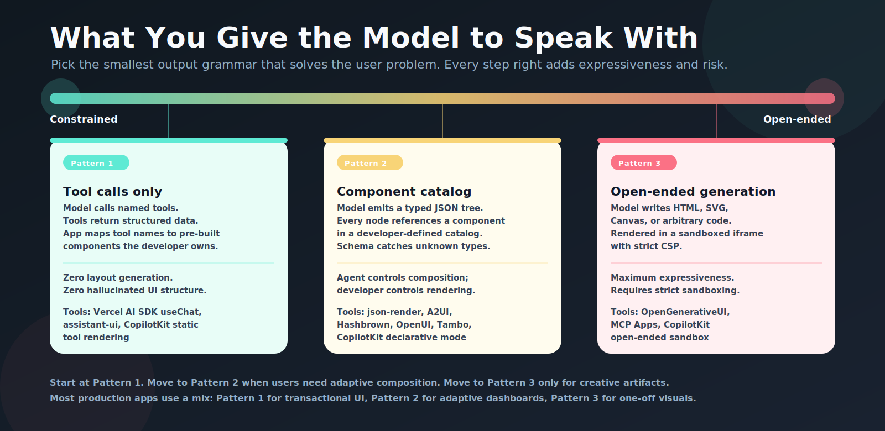

„Generative UI" bedeutet mindestens fünf verschiedene Dinge, je nachdem, wer den Begriff benutzt.

- Chat-Oberflächen, die Produktkarten aus Model-Toolaufrufen einbetten
- JSON-Specs zur Laufzeit, die das Frontend als Komponentenbäume rendert
- Sandbox-iframes, die MCP-Tools an Host-Apps zurückgeben – von Ticketbestellung über Hotelbuchung bis hin zu Kartendarstellung und Checkout-Widgets
- Eventprotokolle, die den Agentenzustand an das Frontend streamen
- v0, Lovable und Bolt: KI-Tools, die zur Designtime React-Code schreiben

Das sind verwandte Konzepte, aber sie sitzen auf verschiedenen Ebenen des Stacks und bringen unterschiedliche Risikoprofile, unterschiedliche Implementierungskosten und unterschiedliche sinnvolle Einsatzgebiete mit. Sie in einen Topf zu werfen, verwandelt jede Architektur-Diskussion in ein Chaos.

Das ist die Karte, die ich brauche, wenn ich entscheide, wo im Stack ich ansetzen will.

---

## Was Generative UI nicht ist

Bevor geklärt wird, was es ist, drei Dinge, die wir beiseitelegen:

**Designtime-Codegenerierung** — v0, Lovable, Bolt, Cursor bauen React-Komponenten zusammen. Diese Tools erzeugen Code, den Entwickler reviewen und committen. Die KI läuft zur Entwicklungszeit. Was ausgerollt wird, ist aus Nutzersicht statisch. Das ist eine großartige Toolkategorie. Es ist nicht das, was „Generative UI zur Laufzeit" bedeutet.

**KI-gestütztes Formular-Autofill** — das Modell füllt Feldwerte aus dem Kontext. Die Struktur der Oberfläche bleibt fest; nur der Inhalt bewegt sich. Das ist ein nützliches Pattern. Es ist keine generative UI.

**KI schreibt rohes HTML in eine Seite** — das Modell gibt `<div>`- und `<button>`-Strings aus, die per `innerHTML` oder `dangerouslySetInnerHTML` eingefügt werden. Das *ist* im technischsten Sinne Generative UI zur Laufzeit. Es ist auch die gefährlichste Variante — und die, die jedes ausgereifte Framework in diesem Bereich existiert, um sie zu vermeiden. Rohes, KI-generiertes Markup bedeutet XSS-Risiko, fehlende Barrierefreiheit, inkonsistentes Styling und halluzinierte Struktur. Der Rest dieses Artikels geht darum, wie man es besser macht.

---

## Eine brauchbare Definition

Generative UI zur Laufzeit bedeutet: **das Modell bestimmt, welche Interfacekomponente oder Komponentenzusammenstellung der Nutzer sieht – basierend auf dem Zustand der Konversation oder Aufgabe.**

Nicht die Worte. Das Interface.

Der einfachste Fall: Dein Flugbuchungs-Assistent ruft ein `search_flights`-Tool auf. Anstatt reinen Text zurückzuliefern („Hier sind drei Optionen..."), rendert er eine `<FlightResultsCard>`-Komponente mit auswählbaren Flügen, Sitzklassen-Toggles und einem „Buchen"-Button. Das Modell hat entschieden, dass eine strukturierte Karte die passende Antwort ist. Der Entwickler hat entschieden, wie diese Karte aussieht und was „Buchen" bewirkt.

Der komplexere Fall: Ein Finanzanalyse-Agent erhält eine Frage zu einem Portfolio und entscheidet, die Antwort aus einer `MetricGroup` mit Kennzahlen, einem `RiskBreakdown`-Chart, einer `ScenarioComparison`-Tabelle und einem `PolicyNotice` zusammenzusetzen. Das Modell hat dieses Layout aus einem Katalog vorab genehmigter Komponenten arrangiert. Der Entwickler hat jede Komponente definiert. Das Modell hat ausgewählt, welche verwendet werden und welche Daten sie füllen.

Beide Fälle sind Generative UI. Sie unterscheiden sich darin, wie viel Kompositionsfreiheit das Modell hat – was sowohl die Fülle möglicher Outputs als auch die Komplexität möglicher Fehler bestimmt.

---

## Die drei Pattern

Der gesamte Raum fällt auf drei Pattern zurück, jedes mit einer eigenen Ausgabegrammatik.



_Jede Generative-UI-Entscheidung ist ein Punkt auf diesem Spektrum. Fang links an._

### Pattern 1: Tool-zu-Komponente-Rendering

Das Modell ruft ein benanntes Tool auf. Deine Anwendung hat ein Mapping von Toolnamen auf Komponenten. Der Toolaufruf löst das Rendern einer Komponente aus.

```tsx
// Das Modell ruft: { name: "show_flight_results", args: { flights: [...] } }

useCopilotAction({
  name: "show_flight_results",
  render: ({ args }) => <FlightResultsCard flights={args.flights} />,
});
```

Das ist das sicherste Pattern, weil das Layout nie vom Modell kommt. Das Modell entscheidet *wann* eine Komponente angezeigt wird und *mit welchen Daten* sie gefüllt wird. Deine Entwickler behalten die Kontrolle über den Komponentencode, das visuelle Design, die Barrierefreiheits-Implementierung und jeden Edge-Case in der Render-Logik.

Das Vercel AI SDK `useChat` mit `tool`-Handlern macht das. assistant-uis Tool-Rendering macht das. CopilotKits „Static Generative UI" ist dieses Pattern. Die meisten funktionierenden Copilot-UIs in der Produktion machen genau das.

**Passend, wenn**: die Menge der darstellbaren Dinge zur Entwicklungszeit bekannt ist. Buchungsbestätigungen, Suchergebnisse, Kontoübersichten, Genehmigungs-Widgets. Wenn du die Szenarien aufzählen kannst, deckt dieses Pattern sie ab.

### Pattern 2: Komponentenkatalog-Komposition

Das Modell gibt einen typisierten JSON-Baum aus, der auf Komponenten aus einem entwicklerdefinierten Katalog referenziert. Dein Frontend hat einen Renderer, der den Baum traversiert und jede Komponente instanziiert.

```json
[
  { "type": "metric_group", "metrics": [
    { "label": "MRR", "value": "$82.400", "delta": "+12%" },
    { "label": "Churn", "value": "2,1%", "delta": "-0,4%" }
  ]},
  { "type": "line_chart", "title": "30-Tage-Wachstum", "data_ref": "mrr_series" },
  { "type": "insight_callout", "text": "Expansionsumsatz treibt das Delta – durchschnittliche Sitzplatzanzahl um 18 % gestiegen." }
]
```

Das Modell hat dieses Layout komponiert: eine `MetricGroup`, einen `LineChart`, einen `InsightCallout`. Aber du hast definiert, was jeder Komponententyp bedeutet, welche Props er akzeptiert und wie er rendert. Wenn das Modell versucht, `{ "type": "custom_untested_thing" }` auszugeben, fängt deine Schema-Validierung es ab, und der Renderer ignoriert oder verwirft es.

Das ist das Pattern hinter `json-render`, `A2UI`, `Hashbrown`, `OpenUI` und `Tambo`. Die eigentliche Ingenieursarbeit hier ist das **Katalogdesign** – die Entscheidung, welche Komponententypen existieren, wie ihre Schemata aussehen und was das Modell komponieren darf und was nicht.

**Passend, wenn**: die Struktur der darzustellenden Inhalte legitim auf Basis der Daten oder der Nutzeranfrage variiert. Dashboards, die sich an das Anstehende in den Zahlen anpassen. Berichte, die je nach Kontext unterschiedliche Abschnitte zeigen. Workflow-Panels, die sich je nach Agentenschritt ändern.

### Pattern 3: Offene Generierung

Das Modell schreibt HTML, SVG, Canvas oder WebGL, das in einer sandboxed iframe mit strikter Content Security Policy gerendert wird.

Das ist passend für Dinge, für die kein fester Komponentenkatalog ausreicht: Algorithmusvisualisierungen, Architekturdiagramme, Ad-hoc-Charts, generative Kunst, didaktische Simulationen. Die iframe-Grenze leistet hier die Sicherheitsarbeit; nimm sie weg, und du bist zurück beim rohe-HTML-Injection-Problem vom Anfang des Artikels.

`CopilotKit/OpenGenerativeUI` ist die beste derzeitige Referenzimplementierung dieses Patterns. Die Sandbox stripped Scripts, limitiert Message-Passing und hält das generierte Artefakt fern vom privilegierten Zustand deiner Anwendung.

**Passend, wenn**: du genuinely beliebige visuelle Outputs brauchst – einmalige erklärende Diagramme, dynamische Simulationen, kreative Artefakte. Setze das nicht für transaktionale UI ein. Eine Checkout-Bestätigung braucht keine sandboxed iframe.

### Jenseits der drei Pattern: LLMs steuern Pixel direkt

Es gibt eine aufkommende vierte Richtung, die nicht sauber in eines der drei Pattern passt: LLMs steuern **immersive, spielähnliche Erlebnisse**, indem sie die visuelle Ausgabe direkter steuern als über eine sandboxed iframe.

Die kanonische Unterscheidung innerhalb der Generativen UI ist **iframe-HTML vs. JSON-Katalog**:

- **iframe-HTML** — das Modell schreibt HTML, SVG, Canvas oder WebGL, das in einer isolierten Sandbox rendert. Maximale Ausdrucksfreiheit; Sicherheit hängt vollständig von der iframe-Grenze ab. Beispiele: Anthropic Artifacts, OpenGenerativeUI.
- **JSON-Katalog** — das Modell gibt ein strukturiertes Payload aus, das auf einen entwicklerdefinierten Komponentenkatalog beschränkt ist; dein Renderer instanziiert vertrauenswürdige, vorgefertigte Komponenten aus dieser Spec. Das Modell entscheidet *was* angezeigt wird; du entscheidest *wie* es rendert. Beispiele: json-render, A2UI.

Darüber hinaus deuten sehr aktuelle Demos auf einen dritten Modus hin, bei dem das Modell weder Komponenten auswählt noch sandboxed HTML schreibt – es steuert die Canvas direkter. Projekte wie [Tencents HunyuanWorld](https://arxiv.org/abs/2502.01999), das aus einem einzelnen Bild explorable 3D-Umgebungen generiert, und Spielearchitekturen, in denen LLMs zur Laufzeit Karten, NPCs und Quests generieren statt einen Komponentenkatalog aufzurufen, deuten auf eine Zukunft hin, in der das Modell eher ein Spielleiter ist als ein Formular-Renderer. In-Browser-LLM-Inferenz über WebGPU ([WebLLM](https://mlc.ai/web-llm/)) treibt dieselbe Grenze lokal voran.

Dieses Gebiet ist genuinely aufregend und genuinely frühestens. Es gibt noch keine stabilen Frameworks, um darauf Produktionsprodukte zu bauen. Ich behandle diesen Ansatz in einem eigenen Artikel, sobald sich das ändert.

---

## Das volle Ökosystem


_Vier Schichten. Protokolle definieren das Wire-Format. App-Shells verwalten State und Rendering. Katalog-Tools begrenzen, was das Modell generieren darf. Python-Tools sind ein paralleler Track für Daten- und ML-Workflows._

---

## Die Protokolle: AG-UI und A2UI

AG-UI und A2UI sind die beiden wichtigsten Standards auf der Protokollebene. Sie lösen verschiedene Probleme und sind keine Konkurrenten.

### AG-UI

**GitHub**: [ag-ui-protocol/ag-ui](https://github.com/ag-ui-protocol/ag-ui)

AG-UI ist ein eventbasiertes Protokoll für die Kommunikation zwischen KI-Agenten und Frontend-Anwendungen. Es definiert etwa 16 Eventtypen: `TEXT_MESSAGE_START`, `TEXT_MESSAGE_CONTENT`, `TOOL_CALL_START`, `TOOL_CALL_END`, `STATE_SNAPSHOT`, `STATE_DELTA` und so weiter. Der Transport liegt bei dir — SSE, WebSockets, Webhooks funktionieren alle. Das Format ist bewusst locker gehalten, um breite Adoption zu ermöglichen.

AG-UI definiert nicht, wie deine UI aussieht. Es definiert, wie der Agent *mit* deinem Frontend kommuniziert. Denk es dir als Wire-Protokoll-Schicht, die es deiner React-App erlaubt, einen LangGraph-Agenten genauso zu abonnieren wie einen CrewAI-Agenten, ohne den Frontend-Code zu ändern.

CopilotKit hat AG-UI aus der Arbeit mit LangGraph und CrewAI heraus entwickelt. Es wurde von LangChain, Mastra, PydanticAI und anderen übernommen. Microsoft hat einen AG-UI-Integrationsleitfaden veröffentlicht. Wenn du ein Multi-Agent-Frontend baust und Backend-Frameworks vom Frontend-Code entkoppeln musst, ist AG-UI die Antwort.

**Eine Klärung, über die Leute stolpern**: AG-UI ist kein UI-Framework. Es sagt dir nicht, was du rendern sollst. Es sagt dir, *dass* der Agent etwas gesagt, ein Tool aufgerufen oder den geteilten State aktualisiert hat. Was du daraufhin renderst, bleibt deine Entscheidung.

### A2UI

**GitHub**: [google/A2UI](https://github.com/google/A2UI) · Spec: [a2ui.org](https://a2ui.org/)

A2UI ist Googles deklarative Spezifikation für das, was Agenten senden, wenn sie UI anzeigen wollen. Während AG-UI die Frage „Wie kommuniziert der Agent?" beantwortet, beantwortet A2UI die Frage „In welchem Format beschreibt der Agent ein Komponentenlayout?".

A2UI nutzt ein flaches JSONL-Format: ein Komponentendeskriptor pro Zeile, jeweils mit ID, Typ und Daten. Flach ist Absicht. Verschachtelte Bäume erfordern, dass das Modell die vollständige Struktur kennt, bevor es mit dem Streaming beginnen kann. Eine flache Liste erlaubt dem Modell, jede Komponente auszugeben, während es darüber „nachdenkt" — dein Frontend kann also mit dem Rendern der ersten KPI-Karte beginnen, während das Modell noch darüber entscheidet, ob es ein Chart hinzufügt.

```jsonl
{"id":"h1","type":"kpi_card","title":"MRR","value":"$82.400","delta":"+12%"}
{"id":"h2","type":"kpi_card","title":"Churn","value":"2,1%","delta":"-0,4%"}
{"id":"c1","type":"line_chart","title":"30-Tage-MRR","data_ref":"mrr_series"}
{"id":"t1","type":"data_table","cols":["Monat","MRR","Netto-Neu"],"data_ref":"monthly"}
```

A2UI ist sicherheitsbewusst: Die Spec ist ein Datenformat, kein ausführbarer Code. Der Komponentenkatalog wird vom Entwickler vorab definiert; der Agent kann nur auf Typen in diesem Katalog referenzieren. Ein A2UI-Renderer, der einen unbekannten Typnamen erhält, ignoriert ihn.

CopilotKits „Open-JSON-UI"-Format ist kompatibel mit A2UI. Wenn du heute ein Spec-Format für einen Komponentenkatalog auswählst, ist A2UI das mit der breitesten plattformübergreifenden Abdeckung.

**Ein Hinweis zur Stabilität**: A2UI ist vor-1.0 — v0.9 beim letzten Check am 8. Mai 2026 — und hat zwischen Minor-Versionen breaking Spec-Änderungen shipped. Googles Kommunikation zur Roadmap war sporadisch, und einige Renderer (Lit, Flutter) hinken Spec-Updates hinterher. Plane Zeit für Spec-Drift ein, wenn du heute darauf baust. Für reine Web-Anwendungsfälle hat json-render derzeit vermutlich das vollständigerere Tooling. A2UIs langfristiger Vorteil ist die plattformübergreifende Reichweite (Web, Flutter, SwiftUI, Android), die json-render nicht bietet.

### MCP Apps

**GitHub**: [modelcontextprotocol](https://github.com/modelcontextprotocol) · Verwandt: [mcp-ui](https://github.com/MCP-UI-Org/mcp-ui)

MCP startete als Protokoll für die Verbindung von LLMs mit Tools und Daten. Die Apps-Erweiterung erlaubt es MCP-Tools, nicht nur Daten, sondern interaktive UI-Artefakte zurückzugeben: React-Komponenten, Formulare, Dashboards, Karten.

Das Sicherheitsmodell ist strikt — und das ist der Punkt: Alles rendert in einer sandboxed iframe mit stripped Berechtigungen, Templates sind vorab deklariert, damit die Host-App sie prüfen kann, und sämtliche Kommunikation ist JSON-RPC, das auditierbar ist. Das ist das richtige Modell für Tool-Anbieter — ein Shopify-MCP-Server kann ein Checkout-Widget zurückgeben; ein Kartendienst kann eine einbettbare Karte zurückgeben. Die Host-App owns den Widget-Code nicht und vertraut ihm nicht.

MCP Apps ist die richtige Wahl, wenn die UI *dem Tool-Anbieter* gehört, nicht deiner Anwendung. Für UI, die in der Domäne deiner Anwendung lebt, bleib bei Pattern 1 oder 2.

---

## Die JavaScript/TypeScript-Frameworks

### CopilotKit

**GitHub**: [CopilotKit/CopilotKit](https://github.com/CopilotKit/CopilotKit) · Beispiele: [CopilotKit/generative-ui](https://github.com/CopilotKit/generative-ui)

CopilotKit ist das am vollständigsten ausgestattete Framework für agent-native Frontend-Anwendungen. Es deckt den gesamten Lebenszyklus ab: Verbindung zu Agent-Backends über AG-UI, Management des bidirektionalen Konversations-States, Rendering generativer UI-Komponenten und Bereitstellung der Shared-State-Infrastruktur, die es Agenten und Nutzern ermöglicht, dieselben Daten zu bearbeiten.

Das Drei-Pattern-Modell lässt sich sauber auf CopilotKits APIs abbilden:
- `useCopilotAction` mit `render`-Callback → Pattern 1
- A2UI/Open-JSON-UI-Rendering → Pattern 2
- `OpenGenerativeUI` sandboxed Artefakte → Pattern 3

Die wichtige CopilotKit-Funktion, die zu wenig diskutiert wird, ist **Shared State und Human-in-the-Loop**: Der Agent kann den Anwendungsstate lesen und schreiben, der Nutzer kann ihn lesen und schreiben, und Änderungen fließen bidirektional. Das ist es, was Copilot-UIs wie echte Kollaboration anfühlen lässt statt wie eine Chatbox, die an ein Produkt geheftet wurde.

### Vercel AI SDK

**GitHub**: [vercel/ai](https://github.com/vercel/ai) · Docs: [ai-sdk.dev](https://ai-sdk.dev/)

Das Vercel AI SDK ist das De-facto-TypeScript-Baseline für KI-Apps. Für Generative UI im Speziellen:

**`useObject`** streamt ein strukturiertes JSON-Objekt vom Server, während es generiert wird. Du definierst ein Zod-Schema; das SDK parst das partielle JSON und löst Re-Renders aus, sobald Felder eintreffen. Das ist der glatteste Pfad zu Pattern 2 in einer Next.js-App.

```tsx
const { object: dashboard } = useObject({
  api: "/api/generate-dashboard",
  schema: z.object({
    title: z.string(),
    metrics: z.array(z.object({ label: z.string(), value: z.number() })),
    insights: z.array(z.string()),
  }),
});
```

**`useChat` mit Tool-Handlern** → Pattern 1. Das Modell ruft Tools auf; du mappst Toolnamen auf Komponenten.

**AI Elements** ([elements.ai-sdk.dev](https://elements.ai-sdk.dev/)) liefert fertige UI-Primitives zur Kombination mit dem SDK.

**Ein Hinweis zur verwirrenden Entwicklung hier**: Im Oktober 2024 kündigte Vercel in [GitHub Discussion #3251](https://github.com/vercel/ai/discussions/3251) an, dass AI SDK RSC — das React-Server-Components-Streaming-Pattern, das als Headline-„Generative UI"-Feature in SDK 3.0 promoted wurde — auf unbestimmte Zeit pausiert wurde wegen „mehrere langjähriger Limitationen" ohne gute Near-Term-Lösung. Teams, die Produktstrategien darauf aufgebaut hatten, wurden kalt erwischt. Die `generateObject`/`streamObject`-APIs wurden später in SDK 6.0 ebenfalls deprecated. Die empfohlene Migration von AI SDK RSC ist das oben beschriebene `useObject`-Pattern oder json-render für katalogbasierte Generierung.

### assistant-ui

**GitHub**: [assistant-ui/assistant-ui](https://github.com/assistant-ui/assistant-ui)

assistant-ui ist ein Set komponierbarer React-Primitives für Chat-Oberflächen in Produktionsqualität. Die richtige Antwort, wenn du polierte Chat-UX brauchst — Nachrichtenblasen, Streaming-Token, Kopieren/Bearbeiten/Regenerieren-Actions, Thinking-States — und dein eigenes Backend und eigenes Tool-Rendering mitbringen willst.

Es funktioniert gut mit jedem Backend (OpenAI, Anthropic, lokale Modelle, Custom-Endpoints) und handhabt Tool-Call-Rendering über ein vertrautes Slot/Render-Prop-Modell.

### json-render

**GitHub**: [vercel-labs/json-render](https://github.com/vercel-labs/json-render) · Docs: [json-render.dev](https://json-render.dev/)

json-render operationalisiert Pattern 2 mit einem meinungsstarken, All-inclusive-Ansatz. Du bekommst einen vorgefertigten Komponentenkatalog (shadcn/ui-Komponenten mit Zod-Schemata), einen Renderer und eine enge Generierungsschleife, in der das Modell schemabasiert auf den Katalog beschränkt ist.

Die Unterscheidungsmerkmale:
- **Multi-Target-Rendering**: dieselbe JSON-Spec kann in eine React-Web-App, eine React-Native-Mobile-App, ein PDF, eine HTML-E-Mail oder ein Remotion-Video rendern. Genuine nützlich für Reports.
- **Progressive Rendering**: Komponenten erscheinen, während das Modell sie streamt — nicht erst, wenn die vollständige Spec angekommen ist.
- **Strikte Schema-Beschränkungen**: der Katalog ist so gestaltet, dass das Modell keine gültigen, aber unbekannten Komponententypen halluzinieren kann.

Wenn du ein Dashboard- oder Report-Generierungsfeature baust und die Infrastrukturarbeit für den eigenen Katalogdesign überspringen willst, ist json-render der schnellste Pfad für Web-Apps.

**Zur Dynamik**: json-render startete Anfang 2026 aus Vercel Labs und scheint bei Webentwicklern schnell Aufmerksamkeit gewonnen zu haben, weil es in Standard-React/Next.js-Projekten sofort nutzbar ist. Das gesagt: json-render ist noch vor-1.0, und die Beziehung zwischen json-render und A2UI wird noch ausgearbeitet — Vercel hat mit A2UI-kompatiblem Output experimentiert, also ist Konvergenz möglich. Für plattformübergreifende Zwecke (nativer Mobile, mehrere Frameworks) ist A2UI die bessere langfristige Wette.

### Hashbrown

**GitHub**: [liveloveapp/hashbrown](https://github.com/liveloveapp/hashbrown)

Hashbrown verfolgt einen markanten Ansatz: statt eine separate KI-Interface-Schicht aufzubauen, bettet es KI-Komponentenauswahl direkt in deine bestehende React- oder Angular-App ein. Du machst deine App-Komponenten für das LLM verfügbar; das LLM wählt aus, welche gerendert werden, und kann clientseitige Tools aufrufen.

Das ist das richtige Tool, wenn du Intelligenz in Produktflächen einweben willst, die keine „Chats" sind — eine Produktseite, die ihr Layout anpasst, ein Einstellungsfeld, das die richtigen Optionen anzeigt, ein Workflow-Editor, der den nächsten Schritt vorschlägt.

### OpenUI

**GitHub**: [thesysdev/openui](https://github.com/thesysdev/openui) · Docs: [openui.com](https://www.openui.com/)

OpenUI ersetzt JSON durch ein zeilenorientiertes, codelike Format („OpenUI Lang"), das für progressives Rendering und Token-Effizienz konzipiert ist. Die Behauptung: etwa 67 % weniger Token als äquivalentes JSON für komplexe Layouts.

Der Tradeoff ist Ökosystem-Reife — OpenUI ist neuer und das Tooling dünner als bei JSON-basierten Ansätzen. Aber wenn Token-Kosten ein meaningful Constraint sind und du komplexe Layouts mit hoher Frequenz generierst, ist die Formateffizienz real.

### Tambo

**GitHub**: [tambo-ai/tambo](https://github.com/tambo-ai/tambo)

Tambo fokussiert sich auf zustandsbehaftete Komponentenauswahl: die KI wählt Komponenten und kann über clientseitige Tools mit ihnen interagieren, wobei der Komponentenstate über die gesamte Konversation hinweg erhalten bleibt. Gut für Anwendungsfälle, in denen UI-Elemente über Turns hinweg persistieren — eine Filterkomponente, die der Nutzer anpasst, während die KI weiterhin über die gefilterten Daten räsoniert.

---

## Die Python-Schicht

Das Python-Ökosystem geht bei KI-Interfaces anders ran. Diese Tools sind auf ML-Modelldemos, Datenanwendungen und interne Tooling optimiert — nicht auf Produktions-Consumer-Apps mit Agent-gesteuerter Layout-Komposition.

Das ist kein Tadel. Für die richtigen Anwendungsfälle sind Gradio und Streamlit die einzigen Tools, die du brauchst.

### Gradio

**GitHub**: [gradio-app/gradio](https://github.com/gradio-app/gradio) · PyPI: `gradio`

Gradios Kernwert: Du schreibst eine Python-Funktion; Gradio hüllt sie in eine Web-UI ein. Die `Interface`-Klasse ist 3 Zeilen für einen Bildklassifikator. `ChatInterface` ist 10 Zeilen für einen Chatbot. `Blocks` gibt dir feingranulare Layout-Kontrolle, wenn du sie brauchst.

Die „Generative UI" in Gradio wird vom Python-Entwickler definiert, nicht vom Modell. Komponenten-Sichtbarkeit und -Konfiguration können sich dynamisch auf Basis von Modellobjects ändern, aber der Komponentenkatalog ist statisch — du bittest das Modell nicht, Layouts zu komponieren.

Gradio ist der Standard für HuggingFace Spaces und das ML-Demo-Ökosystem. Es hat Millionen monatlicher Downloads und treibt einen Großteil der KI-Demo-Landschaft an.

**Zu Gradio greifen, wenn**: du ein Python-Entwickler bist, der ein ML-Modelldemo, einen Forschungsprototyp oder ein internes Tool baust und kein JavaScript anfassen willst.

### Streamlit

**GitHub**: [streamlit/streamlit](https://github.com/streamlit/streamlit)

Streamlits Modell ist meinungsstärker: Ein Python-Skript wird bei jeder Interaktion end-to-end ausgeführt. Du rufst `st.chat_message()`, `st.dataframe()`, `st.plotly_chart()` auf. Das Framework kümmert sich um das Layout.

Das Full-Script-Rerun-Modell klingt ineffizient, ist aber für KI-Chatbots, die Konversationshistorie akkumulieren, überraschend ergonomisch — das gesamte Skript läuft neu ab, der Chat-Verlauf lebt im Session-State, und die Ausgabe ist deterministisch. Streamlit hat mittlerweile First-Class-Support für die meisten großen LLM-Provider und lässt sich nativ in Snowflake Cortex integrieren.

**Zu Streamlit greifen, wenn**: du eine KI-gestützte Daten-App, ein internes Reporting-Tool oder ein ML-gestütztes Dashboard in Python baust und den einfachstmöglichen Deployment-Pfad willst.

### LangChain und Haystack

Das sind Backend-Orchestrierungs-Frameworks, keine UI-Frameworks. Sie tauchen in jeder ehrlichen Generative-UI-Stackkarte auf, weil sie typischerweise die Schicht sind, in der strukturierte Outputs generiert werden, bevor sie ans Frontend geschickt werden.

**LangChain** ([langchain-ai/langchain](https://github.com/langchain-ai/langchain)): `.with_structured_output()` auf jedem LLM liefert dir Pydantic-constrained JSON-Generierung. Der `@tool`-Decorator mit automatischer Schema-Generierung ist der sauberste Weg, um zu definieren, welche Tools das Modell aufrufen kann. LangChain speist strukturierte Ergebnisse in die Frontend-Schicht deiner Wahl ein.

**Haystack** ([deepset-ai/haystack](https://github.com/deepset-ai/haystack)): modulare Pipeline-Architektur mit starkem RAG-Support. Hayhooks verpackt Haystack-Pipelines als HTTP-Endpoints — einschließlich MCP-kompatibler Endpoints. Wenn deine Generative UI ein Retrieval-Backbone braucht, handhabt Haystacks Pipeline-Architektur das sauber.

Keines der Frameworks besitzt die UI-Schicht. Sie generieren die Daten, die dein Frontend (Pattern 1, 2 oder 3) rendert.

---

## Feature-Referenz

Nutze den Katalog oben als Orientierung, nicht als Einkaufsliste. Der Stack fällt meist auf eine Wahl pro Schicht zusammen:

| Bedarf | Hier anfangen |
|------|------------|
| Agent-zu-Frontend Event-Stream | [AG-UI](https://github.com/ag-ui-protocol/ag-ui) |
| Deklaratives UI-Payload über eine Trust-Boundary | [A2UI](https://github.com/google/A2UI) oder [MCP Apps](https://github.com/MCP-UI-Org/mcp-ui) |
| App-eigenes Chat/Tool-Rendering | [Vercel AI SDK](https://github.com/vercel/ai), [assistant-ui](https://github.com/assistant-ui/assistant-ui) oder [CopilotKit](https://github.com/CopilotKit/CopilotKit) |
| Katalog-komponierte Dashboards, Reports und Formulare | [json-render](https://github.com/vercel-labs/json-render), [Hashbrown](https://github.com/liveloveapp/hashbrown), [OpenUI](https://github.com/thesysdev/openui) oder [Tambo](https://github.com/tambo-ai/tambo) |
| Sandboxierte visuelle Artefakte | [OpenGenerativeUI](https://github.com/CopilotKit/OpenGenerativeUI) |
| Python-Demos und Daten-Apps | [Gradio](https://github.com/gradio-app/gradio) oder [Streamlit](https://github.com/streamlit/streamlit) |

---

## Ökosystem-Dynamik und wackeliger Boden

Dieser Raum bewegt sich schnell, und mehrere Projekte haben verwirrende Kommunikation neben ihrem Code shipped. Zuletzt geprüft am 8. Mai 2026; behandle die Projektstatus-Notizen hier als timestamped Lesung, nicht als Dauerurteil.

**Vercel AI SDK RSC** war das Flaggschiff-Generative-UI-Feature beim SDK-3.0-Launch. Vercel pausierte die Entwicklung im Oktober 2024 ([Discussion #3251](https://github.com/vercel/ai/discussions/3251)) mit Verweis auf architektonische Limitationen bei React Server Components ohne gute Near-Term-Lösung. Teams, die darauf gebaut hatten, waren verständlicherweise frustriert. Es ist immer noch in der Doku, ist aber nicht der empfohlene Pfad; `useObject` ist es.

**json-render** (Vercel Labs) ist die neue Richtung — eine katalogbasierte, framework-agnostische Alternative, die die RSC-Coupling-Probleme vermeidet. Es ist vor-1.0 und scheint unter React-/Web-Entwicklern schnell starkes frühes Interesse geweckt zu haben. Der wahrscheinliche DX-Grund: json-render ist in einem Standard-React/Next.js-Projekt sofort nützlich, während A2UIs plattformübergreifender Scope Setup-Reibung addiert. Wie sich das entwickelt, während beide Specs reifen, ist genuinely unklar. Vercel hat A2UI-Kompatibilität in json-render probt, was auf mögliche Konvergenz hindeutet.

**A2UI** (Google) ist vor-1.0 (v0.9 beim letzten Check) mit breaking Spec-Änderungen zwischen Minor-Versionen und inkonsistenter Google-Kommunikation zur Roadmap. Es ist die richtige Wahl für plattformübergreifende Reichweite (Web + Flutter + SwiftUI), die json-render nicht adressiert, und hat meaningful Enterprise-Backing. Für reine Web-Projekte ist die DX derzeit rauer.

**AG-UI** (CopilotKit) ist ebenfalls vor-1.0. Die häufigste Verwechslung: der Name klingt, als wäre es ein UI-Framework. Ist es nicht — es ist ein Transportprotokoll. AG-UI definiert, wie Events zwischen Agent-Backends und deinem Frontend fließen; was du als Antwort renderst, bleibt deine Entscheidung. Dieses mentale Modell ist solide und breit adoptiert, aber die vor-1.0-Spec bedeutet, dass Edge-Cases noch ausgearbeitet werden.

Die praktische Konsequenz: **jeder bedeutende Player hier ist vor-1.0**. Plane API-Änderungen ein. Die Pattern — Tool-zu-Komponente, Katalog-Komposition, sandboxed Generierung — sind stabil genug, um darauf zu bauen. Die konkreten Protokollentscheidungen noch nicht.

---

## Komponentenkatalog-Design: Die eigentliche Ingenieursarbeit

Der Großteil der interessanten Komplexität bei Pattern 2 steckt nicht im Renderer — er steckt im Katalog.

Der Katalog ist eine **Produktentscheidung, als Schema codiert**. Er beantwortet: was sind die meaningful UI-Objekte in dieser Domäne? Nicht „welche React-Komponenten gibt es?", sondern „was muss ein Nutzer in diesem Kontext tatsächlich sehen und womit interagieren?"

**Der zu-granulare Fehlermodus**: Du legst `Row`, `Column`, `Text`, `Button`, `Icon` offen. Jetzt muss das Modell Frontend-Engineer spielen. Es wird mittelmäßiges Layout generieren, das nicht zu deinem Design-System passt, Empty-States vermissen, inaccessibles Markup produzieren und seinen Ansatz von Antwort zu Antwort ändern, weil nichts im Katalog den Output auf die visuelle Sprache deines Produkts einschränkt.

**Der zu-grobe Fehlermodus**: Du legst `WeatherCard`, `FlightCard`, `HotelCard` offen. Das Modell kann sich nicht anpassen, wenn der Nutzer etwas fragt, das nicht auf eine vorgefertigte Karte passt. Es fällt auf Text zurück.

**Die nützliche Mitte**: Domänen-Level-Komponenten mit eingeschränkten Slots.

Ein Reise-App-Katalog könnte so aussehen:

```
TripSummary         — Reiseroute auf einen Blick
FlightOptionList    — auswählbare Flugoptionen mit Preisen
HotelComparison     — Hotelkarten nebeneinander
TravelerForm        — Reisende-Details erfassen
PolicyNotice        — regulatorischer/tariflicher Hinweis
BookingConfirmation — finale Bestätigung mit Action-Button
```

Ein Finanz-App-Katalog könnte so aussehen:

```
PortfolioSnapshot   — Schlüsselpositionen und GuV
TransactionTable    — filterbare, paginierte Transaktionen
RiskBreakdown       — Allokations- und Volatilitätskennzahlen
ScenarioComparison  — Szenarien-Modellierung nebeneinander
ApprovalGate        — Aktion, die menschliche Bestätigung erfordert
```

Der Katalog klingt wie der Wortschatz deines Produkts. Er codiert deine UX-Entscheidungen, deine Barrierefreiheitsanforderungen, dein Empty-State-Handling und deine Dangerous-Action-Pattern im Komponentencode. Das Modell darf diese Stücke arrangieren. Du entscheidest weiterhin, wie jedes Stück aussieht und was es darf.

**Schema-Design-Regeln, die Halluzinationen reduzieren**:

1. Halte Enum-Werte kurz und offensichtlich. `"type": "bar_chart"` statt `"type": "data-visualization-bar-type-vertical"`.
2. Mache ungültige Kompositionen unmöglich. Wenn ein `PolicyNotice` nur am Ende eines Layouts erscheinen darf, setze es nicht auf dieselbe Schema-Ebene wie Elemente, die überall erscheinen können.
3. Setze Required-Fields großzügig ein. Ein optionales Feld ist ein Feld, das das Modell weglassen könnte und dein Renderer als null handhaben muss.
4. Teste den Katalog gegen echte Prompts, bevor du shipst. Speichere die generierten Specs; prüfe sie auf Schema-Verletzungen, halluzinierte Feldwerte und Kompositionen, die technisch gültig, aber semantisch falsch sind.

---

## Häufige Fallen

**Falle: valides JSON als sicheres Verhalten behandeln.** Schema-Validation bestätigt die Struktur. Sie sagt nichts darüber, ob die Action hinter einem Button zu ihrem Label passt, ob eine Summe mit den Daten übereinstimmt, aus denen sie abgeleitet wurde, oder ob eine UI-Komponente etwas tut, das der Nutzer nicht erwartet hat. Generierte UI-Specs brauchen semantische Review, nicht nur Schema-Validation. Mindestens sollten destruktive Actions eine Bestätigungskomponente erfordern, und die Labels dieser Komponenten sollten gegen die Actions getestet werden, die sie auslösen.

**Falle: Design-Primitive statt Produkt-Primitive exponieren.** Wenn das Modell entscheiden muss, ob 16 px oder 20 px Padding angemessen sind, hast du ihm die falsche Abstraktionsebene gegeben. Domänenkomponenten sollen Produkt-Geschmack codieren. Das Modell soll Verhalten komponieren, nicht Presentation-Details managen.

**Falle: Generative UI einsetzen, wo statische UI reicht.** Wenn die Struktur dessen, was du zeigen willst, zur Entwicklungszeit bekannt ist — und das ist meistens der Fall —, ist Pattern 1 mit vorgefertigten Komponenten schneller, sicherer und konsistenter. Generative UI verdient ihre Komplexität, wenn die Struktur legitimerweise auf Basis der Daten oder des Aufgabenkontexts variiert.

**Falle: Barrierefreiheit überspringen.** LLMs halluzinieren WCAG-Verstöße. Sie geben `role="region"` auf interaktiven Elementen aus, generieren Forms mit fehlenden Labels und produzieren Kontrastverhältnisse, die WCAG AA nicht bestehen. Deine Komponentenbibliothek mag voll zugänglich sein; KI-generierte Kompositionen dieser Komponenten sind nicht automatisch zugänglich. Teste den vollen Render-Pfad, nicht nur die Komponenten isoliert.

**Falle: Protokoll und Framework verwechseln.** AG-UI ist kein Frontend-Framework. A2UI ist keine React-Bibliothek. Das sind Wire-Formate und Event-Protokolle. Du brauchst immer noch ein Frontend-Framework, um sie zu implementieren. CopilotKit implementiert AG-UI und A2UI. json-render implementiert das A2UI/Open-JSON-UI-Katalog-Pattern. Das sind verschiedene Schichten.

---

## Empfehlungen nach Anwendungsfall

**Einen Copiloten zu einer bestehenden SaaS-App hinzufügen**: Fang mit Pattern 1 (Tool-zu-Komponente) an. Nutze Vercel AI SDK `useChat` oder CopilotKit. Map deine Top-5–10-Agent-Actions auf vorgefertigte Komponenten. Ship das, miss es, und erweitere den Katalog nur, wenn Nutzer demonstrativ reichhaltigere Komposition brauchen.

**Dashboard-Generierung aus Natürlicher Sprache**: Nutze Pattern 2 mit json-render oder einem Custom-A2UI-Katalog. Definiere einen Katalog von 8–15 Komponententypen, der deine Chart-Typen, Metric-Cards und Tabellen-Varianten abdeckt. Feed das Schema an das Modell; lass es das Layout komponieren. Baue Validation, die unbekannte Typen abfängt, bevor sie den Renderer erreichen.

**Multi-Agent-Frontend**: Nutze CopilotKit mit AG-UI. Der Event-Stream handhabt Echtzeit-Streaming über Agent-Backends hinweg; Shared State handhabt die Übergabe zwischen Agenten; das HITL-Pattern handhabt Approval-Gates.

**Innerhalb von ChatGPT oder einem anderen MCP-Host bauen**: Nutze MCP Apps. Definiere dein Tool als Daten-Tool, das abruft und räsoniert, und ein separates Render-Tool, das ein Widget anfordert. Halte Business-Logik aus der Widget-Vorlage raus.

**ML-Modelldemos und Daten-Apps (Python-Team)**: Gradio für Demos und HuggingFace Spaces. Streamlit für Daten-Apps mit komplexerer Interaktion. Keines erfordert JavaScript.

**Visuelle Artefakte, Simulationen, Diagramme**: Nutze Pattern 3 (OpenGenerativeUI oder Äquivalent). Etabliere strikte iframe-CSP. Behandle den Output aus Sicherheitsperspektive wie untrusted User-Content.

---

Die Frameworks reifen schnell. Die Protokoll-Konvergenz (AG-UI für Streaming, A2UI/Open-JSON-UI für Katalog-Specs) ist noch im Gang, aber die Form wird klar genug, um darauf zu bauen.

Die Ingenieurs-Herausforderungen, die jetzt am meisten mattern, sind nicht Framework-Auswahl. Es ist Katalogdesign — die Entscheidung, was das Modell sagen darf, was Produktklarheit mehr erfordert als technisches Können. Es ist semantische Validation — zu testen, dass generierte UI das tut, was sie behauptet, nicht nur, dass sie Schema-Validation besteht. Und es ist die Barrierefreiheits-Lücke — Kataloge zu bauen, in denen jede Komponente und jede Komposition den Barrierefreiheits-Standard erfüllt, den du für handgeschriebene UI anlegen würdest.

Das Modell wird tun, was du ihm sagst, innerhalb der Grammatik, die du ihm gibst. Mach die Grammatik absichtlich.
