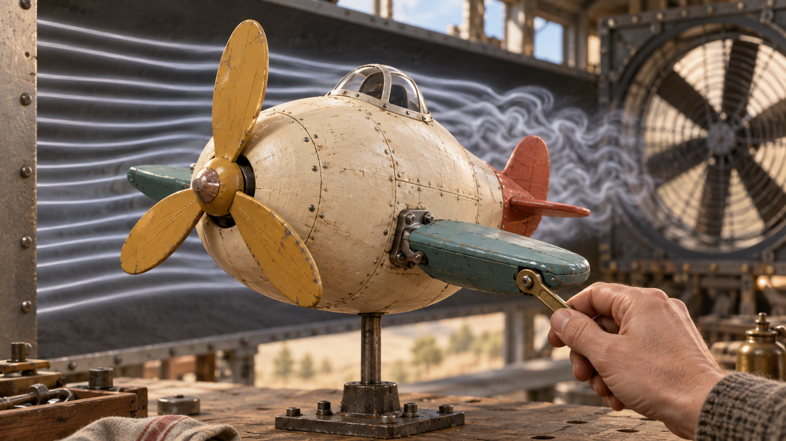
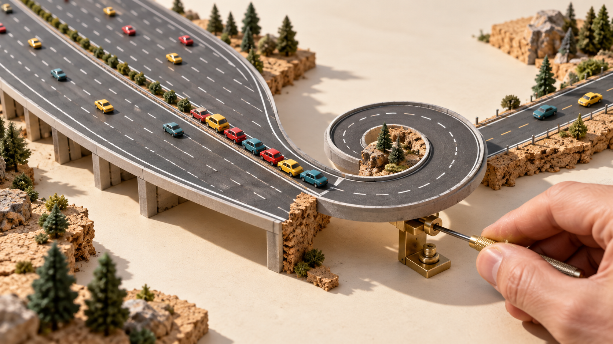
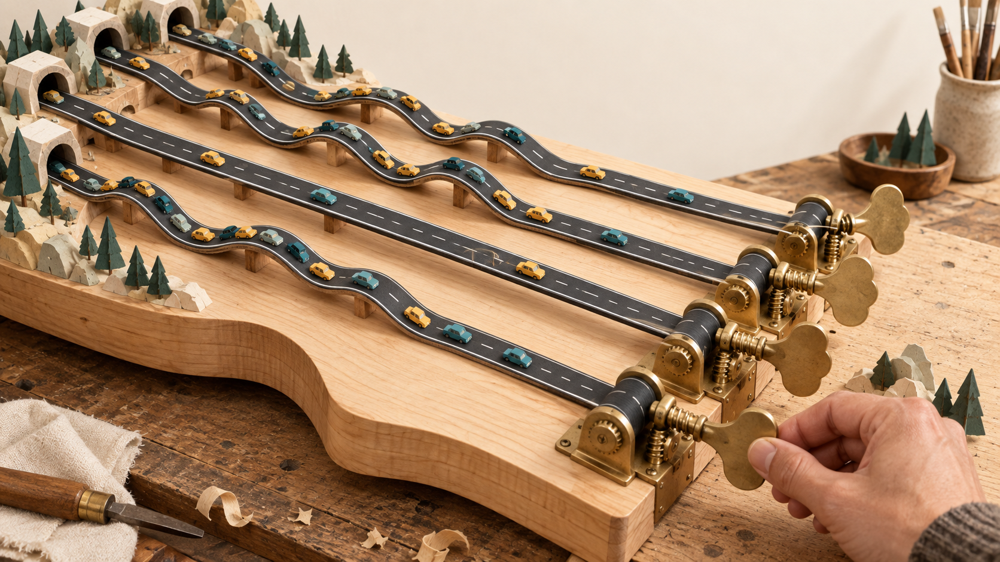

# Trust, but Throttle — goofy plane and highway exploration

Generated with the built-in image generator. Wide concept previews only; no final cover or square selected.

Recommendation: **Tune the flying potato**. Its odd silhouette, precise adjustment and visible turbulent wake communicate experimentation under load in one scene. The musical highway is the more surreal alternative. The hairpin highway needs cleaner road continuity if selected for refinement.

## 4. Tune the flying potato

An agent can propose a plausible adjustment; the wind tunnel gets the final vote.

Square composition: Center the bulbous plane, adjustable wing and wind ribbons; retain one tuning tool.

Prompt: Wide 16:9 editorial hero illustration for Trust, but Throttle, a technical essay about proving performance improvements under realistic load. A hilariously ungainly but lovable experimental airplane undergoing serious wind-tunnel tuning: very bulbous potato-shaped cream fuselage, tiny cockpit, absurdly short stubby teal wings, oversized mustard propeller and little red tail. It is a real miniature physical airplane, NOT anthropomorphic, no eyes or smile. Plane held securely on a thin testing pedestal in an open-sided wind tunnel on a workshop bench. Fine white airflow ribbons enter smoothly from left, then visibly curl and tumble behind the fat fuselage. A single human hand with a small brass wrench precisely adjusts the angle of one wing at a clearly visible hinge. Comically wrong overall shape versus painstaking precise tuning is the visual joke. Close three-quarter view, airplane dominates center, hand enters from lower right, visible large tunnel fan subtly in background. Tactile hand-built painted wood and riveted tin, high-end stop-motion film production design, warm cream, dusty teal, ochre and coral, soft daylight, shallow depth of field, sophisticated and playful. One strong readable silhouette, square-friendly central subject. No text, labels, logos, numbers, watermarks, robot faces, screens or neon.

## 5. Six lanes into a hairpin

Optimizing the straight section misses the expensive reversal.

Square composition: Focus on the adjustable hairpin, backed-up toy cars and the hand turning its adjustment screw.

Prompt: Wide 16:9 witty editorial hero image about frontend performance tests revealing that a fast straight-line optimization fails at reversals. An absurd miniature highway on a pale workshop tabletop: a grand smooth six-lane expressway abruptly funnels into ONE ridiculous tight curled hairpin, then emerges as a modest road. Tiny colorful toy cars are neatly backed up just before the hairpin, while the broad straightaway behind looks lavish and overengineered. The hairpin is a physical movable road piece mounted on a small brass adjustment bracket. One human hand enters with a precision screwdriver, painstakingly adjusting the tiny screw underneath the curved road while the obvious geometry remains absurd. Elevated oblique view, central curled road dominant, the highway sweeping in from upper left, miniature sparse landscape of cork and paper. Tactile architectural scale-model photography, charcoal road with plain cream lane markings, yellow red teal cars, warm ivory studio background, soft directional daylight, crisp physical shadows. Clear funny causal scene, no crashes, no people in cars, no hazard drama. No text, labels, numerals, logos, watermark, UI, glowing elements. Designed as premium magazine cover art, recognizable at small size.

## 6. Tune the road, then drive it

A neatly tuned-looking system still needs to be tested by actual traffic.

Square composition: Keep three road strings, one tuning peg and a car visibly crossing a remaining kink.

Prompt: Wide 16:9 surreal editorial illustration for a technical essay about tuning a frontend and testing real user motion. A highway built like an oversized acoustic musical instrument on a wooden workbench: four narrow charcoal road ribbons stretch in parallel across a warm maple soundboard, each bearing simple dashed ivory lane markings and a few miniature mustard and teal cars. At the near right end, each road ribbon connects mechanically to a large brass guitar tuning peg. One human hand turns ONE peg; that road ribbon becomes taut and smooth while neighboring ribbons retain visible wavy humps and kinks that cause tiny queues of cars. Physical whimsical invention, roads unmistakably roads, pegs unmistakably tuning pegs; avoid an ordinary guitar with roads painted on it. Three-quarter overhead composition, road ribbons sweep from upper left to large tuning pegs in lower right, clean central focus and generous cream margins. Handmade cut-paper and wood editorial sculpture, elegant playful absurdity, matte materials, warm daylight, cream charcoal ochre muted teal brass palette. No writing, labels, numerals, logos, watermark, screens, robots, neon or clutter.

