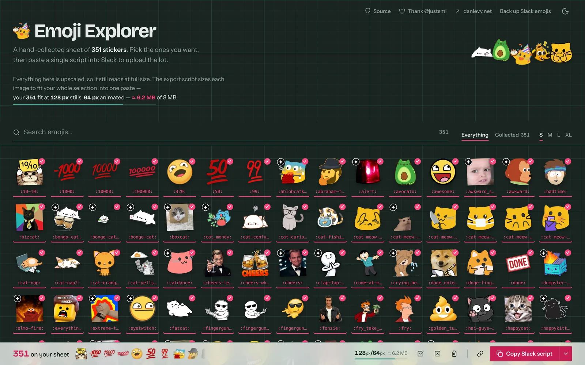

The agent proposed a sensible CSS optimization for a dense image grid, applied it, measured it, and declared victory. Rapid scrolling had gotten three times worse.

It wasn't lying. It had a good explanation — let the browser skip off-screen cards, do less rendering, go faster — and a passing test to back it up. The test jumped straight to the bottom of the page. On that motion, the change genuinely helped.

Then the harness learned to scroll back and forth, and the win evaporated.

That's the whole job. An agent tuning frontend performance is a very fast hill-climber attached to whatever number you gave it, and it will find the peak of the wrong hill with total confidence and a tidy summary table. The interesting work isn't prompting it better. It's building the motion vocabulary and the measurement it can't talk its way around.

> Agents are good at performance tuning exactly to the degree your harness can prove them wrong.

It was worth doing. Watching the frame counter by hand in DevTools, the worst of the scrolling went from **about 12 fps at the 99th percentile to a steady 60+**.

Here's the thing we were tuning — [Emoji Brain](https://github.com/justsml/emoji-brain), a wall of a few hundred selectable cards, every one of them a transparent image, a fraction of them animated:



A media gallery, an asset picker, a photo grid, a search results page made of thumbnails — same shape, same failure modes.

## Give the Agent Hands Before You Give It Opinions

The default agent loop for performance is: read the code, recognize a pattern from its training data, apply the fix, describe the improvement. Three of those four steps are free. Only the third one changes anything, and none of them involve a browser.

So the first thing to build is not a prompt. It's a script the agent can run that produces numbers it didn't write.

Ours is a Playwright spec that boots a production preview, throttles the CPU, drives the grid, and prints a JSON blob. The agent's entire job becomes: change something, run it, read the blob, keep or revert. That's a loop it's genuinely good at — it's mechanical, it's fast, and the feedback is not a matter of opinion.

Use Chromium, and talk to it over CDP. This is the one place where the browser choice isn't a preference: the Chrome DevTools Protocol is the only connection that hands an agent CPU throttling, network emulation, Chrome's own CPU counters, tracing, and the GPU identity of the machine it's running on — all from the same session that's driving the page. WebDriver gives you none of that. Every throttle, counter, jank verdict and GPU fingerprint below came through a `newCDPSession`; the few numbers that didn't are exactly the ones that need caveats.

Three setup calls do most of the work:

```ts
const cdp = await page.context().newCDPSession(page);
await cdp.send('Performance.enable');
await cdp.send('Emulation.setCPUThrottlingRate', {
  rate: 2,
});

await cdp.send('Network.enable');
await cdp.send('Network.emulateNetworkConditions', {
  offline: false,
  latency: 150,
  downloadThroughput: (1.6 * 1024 * 1024) / 8,
  uploadThroughput: (750 * 1024) / 8,
});
```

CPU throttling matters because your laptop hides the bug. [CDP's throttling rate](https://chromedevtools.github.io/devtools-protocol/tot/Emulation/#method-setCPUThrottlingRate) is a slowdown factor, not a phone: `2` approximates half-speed execution relative to the host, and simulates nothing about the GPU. It's enough to make the difference between two candidate fixes visible, which is all the agent needs.

The network profile is the 4G row of every budget further down. Playwright has no API for it — those 3G and 4G numbers exist because of `Network.emulateNetworkConditions`.

The performance tests also run in their own config — isolated preview port, one worker, caches off, no retries, no video. Trace recording and a second test worker are themselves a measurable load. An agent running benchmarks next to your dev server and a video encoder is generating fiction.

## Teach It to Scroll Like a Person Who Changed Their Mind

A neat downward scroll is a generous benchmark. It's also the only one an agent will invent on its own, because it's the one that's easy to write.

People are worse than that. They reverse direction mid-flick. They slam End, then Home, then End again. They creep down a row at a time reading labels. They park the pointer mid-grid and scroll cards underneath it. Each motion stresses a different part of the pipeline, and an optimization that helps one can wreck another — which is exactly what happened to us.

So the harness defines the vocabulary, and the agent runs all of it every time:

```ts
// Per phase: pixels, gap between wheel ticks, and
// how many ticks before the direction flips.
const WHEEL = {
  slow: {delta: 90, waitMs: 35, flipEvery: 30},
  rapid: {delta: 1200, waitMs: 16, flipEvery: 3},
};

const phases = ['slow', 'rapid', 'jumps'] as const;

for (const phase of phases) {
  // Let the preceding native wheel animation finish
  // before we reset the metrics for this phase.
  await page.waitForTimeout(500);
  await begin(page, phase);

  const before = await cpuMetrics(cdp);
  const positions: number[] = [];

  if (phase === 'jumps') {
    for (let i = 0; i < 12; i++) {
      const toBottom = i % 2 === 0;
      await page.evaluate(
        (bottom) =>
          window.scrollTo({
            top: bottom
              ? document.documentElement.scrollHeight
              : 0,
            behavior: 'instant',
          }),
        toBottom,
      );
      await page.waitForTimeout(150);
      positions.push(
        await page.evaluate(() => window.scrollY),
      );
    }
  } else {
    const {delta, waitMs, flipEvery} = WHEEL[phase];
    for (let i = 0; i < 60; i++) {
      const reversed =
        Math.floor(i / flipEvery) % 2 === 1;
      await page.mouse.wheel(
        0,
        reversed ? -delta : delta,
      );
      await page.waitForTimeout(waitMs);
    }
  }

  report[phase] = {
    ...(await snapshot(page)),
    positions,
    before,
    after: await cpuMetrics(cdp),
  };
}
```

Three things in there are worth stealing.

**Use `page.mouse.wheel`, not `window.scrollTo`.** Wheel input goes through the real compositor path, with real inertia. `scrollTo` with `behavior: 'smooth'` is a different code path and a different animation; `behavior: 'instant'` is a third. Test the ones your users actually produce, in separate phases, because they have separate costs.

**Reverse direction on a short period.** The `rapid` phase flips every three steps. Reversals are where containment and lazy-rendering strategies send you the bill, because the browser keeps re-crossing the same boundary it just discarded work at. A monotonic scroll never crosses the same boundary twice.

**Wait out the inertia between phases.** That `waitForTimeout(500)` is there because native wheel animation leaks across phase boundaries and contaminates the next measurement. An agent will not add this on its own and will not notice it's missing.

One more line, easy to skip: `page.mouse.move(width / 2, 500)` before the loop. It parks the cursor in the grid so cards scroll under a stationary pointer, which is how you discover that hover-to-play is firing network requests during scroll.

## Assert the Motion Happened

Our first Home/End test didn't reliably reach the top. Wheel inertia leaked in, the page landed at row four instead of zero, and the test passed anyway — reporting excellent frame timings for an interaction it never performed.

An agent handed that harness will tune against the lie for as long as you let it. So the phase asserts its own endpoints:

```ts
// 5px of slack for subpixel scroll rounding.
const atBottom = height - viewport.height - 5;

expect.soft(Math.max(...positions))
  .toBeGreaterThan(atBottom);

for (const [i, position] of positions.entries()) {
  // Odd steps went Home, even steps went End.
  if (i % 2) {
    expect.soft(position).toBeLessThan(10);
  } else {
    expect.soft(position).toBeGreaterThan(atBottom);
  }
}
```

And the test asserts that the document height never changed and that no page errors fired. A "faster" grid that quietly stopped rendering half its cards would otherwise post a spectacular score.

This is the rule that generalizes: **every benchmark phase must prove it did the thing in its name.** Record scroll positions, element counts, request counts — whatever makes the action falsifiable. Agents optimize whatever you measure, including your bugs.

## Measure Frame Gaps, Long Tasks, and CPU Counters Together

"Crank the FPS" is a goal, not a metric. The sampler we give the agent is the one piece here that isn't CDP — it's ordinary page JavaScript, installed before page scripts, collecting four signals from inside the renderer:

```ts
await page.addInitScript(() => {
  const state = {
    phase: 'load',
    started: performance.now(),
    gaps: [] as number[],
    longTasks: [] as number[],
    lastFrame: 0,
    // … paints, lcp, layoutShiftSum
  };
  (window as any).__perf = state;

  new PerformanceObserver((list) => {
    for (const entry of list.getEntries()) {
      // Ignore tasks that began before this phase.
      if (entry.startTime >= state.started) {
        state.longTasks.push(entry.duration);
      }
    }
  }).observe({type: 'longtask', buffered: true});

  const frame = (now: number) => {
    if (state.lastFrame) {
      state.gaps.push(now - state.lastFrame);
    }
    state.lastFrame = now;
    requestAnimationFrame(frame);
  };
  requestAnimationFrame(frame);
});
```

The snapshot reduces that to `p95FrameGapMs`, `maxFrameGapMs`, `longTaskCount`, `maxLongTaskMs`, and blocking time above 50 ms, plus FCP, LCP and a layout-shift sum. Alongside it, `Performance.getMetrics` pulls Chrome's own `TaskDuration`, `ScriptDuration`, `LayoutDuration`, `RecalcStyleDuration`, heap size and DOM node count, sampled before and after each phase.

That split is the point. Page JavaScript only sees what the main thread saw; CDP gets you the other side of it. Give the agent both. The frame gaps say *whether* an interaction felt bad; the CPU counters say *which subsystem* to go look at. An agent with only p95 will thrash between plausible fixes. An agent that can see `RecalcStyleDuration` triple will go read your selectors.

Two honesty constraints belong in the harness docs, where the agent will read them and repeat them in its summary:

- Frame gaps measure main-thread animation callbacks. They do not prove every compositor frame was presented. This is not physical display FPS.
- Long-task blocking is per phase. It is not Lighthouse TBT, and input round trips measured through Playwright include transport overhead and are not INP.

If you skip this, the agent will write "we achieved 60 FPS" in the PR description, because that is what the number looks like.

When you need ground truth for scrolling specifically, Chromium will hand it to you. We record a trace during the `rapid` phase and count the compositor's own jank verdicts:

```ts
await cdp.send('Tracing.start', {
  traceConfig: {
    includedCategories: [
      'input',
      'input.scrolling',
    ],
  },
});

// … drive the rapid phase …

const events: any[] = [];
cdp.on('Tracing.dataCollected', ({value}) =>
  events.push(...value),
);
await cdp.send('Tracing.end');
await new Promise((done) =>
  cdp.once('Tracing.tracingComplete', done),
);

const scrollFrames = [];

for (const event of events) {
  const data = event.args?.scroll_jank_v4;
  // result_id is a uint64 and loses precision in
  // JSON.parse, so count 'b' (begin) events
  // directly instead of merging by a rounded id.
  if (
    event.name === 'ScrollJankV4' &&
    event.ph === 'b' &&
    data
  ) {
    scrollFrames.push(data);
  }
}

report.compositor = {
  scrollFrames: scrollFrames.length,
  jankyScrollFrames: scrollFrames.filter(
    (frame) => frame.is_janky,
  ).length,
};
```

That's the compositor grading itself, independent of anything our main-thread sampler believes.

## Let the Agent Run Experiments Without Editing the Product

This is the trick that made the loop productive.

Every rendering idea the agent wants to try — containment, layer hints, dropping shadows — goes in as an environment-gated stylesheet injected at test time, not as an edit to the CSS you ship:

```ts
const {
  SCROLL_CONTAINMENT_EXPERIMENT,
  SCROLL_LAYER_EXPERIMENT,
  SCROLL_PAINT_EXPERIMENT,
} = process.env;

if (SCROLL_CONTAINMENT_EXPERIMENT) {
  await page.addStyleTag({
    content: `
.emoji-cell:has(.emoji-card-selected):not(:hover):not(:focus-within) {
  content-visibility: auto;
  contain: layout style paint;
}`,
  });
}

if (SCROLL_LAYER_EXPERIMENT) {
  await page.addStyleTag({
    content:
      '.emoji-card-image {will-change: transform;}',
  });
}

if (SCROLL_PAINT_EXPERIMENT === 'shadows') {
  await page.addStyleTag({
    content:
      '.emoji-card-image {filter: none !important;}',
  });
}
```

Now an A/B is two runs of the same binary with one variable flipped, and the branch stays clean between them. The agent can propose five ideas, test all five, and land zero. Rejected experiments stay in the repo as named flags: the next agent that suggests `will-change` can be told to run `SCROLL_LAYER_EXPERIMENT=1` and read the result itself.

The default behavior is worse — the agent edits the stylesheet, runs a test, likes the number, and moves on with the edit still in place. Three of those in a row and you have no idea which one did what.

## What the Loop Actually Rejected

Here's the containment experiment that opened this article, run three times against a production build at 1440 × 1000 with 2× CPU slowdown. Our grid contains off-screen cards but makes an exception for selected ones, and the first visit selects the whole collection — so removing the exception looked like free money.

| Interaction | Existing behavior: p95 frame gap | Contain selected cards too |
| --- | ---: | ---: |
| Slow wheel scrolling | 16.8 ms | 33.3 ms |
| Rapid reversals | 16.8 ms | 50.0 ms |
| Instant end/home jumps | 16.8 ms | 16.8 ms |

The main-thread totals explain why one test would have shipped it. Jumping between the ends of the page used **319 ms instead of 437 ms** — a real win. But rapid reversals used **1,335 ms instead of 824 ms**, about 62% more work, and slow scrolling rose from 1,160 to 1,446 ms.

The optimization helped us jump *past* the content and made browsing *through* it worse. One phase in the vocabulary, and we'd have shipped it with a chart.

We kept the exception:

```css
.emoji-cell {
  /* Preview + card padding + single-line label;
     independent of image loading. */
  height: calc(var(--emoji-size) + 1.509375rem);
  content-visibility: auto;
  contain: layout style paint;
}

.emoji-cell:hover,
.emoji-cell:focus-within,
.emoji-cell:has(.emoji-card-selected) {
  content-visibility: visible;
  contain: layout style;
}
```

`will-change: transform` on every image went the same way: worse rapid XL scrolling in the software-rendered run, so out it went. Blanket layer hints are a folk remedy that agents repeat with great confidence; [the actual guidance](https://developer.mozilla.org/en-US/docs/Web/CSS/Reference/Properties/will-change) is that preparation consumes resources and you should hint a bounded set of elements when measurements justify it. Our measurement didn't.

The useful thing to borrow here is the phase list, not the oddly specific card height.

## Keep the Aesthetic Vote for Yourself

Left alone with a frame-gap budget, an agent will eventually optimize your product into an empty white rectangle and congratulate itself on the frame rate.

It proposed removing the toolbar and tray backdrop blur: worth about 8% in the early investigation, and the frosted design goes with it. It proposed dropping card shadows: improved one worst-frame measurement while making rapid-scroll p95 worse, so that one wasn't even a trade. We kept both effects. Their cost buys a visible part of the design.

Autoplaying 92 animated images nobody is looking at buys much less. That's the same class of change — spend rendering, get something back — with a wildly different exchange rate, and the agent cannot tell them apart because the difference is product judgment, not milliseconds.

So say it in the prompt, in the repo, in the budgets file: **which effects are load-bearing design and off the table.** Otherwise every tuning session reopens the argument, and one of these days you'll be busy and it'll win.

## Point It at Unsolicited Work First

The agent's instinct is to reach for rendering hints, because that's what performance blog posts are made of. The bigger wins were all in a duller question: **why is this work happening right now?**

Why is an image animating before anyone looks at it? Why does scrolling trigger downloads? Why does selecting one card re-render its neighbors? Why does the browser have the export machinery before anyone clicked Export?

Make that the agent's first pass, and the rendering hints usually become unnecessary:

**Stills instead of autoplay.** Pre-generated first-frame stills in the grid, with playback on hover, focus, or tap. Across three traced 30-step scroll runs, [the recorded comparison](https://github.com/justsml/emoji-brain/commit/9ab1f627a36e8d132b5227f12952e29973e6fe9c) shows raster time falling 1,859 → 844 ms, image decoding 440 → 149 ms, and raster tasks 1,228 → 458. The payload for those 92 items went from **5.45 MB to 0.20 MB**, with the animation still one hover away.

**Hover intent.** With the pointer parked mid-grid, each card crossing under it started an animation download. We added 120 ms of intent; click and keyboard focus stay immediate. The browser test crosses a card for 20 ms and asserts zero animation requests. The measured win is avoided requests, not FPS, and the harness doesn't claim otherwise.

**One source of layout.** Switching the Astro island from `client:only="react"` to `client:load` meant the server guessed a container width, then the browser measured the real one and rearranged 350+ cells. We were running two layout engines and they disagreed. CSS Grid with `repeat(auto-fill, minmax(...))` already knew the answer; keyboard navigation reads cell positions only when an arrow key needs the column count. [That work](https://github.com/justsml/emoji-brain/commit/e881fc68011e2d917d394b14b5d60466d6c225cf) recorded grid readiness going from **1,022 → 540 ms** on 4G/half-CPU and **2,328 → 936 ms** on 3G/half-CPU.

**Stable props over more memoization.** Cards were memoized; selecting one still re-rendered the others, because the keyboard callback captured the whole selection and changed identity on every selection change. Each cell already knew whether it was selected; passing that flag into a stable handler fixed it. In the three-card regression fixture, toggling one card went from rendering three to rendering one. Render counts aren't milliseconds, but they're cheap, fast, and falsifiable — good evidence that an action stopped recruiting unrelated work.

**Persistence after paint.** Selection state updates immediately; `JSON.stringify` and `localStorage.setItem` are deferred via [`requestIdleCallback`](https://developer.mozilla.org/en-US/docs/Web/API/Window/requestIdleCallback) with a one-second timeout and a 250 ms fallback, flushed on `pagehide`, hidden visibility, and unmount. Our first version had a race — change a selection, reload immediately, lose it — fixed by capturing the committed value in a layout effect. The test that caught it does exactly that: change, reload, assert. Idle scheduling doesn't make a synchronous write interruptible; it just stops it from landing mid-gesture.

**Work off the thread, then check the thread anyway.** Bulk export runs in a [worker](https://github.com/justsml/emoji-brain/blob/ce5f61f/src/lib/exportCore.ts): four concurrent fetches, ZIP `STORE` mode because the WebPs are already compressed, progress messages throttled to ~4/second, results transferred as an `ArrayBuffer`. Moving work off the main thread is the start, not the finish — the September 11 export runs still showed 50 ms p95 frame gaps and a 507 ms main-thread task on 3G. A generated script converting a 9.6 MB payload in one `Uint8Array.from(atob(...))` pass was the culprit:

| Conversion | Elapsed | Largest frame gap |
| --- | ---: | ---: |
| Whole payload | 2,043 ms | 2,048 ms |
| 64 KiB chunks with yields | 923 ms | 20 ms |

Faster *and* twenty milliseconds instead of two seconds of frozen page. That's the clearest single argument for measuring duration and responsiveness as two separate numbers: optimize only the first and you'll happily ship the 2,048 ms version.

## Check What the Agent Is Running On

Two environment facts quietly invalidate results, and neither shows up in the metrics.

**The renderer.** Default headless Chromium on our test machine used SwiftShader software rendering. Full Chromium used Apple M2 Metal GPU compositing. That's not a small difference for a rasterization question — it's the whole question. [Playwright documents the headless modes](https://playwright.dev/docs/browsers#chromium-new-headless-mode), but don't take the channel name as proof of GPU acceleration. We record the GPU identity into the report:

```ts
const browser = page.context().browser()!;
const session = await browser.newBrowserCDPSession();

const info = await session.send(
  'SystemInfo.getInfo',
);
await session.detach();

const {gpu} = info;

report.renderer = {
  devices: gpu.devices,
  features: gpu.featureStatus,
};
```

Now every result carries the renderer it was produced on, and a comparison across two different ones is visibly invalid rather than silently wrong.

**Host load.** Our own latest retained run failed its export-responsiveness budget because of concurrent load on the machine, and it's labeled in the repo as *not a passing baseline*. Agents run benchmarks whenever they feel like it, including while a build is going. Label runs, don't average across contaminated ones.

There's also a control test that stalls the main thread for 650 ms and asserts the sampler notices. It's excluded from application measurements and exists so a silently broken instrument can't report clean numbers forever.

## Budgets Are the Guardrail, and They Ratchet One Way

The last piece is a budget table, because an agent left with "make it faster" will optimize indefinitely, and an agent with a failing gate will find the shortest path to green — which is sometimes editing the gate.

| Check | Budget |
| --- | --- |
| Grid-ready time | `<15s` on 4G; `<30s` on 3G |
| Completed initial resource transfers | `<3.5 MB` |
| Scroll/export p95 frame gap | `<50 ms` |
| Longest frame gap or main-thread task | `<500 ms` |
| Search input round trip during export | `<1s` |
| Full-catalog export | `<90s` on 4G; `<180s` on 3G |

Two rules ship next to that table, in the docs the agent reads:

> These are regression ceilings, not claims of ideal UX. When a gate fails, inspect the attached measurements. Do not raise the threshold.

Second rule: the per-phase soft assertions inside the spec are tighter than the release budgets — `p95FrameGapMs < 35`, `maxFrameGapMs < 150`, `maxLongTaskMs < 100`. Soft, so one bad phase still produces a full report instead of aborting the run. That's the difference between an agent getting one signal and an agent getting the whole picture in a single pass.

## What Green Looks Like, Including the Ugly Parts

The final matrix ran three repetitions each across desktop and phone widths, small and XL cards, 351 cards selected, 2× CPU slowdown. Median p95 animation-frame gaps landed around **16.7–16.8 ms** with **zero scroll long tasks**. Two focused compositor traces recorded 59 and 60 native scroll results with no janky frames in those traces.

And the unfinished business, which belongs in the same paragraph: initial rendering still has an ~80–100 ms task under slowdown, and dense desktop rapid scrolling had a median worst frame gap of 116.6 ms. Main-thread frame sampling isn't physical display FPS, and a narrow window on an M2 is not a low-end phone.

The hand-checked version, from the DevTools frame counter rather than the harness: worst-case scrolling sat near 12 fps at the 99th percentile before any of this and holds 60+ after. The two instruments agree, which is reassuring and not proof — the harness samples `requestAnimationFrame` callbacks, the frame counter watches presented frames, and only the second is physical display FPS. The harness never claims that number, and neither should the agent.

Keep all of it in the report. A good percentile doesn't erase an ugly outlier, and an agent writing the summary will drop the outlier unless the harness hands it over attached to the same JSON.

*Measurement notes: these experiments span September 9–13, 2026, with source and bundle sizes checked September 15. The catalog changed during that period. Animation and layout figures come from their linked commits; containment and final scroll results have [checked-in reports and raw measurements](https://github.com/justsml/emoji-brain/tree/5f6c209/docs/performance). They are separate experiments, not one controlled before-and-after run.*

## The Recipe

If you're pointing an agent at a slow list this week:

1. **Build the harness before the prompt.** Production build, isolated runner, one worker, caches off, 2× CPU throttle.
2. **Define the motion vocabulary.** Slow wheel, rapid reversals, instant jumps, smooth-scroll, pointer parked in the content. Real wheel events, not `scrollTo`.
3. **Make every phase assert it happened.** Scroll positions, document height, zero page errors.
4. **Report frame gaps and CPU counters together,** with the honesty caveats in the same file.
5. **Gate experiments behind env flags** so an A/B is two runs, not two branches.
6. **Write down which effects are off the table** before the agent asks.
7. **Aim it at unsolicited work first** — autoplay, eager downloads, duplicated layout, unstable props — and at rendering hints last.
8. **Budgets ratchet one way.** Failing gate means read the numbers, not edit the ceiling.

Then let it run. It'll try things you wouldn't have bothered with, and some of them will work. It'll also try containment on selected cards, and your harness will scroll backwards and tell it no.

We ended up with a faster grid that still has its shadows, its blur, and every animated frame we started with.

They just have to wait their turn.
