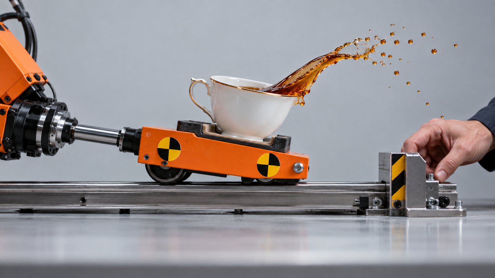
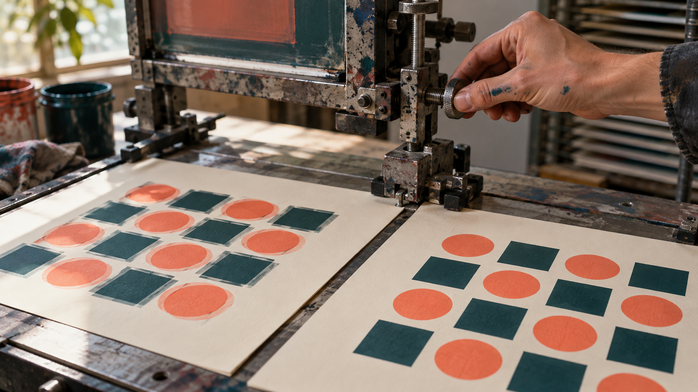

# Trust, but Throttle: ten new hero candidates

Generated with the built-in image generator. [Full prompts](./hero-concepts-round-4.md).

## 10 — The fragile passenger

Speed alone misses responsiveness; test what happens when motion changes.

## 11 — The reversal snags

A one-direction benchmark misses the failure exposed by reversals.

## 12 — Rehearse the difficult turn

Human judgment defines realistic movements for the automated rehearsal.

## 13 — Water only what is growing

Avoiding unneeded work is more useful than making all work faster.

## 14 — The beautiful fast mistake

A throughput improvement counts only if the output remains correct.

## 15 — Test against the returning wave

Realistic stress includes the return motion, not only the first pass.

## 16 — Keep the glaze

Performance work should preserve the product's valuable visual qualities.

## 17 — The wrong hill

An agent can confidently optimize the wrong objective.

## 18 — Wait for the order

Defer expensive work until someone actually requests it.

## 19 — The test can say no

The harness must verify the action and keep its acceptance gate intact.

