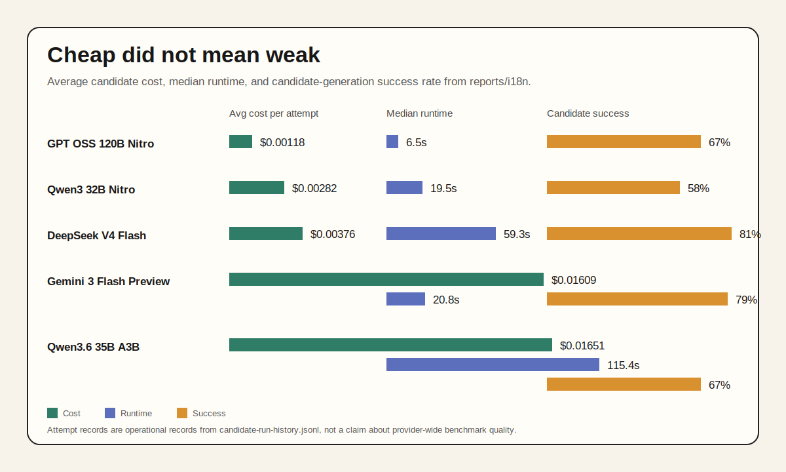
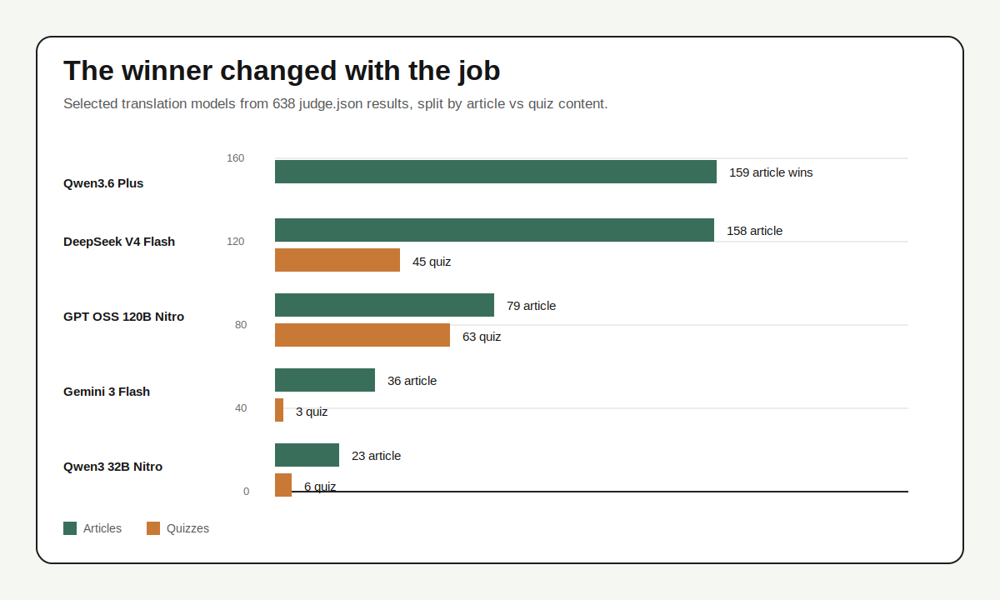
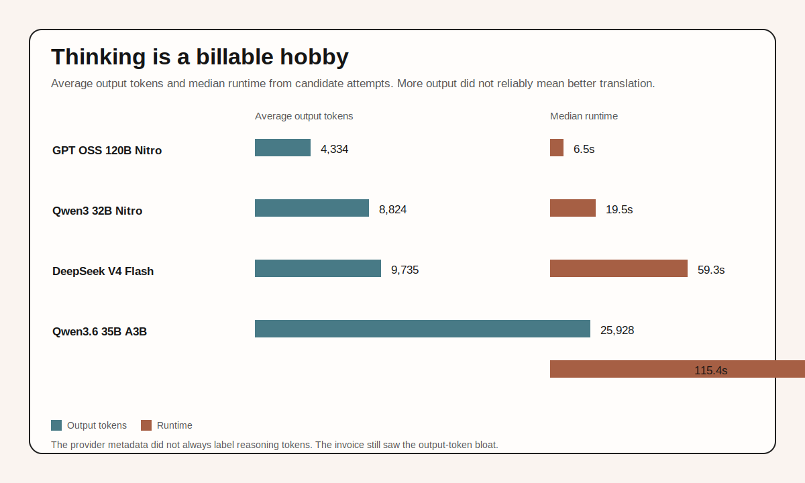
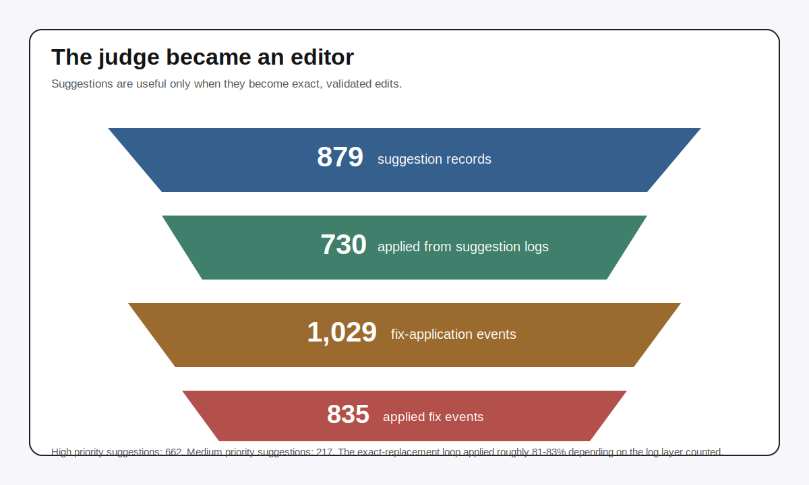

I thought I was building a translation pipeline.

That was the cover story.

The real project was an eval-driven AI development loop hiding inside a localization project. Send English in. Get Spanish, Japanese, Arabic, Hebrew, Hindi, German, Italian, Russian, and Chinese out. Compare candidates. Reject fluent wrongness. Patch exact failures. Run validation again. Promote the version that survived both the judge and the boring checks.

Once the source material included MDX, code blocks, old jokes, screenshots, frontmatter, internal links, and interactive quizzes, "translate this blog" stopped being a prompt. It became a system. Different models were good at different pieces. Some were fast and cheap but sloppy with structure. Some were slower but excellent for RTL languages. Some produced beautiful prose while quietly changing quiz answers, which is a polite way to commit educational vandalism.

The useful lesson was not "use the smartest model."

The useful lesson was: build the system so you can try several models, measure them against your content, promote the winner, and let deterministic checks veto anything the judge model found too charming.

The eval is not a report card you staple on at the end. It is the steering wheel.

Last verified: May 14, 2026. Cost and runtime numbers below come from this blog's local i18n report artifacts, not a universal model benchmark.

---

## The Corpus Became The Test Suite

The translation reports are now large enough to be more useful than anecdotes. More importantly, they are specific enough to be useful for development:

- 95 posts with i18n report directories
- 638 locale-level `judge.json` results
- 862 candidate run history files
- 1,650 candidate runs
- 3,771 candidate attempt records
- 2,962 timestamped `run.json` artifacts
- 879 judge suggestion records, with 730 marked applied
- 1,029 fix-application events in the judgement logs, with 835 applied

Those attempt records are operational records. They are not a clean academic benchmark. Some retries, commit failures, deferred validations, and model-provider weirdness show up in the logs because production systems have the audacity to contain production-system details.

Good.

That mess is the point. Public benchmarks measure tasks that fit neatly into someone else's spreadsheet. This dataset measures whether a model can translate *this* blog without breaking Astro, MDX, quizzes, code examples, links, tone, and my regrettable fondness for obscure cultural references.

That is eval-driven development in the only form I trust: the test set is not aspirational. It is the product trying to break.

## The First Win Was Knowing What Failed

The recent eval runs were humbling in the correct way.

One run had 0 passed and 16 failed. That sounds disastrous until you look at why. Many candidates had high judge scores, but deterministic integrity checks failed them:

- missing quiz challenges
- changed code-like answer options
- unclosed HTML tags
- wrong asset paths
- changed number of headings or blockquotes
- untranslated metadata

That is exactly what evals are for.

An LLM judge is good at "does this read well?" It is weaker at "did this preserve every structural invariant in a long MDX document?" Deterministic checks are cheap, rude, and correct. They do not care that the Spanish was elegant if the quiz is missing any questions.

This is the broader lesson from [LLM evals](/llm-evals-are-broken/): use the cheapest evaluation method that can honestly catch the failure. For translation, that means:

- schema checks for structured quiz JSON
- count checks for `Challenge`, option, answer, hint, and explanation structures
- code fence and inline-code preservation checks
- image and internal-link path checks
- language/locale checks
- LLM judge scores for tone, fluency, cultural adaptation, and technical nuance

The judge should evaluate the parts that need judgment. The validator should enforce the parts that are not negotiable.

## The Eval Changed The Architecture

The easiest AI system to build is a one-shot prompt with a bigger model at the end of it.

The evals made that design look lazy fast.

If a candidate failed because it changed quiz options, the answer was not "ask the model to be more careful." The answer was to preserve code-like options outside the model and test that preservation explicitly. If candidates disagreed by locale family, the answer was not "pick a global winner." The answer was to route by content shape and language. If the judge kept suggesting unsafe link fixes, the answer was not "trust the judge harder." The answer was exact replacements, validation, and false-positive tracking.

That is the loop:

1. Generate candidates.
2. Judge what needs judgment.
3. Validate what must be exact.
4. Patch only concrete failures.
5. Promote only the result that survives the next run.

Eval-driven AI development is not a vibe check. It is a pressure system that changes the code.

<figure class="breakout">

<figcaption>The eval loop made the model economics visible. GPT OSS 120B Nitro was the cheap speed demon. DeepSeek V4 Flash was slower but had the highest candidate-generation success rate among the current cheap pool. Qwen3 32B Nitro was a useful second opinion, not the main winner.</figcaption>
</figure>

## Cheap Candidates Made The Eval Useful

For candidate generation, the most interesting current cheap models were DeepSeek V4 Flash, GPT OSS 120B Nitro, and Qwen3 32B Nitro.

| Model | Attempt records | Candidate records | Candidate rate | Avg attempt cost | Median runtime | Best use in this corpus |
| --- | ---: | ---: | ---: | ---: | ---: | --- |
| `openai/gpt-oss-120b:nitro` | 1,426 | 957 | 67.1% | $0.00118 | 6.5s | Fast, cheap first pass; especially strong on quiz wins |
| `qwen/qwen3-32b:nitro` | 1,230 | 712 | 57.9% | $0.00282 | 19.5s | Cheap alternate candidate; useful when it disagreed |
| `deepseek/deepseek-v4-flash` | 566 | 456 | 80.6% | $0.00376 | 59.3s | Strong promotion rate; excellent for Arabic, Hebrew, and Chinese runs |
| `google/gemini-3-flash-preview` | 133 | 105 | 78.9% | $0.01609 | 20.8s | Better as a judge/default reviewer than a cheap generator |
| `qwen/qwen3.6-35b-a3b` | 207 | 139 | 67.1% | $0.01651 | 115.4s | Sometimes good, often too slow and output-heavy |

The first surprise: GPT OSS 120B Nitro was not merely "cheap enough to try." It became a real workhorse. It produced the most candidate records in the dataset and was often fast enough that a failed run was annoying, not budget-threatening.

The second surprise: DeepSeek V4 Flash cost more per attempt and took longer, but it won the quality lottery often enough to justify its place in the pool. In `judge.json` selections, DeepSeek V4 Flash was the top overall winner: 203 selected translations, including 158 article selections and 45 quiz selections.

The third surprise: Qwen3 32B Nitro did not win as often as the other two, but it still mattered. Cheap second opinions are valuable when the judge needs contrast. A translation workflow with one model gives the judge nothing to compare. A translation workflow with two or three cheap candidates turns model selection into an actual decision.

This is the important product-design shift: do not ask "which model translates best?" Ask "which portfolio of models gives the eval loop enough diversity to find a good result without summoning the expensive cavalry?"

## The Expensive Tier Was Not The Default Escape Hatch

The pipeline has hooks for escalation models like Gemini 3 Pro and Sonnet 4.6. They are useful tools to have in the cabinet.

They were not the story here.

The local corpus does not contain enough direct Gemini 3 Pro or Sonnet 4.6 candidate runs to make a fair head-to-head claim. That is itself a useful finding: the cheap pool handled enough work that the expensive fallback tier was mostly something to reserve for disagreement, structural suspicion, or unusually high-risk content.

Gemini 3 Flash Preview became the default judge in many runs, not because it was the cheapest generator, but because it was good at comparative review. Even there, it needed guardrails. The judge could praise a translation that still failed deterministic checks. It could also suggest a link fix that a later pass decided was unnecessary.

That is fine. A judge model is not a court. It is an experienced reviewer with a token meter and occasional confidence issues.

## Judge Wins Were Content-Specific

The clearest split was articles vs. quizzes.

<figure class="breakout">

<figcaption>The eval winners depended on the content shape. Qwen3.6 Plus and DeepSeek V4 Flash carried article wins. GPT OSS 120B Nitro led quiz wins.</figcaption>
</figure>

From `judge.json` selections:

| Model | Article wins | Quiz wins | Notes |
| --- | ---: | ---: | --- |
| `qwen/qwen3.6-plus` | 159 | 0 | Strong legacy article performer, but not the current cheapest default |
| `deepseek/deepseek-v4-flash` | 158 | 45 | Best overall current selection count, especially strong in RTL/Chinese coverage |
| `openai/gpt-oss-120b:nitro` | 79 | 63 | Best quiz selection count, very fast and cheap |
| `google/gemini-3-flash-preview` | 36 | 3 | Useful judge; occasional generator winner |
| `qwen/qwen3-32b:nitro` | 23 | 6 | Cheap comparison candidate with selective wins |

This is where "use the most powerful model" starts to look like a procurement department wearing a lab coat.

Quizzes are not normal prose. A quiz question contains a lesson, an answer key, a plausible distractor set, code-like strings that must not change, hints, explanations, and MDX component structure. A translation can sound fluent and still be wrong if it translates `Throws a TypeError` into a natural phrase when the option is intentionally code-like. That is not localization. That is changing the test.

GPT OSS 120B Nitro did surprisingly well on quiz selection. DeepSeek V4 Flash also did well, especially when the structured translator kept the task narrow. Qwen3 32B Nitro occasionally won, but mostly helped as a cheap comparator.

The best model for normal article prose was not automatically the best model for interactive teaching material.

That should make every AI application architect a little calmer and a little more suspicious.

## Quizzes Needed The Opposite Of One Big Prompt

The first instinct for translation is to send the whole document. That gives the model maximum context and lets it keep terms consistent.

For regular prose, chunking worked well. The default article strategy became `18p`: eighteen paragraphs per active chunk, with one neighboring source paragraph before and after as context. The neighboring paragraphs are context, not output. Stable translation rules and locale guidance sit in cacheable prompt blocks. The dynamic prompt only carries the current chunk.

For quizzes, the whole-document strategy was a trap.

The eval reports are blunt about the failure mode:

- 98 `integrity:html-unclosed-tag` failures
- 91 `integrity:quiz-code-option-preservation` failures
- 84 `integrity:html-mismatched-closing-tag` failures
- 69 `integrity:quiz-missing-challenge` failures

That is what happens when a model tries to be a translator, a JSX parser, and a helpful editor at the same time. It starts "fixing" things. It drops a `Challenge`. It translates code-like options. It closes a `slot` in the wrong place. Then the judge says the prose is lovely while Astro quietly reaches for a chair.

The better strategy was structured quiz translation:

1. Parse the quiz into typed `Challenge` objects.
2. Generate a short quiz description from the intro and outro.
3. Translate one challenge at a time as JSON.
4. Preserve code blocks automatically.
5. Validate array counts, answer counts, options, hints, and explanation slots.
6. Reassemble the MDX from structure, not from model improvisation.

That looks like smaller chunks, but it also needs the opposite instinct: give each tiny chunk enough global context to know what it is teaching. The challenge payload should be narrow. The stable context should say, "this is a technical quiz about JavaScript errors for experienced developers; keep code exact; translate teaching prose naturally."

In other words: small working set, large enough mental model.

That is a pattern worth stealing for other AI systems. Do not shove the whole world into every call. Do not starve the model either. Send the smallest mutable unit, plus the durable context it needs to avoid sounding like it woke up halfway through the article.

## Thinking Is Dangerously Expensive

Thinking is wonderful in humans. In LLM APIs, thinking is a metered utility with a user interface problem.

Sometimes frontier models can use extra reasoning to improve an answer. They have enough capability for the extra computation to buy something. Cheaper thinking-capable models are more mixed. Ask them to think too much and they may spend real money narrating themselves into a corner.

<figure class="breakout">

<figcaption>More output was not the same as better translation. Qwen3.6 35B A3B produced far more output tokens and ran much longer than the cheap Nitro models.</figcaption>
</figure>

The clearest operational symptom was output-token inflation:

| Model | Average output tokens | Median runtime | Average attempt cost |
| --- | ---: | ---: | ---: |
| `openai/gpt-oss-120b:nitro` | 4,334 | 6.5s | $0.00118 |
| `qwen/qwen3-32b:nitro` | 8,824 | 19.5s | $0.00282 |
| `deepseek/deepseek-v4-flash` | 9,735 | 59.3s | $0.00376 |
| `qwen/qwen3.6-35b-a3b` | 25,928 | 115.4s | $0.01651 |

Provider metadata did not always label reasoning tokens cleanly, so I am not claiming every extra token was literally hidden chain-of-thought. The practical effect was simpler: some thinking-shaped runs produced much larger outputs, took longer, and did not reliably win.

That is the tax.

When the task is translation, more thinking can become over-editing. The model starts second-guessing phrasing, normalizing code-like text, or "improving" structure. For cheap models especially, more thought can mean more opportunity to drift.

Without evals, that looks like model personality. With evals, it becomes a measurable tax.

Thinking is not free. Worse, it can be confidently counterproductive. Very on-brand for thinking, honestly.

## The Judge Was Useful Because It Was Not Alone

The judge model had three jobs:

1. Compare candidate commits.
2. Select the best translation.
3. Generate exact replacement suggestions for medium/high-priority issues.

It worked well enough to become part of the pipeline. It did not work well enough to trust by itself.

<figure class="breakout">

<figcaption>The judge became useful when its suggestions were exact replacements that could be applied, rescored, and validated.</figcaption>
</figure>

The suggestion loop generated 879 suggestion records. 730 were marked applied. The broader judgement logs contain 1,029 fix-application events, with 835 applied. The difference comes from counting different layers of the workflow: suggestion files vs. all fix application events in judgement logs.

That distinction matters because "the judge suggested something" is not the same as "the system safely changed the translation."

The useful suggestions were concrete:

- wrong inherited asset paths inside locale folders
- internal links accidentally rewritten as asset-relative paths
- untranslated headings
- literal idiom translations
- code-ish answer options that should have stayed exact
- malformed HTML or MDX structure

The weak suggestions were also concrete:

- link fixes where the judge confused site-root links with inherited asset paths
- style preferences dressed up as correctness
- prose improvements that were plausible but not worth another edit pass

The fix loop only worked because suggestions had to include exact `match`, exact `replacement`, and an English reason. That turns a judge into a constrained patch generator instead of a vibes faucet.

Then the system re-ran validation.

This is the boring part that makes the fancy part useful.

## What Worked

The best strategy was an eval loop, not a heroic model.

**Generate multiple cheap candidates.** GPT OSS 120B Nitro, DeepSeek V4 Flash, and Qwen3 32B Nitro were cheap enough to run as a pool. The judge needed contrast. The system needed cheap failure.

**Route by observed failure, not model reputation.** DeepSeek V4 Flash became a strong choice for several locale families, especially Arabic, Hebrew, and Chinese coverage. GPT OSS 120B Nitro became a quiz workhorse. Qwen3 32B Nitro was a useful alternate candidate when the first two disagreed or had structural weirdness.

**Preserve structure outside the model whenever possible.** The structured quiz translator was better than asking a model to rewrite a full MDX file. A model should translate reader-facing prose. It should not be responsible for remembering how many `Challenge` components exist.

**Make prompts cacheable and boring.** Stable rules, locale guidance, and article/quiz context belong in reusable prompt blocks. Per-chunk prompts should carry only the current mutable payload.

**Let exact suggestions patch, then rescore.** A judge suggestion is useful when it can become a small deterministic replacement, not when it asks a human to "make this more natural" 400 times.

**Treat failed evals as product feedback.** The failures were not only defects in generated content. They were design notes for the pipeline: parse quizzes, narrow payloads, preserve code, track model pairs, and stop trusting language fluency as a proxy for correctness.

**Defer expensive models.** The expensive tier should be available for escalation, but not treated as the default. If cheap candidates plus a competent judge produce a validated result, the expensive call is just a very nicely formatted invoice.

## What Did Not Work

**Single-model translation.** It is tempting because it is simple. It also gives you no comparison surface. If the output is bad in a subtle way, you have no second candidate exposing the weakness.

**Treating evals as a dashboard instead of a development loop.** A score is useful only if it changes routing, prompts, parsers, validators, or escalation rules. Otherwise it is just telemetry with better posture.

**Whole-document quiz translation.** It produced fluent disasters: missing challenges, mangled slots, changed code-like options, and malformed MDX.

**Asking cheap models to think harder.** More output tokens often meant more cost, more latency, and more chances to drift. Thinking tokens are like meetings: sometimes necessary, often scheduled by fear.

**Trusting LLM-as-judge for structure.** The judge was valuable for language quality and candidate comparison. Deterministic checks were better at catching broken markup and changed quiz mechanics.

**Treating translation as a vendor API swap.** Paid translation APIs are still useful for many product surfaces. But technical content translation is not just sentence translation. It is content migration with semantic, structural, and editorial constraints.

## What I Would Try Next

The next version of this system should let eval results route more aggressively.

For normal prose:

- start with GPT OSS 120B Nitro and DeepSeek V4 Flash
- add Qwen3 32B Nitro when the article is code-heavy or the first two disagree
- judge with Gemini 3 Flash or another cheap strong reviewer
- escalate only on disagreement, low scores, or structural suspicion

For quizzes:

- always use structured `Challenge` translation
- keep challenge-level JSON outputs
- preserve code-like answer options with deterministic checks
- feed each challenge a compact whole-quiz summary
- run at least two cheap candidates because quiz failures are weirdly model-specific

For judges:

- keep exact-replacement suggestions
- record false positives
- score judge suggestions after application, not only before
- track which models produce fixes that survive validation

For reporting:

- separate unique provider calls from operational attempt records
- track reasoning tokens consistently when providers expose them
- add charts for cost per accepted translation, not only cost per candidate attempt
- compare model pairs, because the best unit may be "GPT OSS plus DeepSeek" rather than either model alone
- track which eval failures changed the implementation, because that is where the useful learning lives

That last one matters. AI applications are not going to be one model forever. They are going to be small routing systems with evals, fallbacks, typed payloads, cheap candidates, expensive escalation, and a lot of unglamorous validation.

Translation made that obvious because the failures were so visible. A broken quiz does not merely sound awkward. It breaks the page, changes the answer, or teaches the wrong thing with confidence.

That is the eval-driven development lesson hiding inside this project:

Do not buy intelligence by the pound. Route the work, measure the output, and keep the parts of the system that must be exact out of the model's hands.

The future is not one giant model thinking very deeply about your problem while a dashboard politely records the damage.

The future is five cheaper models, three validators, a judge with a clipboard, and a build step that refuses to be impressed.
